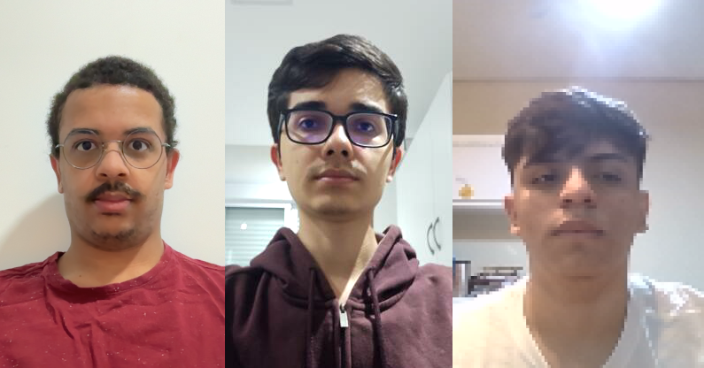
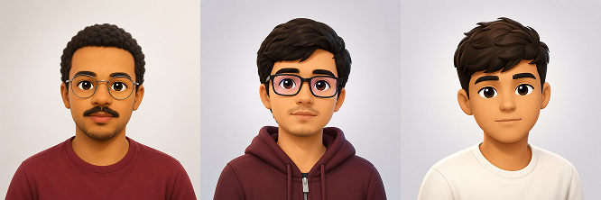

> Notebook: [`laboratorios/lab1/lab1.ipynb`](https://github.com/kaykyb/ufabc-cv/blob/main/laboratorios/lab1/lab1.ipynb)

**Autores:** Kayky de Brito dos Santos; Andre Marques da Silva; Rafael de Souza Coelho

**Data de realização dos experimentos:** 5 de junho de 2026

**Data de publicação do relatório:** 5 de junho de 2026

## Introdução

O Laboratório 1 introduz os fundamentos de entrada e saída de dados visuais em OpenCV. O relatório é dividido em três partes, conforme o enunciado da disciplina.

A **Parte 1** trata de leitura e escrita de imagens, leitura de vídeo em arquivo e captura/gravação de webcam, a partir dos scripts `L__1_img.py`, `L__2_video.py`, `L__3_webcam.py` e `L__4_webcap.py`. As **Partes 2 e 3** serão descritas em seções específicas abaixo.

---

## Parte 1: Imagens, vídeo em arquivo e webcam

### Procedimentos experimentais

#### A) Leitura de imagem em arquivo

Executou-se o programa original sem modificações:

```bash
python3 L__1_img.py
```

Código original (`L__1_img.py`):

```python
import numpy as np
import cv2 as cv

img = cv.imread('messi5.jpg', 0)
cv.imshow('image', img)
k = cv.waitKey(0)
if k == 27:          # ESC para sair
    cv.destroyAllWindows()
elif k == ord('s'):  # 's' para salvar e sair
    cv.imwrite('messigray.png', img)
    cv.destroyAllWindows()
```

A janela exibe a imagem `messi5.jpg` e, ao pressionar `s`, grava `messigray.png`.

#### B) Leitura de vídeo em arquivo

Executou-se o programa original sem modificações:

```bash
python3 L__2_video.py
```

Em seguida, foram produzidas duas variantes para reprodução mais rápida (100 fps) e mais lenta (5 fps), alterando apenas o intervalo entre a exibição dos quadros:

```python
# Versão mais rápida - 100 fps
time.sleep(1/100.0)

# Versão mais lenta - 5 fps
time.sleep(1/5.0)
```

#### C) Leitura de imagem da câmera

Modificou-se `L__3_webcam.py` para que a tecla `x` capture o quadro corrente em `foto1.png` (mantendo `q` para encerrar):

```python
import numpy as np
import cv2 as cv

cap = cv.VideoCapture(0)

if not cap.isOpened():
    print("Cannot open camera")
    exit()
    
while True:
    # Capture frame-by-frame
    ret, frame = cap.read()
    # if frame is read correctly ret is True
    if not ret:
        print("Can't receive frame (stream end?). Exiting ...")
        break
    
    # Display the resulting frame
    cv.imshow('frame', frame)
    
    key = cv.waitKey(1)
    if key == ord('q'):
        break
    elif key == ord('x'):
        cv.imwrite('foto1.png', frame)

# When everything done, release the capture
cap.release()
cv.destroyAllWindows()
```

#### D) Gravação de vídeo da câmera

Modificou-se `L__4_webcap.py` em dois pontos:
- remoção do espelhamento vertical para que o vídeo gravado fique "normal"
- ajuste do `fps` do `VideoWriter` para a taxa fixa de 25 FPS, e calculando o tempo entre frames para não termos um efeito de camera lenta/rápida.

```python
import numpy as np
import cv2 as cv
cap = cv.VideoCapture(0)

# Get current width of frame
width = cap.get(cv.CAP_PROP_FRAME_WIDTH)   # float
# Get current height of frame
height = cap.get(cv.CAP_PROP_FRAME_HEIGHT) # float
# Define Video Frame Rate in fps
fps = 25
# Tempo que cada frame deve durar.
time_per_frame = 1 / fps

# Define the codec and create VideoWriter object
fourcc = cv.VideoWriter_fourcc(*'XVID')
out = cv.VideoWriter('saida.avi', fourcc, fps, (int(width),int(height)) )

while cap.isOpened():
    # Usamos o start_time para garantir que cada frame será capturado em um intervalo igual de tempo
    # Caso contrário o vídeo poderá ficar acelerado ou lento.
    start_time = time.time()

    ret, frame = cap.read()
    if not ret:
        print("Can't receive frame (stream end?). Exiting ...")
        break
    frame = cv.flip(frame, 0)
    # write the flipped frame
    out.write(frame)
    cv.imshow('frame', frame)

    # Calculamos quanto tempo já se foi desde quando começamos a capturar este frame
    passed_time = time.time() - start_time

    # Calculamos quanto tempo ainda devemos esperar para gravar o próximo frame em um intervalo igual de tempo
    wait_time = int((time_per_frame - passed_time) * 1000)

    if wait_time > 0 and cv.waitKey(wait_time) == ord('q'):
        break

# Release everything if job is finished
cap.release()
out.release()
cv.destroyAllWindows()
```

### Análise e discussão

**A) Por que a janela aberta não mostra a imagem colorida?**

A função `cv.imread('messi5.jpg', 0)` recebe `0` como segundo argumento, que é o equivalente numérico da _flag_ `cv.IMREAD_GRAYSCALE`. Isso instrui o OpenCV a decodificar o arquivo já convertendo para um único canal de luminância: o objeto retornado é uma matriz 2D `H × W` (em vez do 3D `H × W × 3` típico de uma imagem BGR). Para obter a imagem colorida, basta usar `cv.imread('messi5.jpg', 1)` (equivalente a `cv.IMREAD_COLOR`) ou omitir o argumento, já que o padrão é colorido. Ver Referência [1].

**B) Explicação da alteração de velocidade.**

A velocidade de exibição em `L__2_video.py` é determinada principalmente pelo `time.sleep(1/25.0)` dentro do laço - ou seja, o programa propositadamente aguarda 40 ms entre quadros para simular 25 fps, independentemente da taxa real codificada no arquivo. Reduzir esse intervalo aproxima a reprodução do _loop_ "tão rápido quanto o computador conseguir decodificar"; aumentá-lo torna a exibição arrastada. As soluções adotadas foram `time.sleep(1/100.0)` (mais rápido) e `time.sleep(1/5.0)` (mais lento), conforme mostrado nos procedimentos.

**C) Captura por tecla `x`.**

A solução troca o teste único `cv.waitKey(1) == ord('q')` por uma leitura única de tecla mantida em variável (`key`), permitindo decidir entre encerrar (`q`) ou salvar o quadro corrente (`x`) sem chamar `waitKey` duas vezes. A escrita é feita com `cv.imwrite('foto1.png', frame)`, que infere o codec PNG a partir da extensão e grava no diretório de execução do script.

**D) Gravação "normal" e velocidade adequada.**

Dois problemas do programa original foram corrigidos:

1. **Imagem invertida na gravação.** O `cv.flip(frame, 0)` aplicava espelhamento vertical antes de escrever no `VideoWriter`. Removendo essa chamada, os quadros gravados ficam com a mesma orientação dos exibidos.
2. **Velocidade de reprodução incorreta.** O `VideoWriter` foi criado com `fps = 10.0`, mas o laço lia da câmera o mais rápido possível. O resultado é um arquivo com 10 fps no cabeçalho que contém quadros amostrados a uma taxa maior. Ao reproduzir, o player respeita os 10 fps declarados e o vídeo aparenta câmera lenta. A correção foi ficxar o FPS em 25 (ou qualquer outro número que o sistema "aguente") e adicionar um delay no `waitKey` alinhando a taxa declarada de FPS à taxa real de captura.

**Onde realizar processamento de imagem nos quatro programas?**

O processamento deve ocorrer logo após a obtenção do quadro (`img = cv.imread(...)` no programa A; `ret, frame = cap.read()` nos programas B, C e D) e antes do consumo desse quadro, isto é, antes de `cv.imshow`, `cv.imwrite` ou `out.write`. Essa é a única posição em que o quadro está disponível em memória e ainda não foi nem exibido nem persistido.

---

## Parte 2: Obtenção de fotos e vídeos da equipe

### Procedimentos experimentais

Os programas corrigidos da Parte 1 (`L__3_webcam.py` e `L__4_webcap.py`) foram portados para o notebook [`laboratorios/lab1/lab1.ipynb`](https://github.com/kaykyb/ufabc-cv/blob/main/laboratorios/lab1/lab1.ipynb), com comentários explicativos em cada célula. As células foram organizadas em dois fluxos:

1. **Captura de foto**: abre a webcam, exibe o _preview_ em janela e grava a imagem corrente em `foto1.png` ao pressionar `x` (`q` encerra sem salvar).
2. **Gravação de vídeo**: abre a webcam, mantém a orientação original do quadro, declara `fps = 25` no `VideoWriter` e usa a estratégia de delay por `cv.waitKey` da Parte 1.D para que o arquivo `saida.mp4` reproduza na velocidade real.

#### a) Foto geral da equipe

Cada integrante capturou individualmente sua foto pela webcam usando o programa do notebook (mesmo fluxo da Parte 1.C). A foto geral da equipe foi composta a partir dessas imagens individuais em um editor externo.



#### b) Foto-montagem de avatares

Os avatares individuais foram gerados com IA e em seguida editados e compostos numa única imagem no Figma, preservando a mesma ordem da foto geral (Kayky · Andre · Rafael).



#### c) Vídeos curtos

Foram planejados quatro vídeos curtos com a webcam, conforme o enunciado: dois com pessoas (um lento, um rápido) e dois com um objeto (um lento, um rápido). Os integrantes que aparecem em cada vídeo são diferentes entre si.

##### c.i) Pessoa, movimento lento

<video controls width="100%">
  <source src="pessoa_lento.mp4" type="video/mp4">
</video>

##### c.ii) Pessoa, movimento rápido

<video controls width="100%">
  <source src="pessoa_rapido.mp4" type="video/mp4">
</video>

##### c.iii) Objeto, movimento lento

<video controls width="100%">
  <source src="objeto_lento.mp4" type="video/mp4">
</video>

##### c.iv) Objeto, movimento rápido

<video controls width="100%">
  <source src="objeto_rapido.mp4" type="video/mp4">
</video>

### Análise e discussão

A portabilidade dos programas da Parte 1 para o notebook não exigiu mudanças funcionais. A única alteração foi a substituição do de script por células Markdown intercaladas com células de código. O comportamento de `cv.imshow`, `cv.waitKey` e `cv.VideoWriter` permanece idêntico, pois o Jupyter executa Python e o OpenCV abre janelas nativas do sistema operacional independentemente do sistema. Isso confirma que o notebook é um meio adequado para registrar comentários e justificativas das escolhas (`fps = 25`, ausência de `cv.flip`, espaçamento por `waitKey`) sem alterar a captura em si.

## Conclusões

O Laboratório 1 consolidou o ciclo básico de entrada e saída visual em OpenCV: na Parte 1 ficou claro que o segundo argumento de `cv.imread` decide entre tons de cinza e cor, que a velocidade de reprodução depende do intervalo entre `imshow` consecutivos e que a fidelidade de uma gravação por `cv.VideoWriter` depende de declarar um `fps` coerente e evitar transformações indesejadas. 

Na Parte 2, esses programas corrigidos foram portados para o notebook e usados para produzir o material de equipe (foto geral com cores RGB, montagem de avatares e quatro vídeos de movimento lento e rápido).

Revisamos os conceitos básicos de processamento de imagens.

## Referências

- [1] OpenCV. _Getting Started with Images._ <https://docs.opencv.org/4.x/db/deb/tutorial_display_image.html>
- [2] OpenCV. _Getting Started with Videos._ <https://docs.opencv.org/4.x/dd/d43/tutorial_py_video_display.html>
- [3] OpenCV. _VideoWriter Class Reference._ <https://docs.opencv.org/4.x/dd/d9e/classcv_1_1VideoWriter.html>
- [4] Material da disciplina UFABC, Visão Computacional, Laboratório 1.
