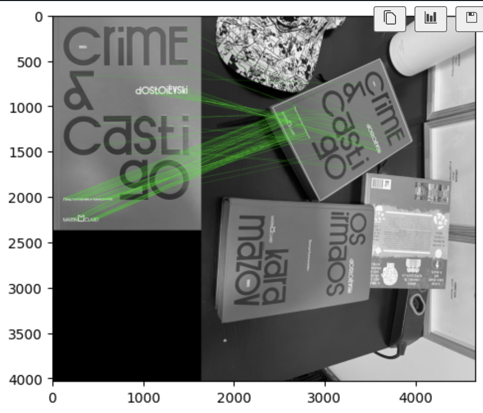

> Notebook: [`laboratorios/lab2/lab2.ipynb`](https://github.com/kaykyb/ufabc-cv/blob/main/laboratorios/lab2/lab2.ipynb)

**Autores:**

- Kayky de Brito dos Santos
- André Marques da Silva
- Rafael de Souza Coelho

**Data de realização dos experimentos:** 13 de junho de 2026

**Data de publicação do relatório:** 13 de junho de 2026

## Introdução

Este relatório detalha os experimentos conduzidos no Laboratório 2 de Visão Computacional, cujo foco é a extração e correspondência de características (*features*) em imagens. Características são pontos ou regiões de interesse — como bordas e cantos — que se destacam visualmente e podem ser identificados de forma repetível, independentemente de alterações na câmera ou no cenário. O objetivo principal desta prática é compreender e aplicar detectores e descritores locais robustos, culminando no uso prático do algoritmo SIFT para encontrar correspondências entre imagens estáticas e fluxos de vídeo ao vivo, além de explorar a Transformada de Hough para detecção paramétrica de formas geométricas.

## Fundamentação Teórica

A utilização de *features* locais divide-se em três etapas essenciais: detecção (identificação dos pontos de interesse), descrição (extração de um vetor representativo da região ao redor do ponto) e correspondência ou *matching* (cálculo de similaridade entre descritores de vistas distintas). Para que um algoritmo seja eficiente, os descritores precisam garantir invariância geométrica e discriminabilidade.

* **Detecção de Cantos (Harris e Shi-Tomasi):** São métodos focados em encontrar cantos (*corners*), regiões onde a intensidade da imagem varia significativamente em múltiplas direções simultâneas.
* **SIFT (Scale-Invariant Feature Transform):** Método de estado da arte que resolve simultaneamente os problemas de invariância à escala e à rotação 2D, construindo um histograma de orientações de gradientes para gerar um vetor descritor final de 128 dimensões. O SIFT é extraordinariamente robusto a mudanças de iluminação e rotações fora do plano de até 60 graus.

---

## Parte 2: SIFT

### Procedimentos experimentais

#### A) Matching + homografia em duas imagens

Seguimos o tutorial [_Feature Matching + Homography to find Objects_](https://docs.opencv.org/4.x/d1/de0/tutorial_py_feature_homography.html) usando duas fotos do mesmo objeto em posições diferentes.

Primeiro carregamos as imagens em escala de cinza, que é o formato esperado pelo SIFT:

```python
img1 = cv.imread(r"images/IMG_3401.jpeg", cv.IMREAD_GRAYSCALE)
img2 = cv.imread(r"images/IMG_3402.jpeg", cv.IMREAD_GRAYSCALE)
```

Depois rodamos o SIFT em cada imagem para detectar os keypoints e calcular seus descritores:

```python
sift = cv.SIFT_create()
kp1, des1 = sift.detectAndCompute(img1, None)
kp2, des2 = sift.detectAndCompute(img2, None)
```

Para parear os keypoints das duas imagens usamos o FLANN, que busca, para cada descritor da imagem 1, os dois mais parecidos na imagem 2. Em seguida aplicamos o _ratio test_ do Lowe, que só mantém o match quando o melhor candidato é claramente melhor que o segundo:

```python
flann = cv.FlannBasedMatcher(index_params, search_params)
matches = flann.knnMatch(des1, des2, k=2)

good = []
for m, n in matches:
    if m.distance < 0.7 * n.distance:
        good.append(m)
```

Com os bons matches em mãos, usamos `cv.findHomography` com RANSAC para descobrir a transformação que leva a imagem 1 na imagem 2. Em seguida projetamos os quatro cantos da imagem 1 nessa transformação e desenhamos o contorno do objeto sobre a imagem 2:

```python
M, mask = cv.findHomography(src_pts, dst_pts, cv.RANSAC, 5.0)
dst = cv.perspectiveTransform(pts, M)
img2 = cv.polylines(img2, [np.int32(dst)], True, 255, 3, cv.LINE_AA)
```

Por fim, `cv.drawMatches` mostra as duas imagens lado a lado com as linhas verdes ligando os pares correspondentes:



É possível ver que o SIFT encontrou bastante correspondência mesmo com o objeto em ângulos diferentes, e a homografia conseguiu desenhar o contorno do objeto na segunda imagem.

#### B) Matching ao vivo com duas webcams

Para a parte B, adaptamos o mesmo código para rodar em loop sobre o vídeo de duas webcams ligadas ao mesmo tempo.

A diferença principal é que abrimos duas câmeras e instanciamos o SIFT e o FLANN uma vez só, fora do loop:

```python
cap1 = cv.VideoCapture(0)
cap2 = cv.VideoCapture(1)

sift = cv.SIFT_create()
flann = cv.FlannBasedMatcher(index_params, search_params)
```

Dentro do loop, a cada iteração lemos um frame de cada câmera, convertemos para cinza e rodamos exatamente o mesmo pipeline da parte A: SIFT, FLANN, _ratio test_, homografia com RANSAC e desenho do contorno.

Como agora estamos lidando com vídeo ao vivo, foi preciso adicionar algumas checagens que não eram necessárias com imagens estáticas:

- somente rodar o matching se as duas câmeras devolveram descritores suficientes;
- somente desenhar o contorno se a homografia realmente foi encontrada (`M is not None`);
- quando não há matches suficientes, escrever na tela quantos faltam com `cv.putText`, pra dar um feedback visual.

```python
if len(good) > MIN_MATCH_COUNT:
    M, mask = cv.findHomography(src_pts, dst_pts, cv.RANSAC, 5.0)
    if M is not None:
        # desenha o contorno do objeto
        ...
else:
    cv.putText(frame2, f"Matches: {len(good)}/{MIN_MATCH_COUNT}", (10, 30),
               cv.FONT_HERSHEY_SIMPLEX, 1, (0, 0, 255), 2)
```

A janela mostra o `drawMatches` em cima e os dois frames originais embaixo, e o programa encerra ao apertar `q`.

O vídeo abaixo mostra o programa rodando, com o objeto sendo apresentado em ângulos diferentes pras duas webcams:

<video controls width="100%">
  <source src="SIFT_matches.mp4" type="video/mp4">
</video>

Podemos notar que o matching se mantém bem estável quando o objeto se mexe, o contorno acompanha ele enquanto há matches suficientes.

### Análise e discussão

As técnicas de detecção e correspondência de features formam a base para diversas soluções modernas. Observando os testes da Parte 2, o uso do Ratio Test provou ser indispensável na etapa de matching, pois calcula a razão entre a distância do melhor candidato e a do segundo melhor, limpando correspondências ambíguas antes de aplicarmos o RANSAC para o cálculo da homografia. Na Parte 3, a Transformada de Hough mostrou-se altamente eficaz na parametrização de contornos e formas perfeitas.

## Conclusões

O laboratório demonstrou com sucesso a aplicação prática de descritores invariantes à escala e detectores geométricos. A transição dos experimentos com imagens estáticas para o processamento de vídeo estereoscópico ao vivo evidenciou que algoritmos robustos como o SIFT, quando aliados a filtros de distância métrica (FLANN + Ratio Test) e de consenso geométrico (Homografia via RANSAC), entregam uma detecção extremamente estável para o rastreamento dinâmico. 

Conclui-se que o domínio integrado do pipeline de Feature Detection com transformadas morfológicas amplia significativamente a capacidade de solucionar problemas complexos do mundo real.

## Referências

- [1] OpenCV. _Feature Detection and Description._ <https://docs.opencv.org/4.x/db/d27/tutorial_py_table_of_contents_feature2d.html>

- [2] OpenCV. _Feature Matching + Homography to find Objects._ <https://docs.opencv.org/4.x/d1/de0/tutorial_py_feature_homography.html>

- [3] LearnOpenCV. _Hough Transform with OpenCV (C++/Python)._ <https://learnopencv.com/hough-transform-with-opencv-c-python/>

- [4] Material da disciplina UFABC, Visão Computacional, Laboratório 2.
