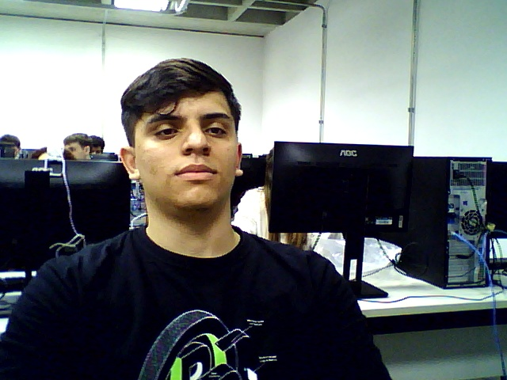
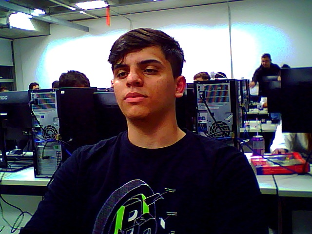
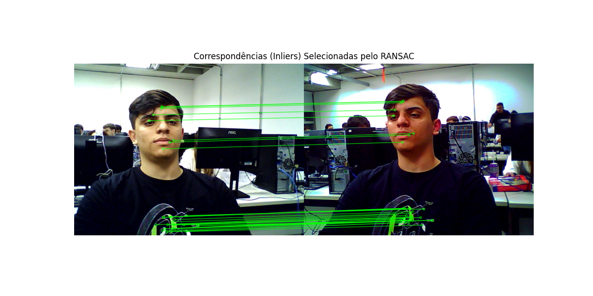
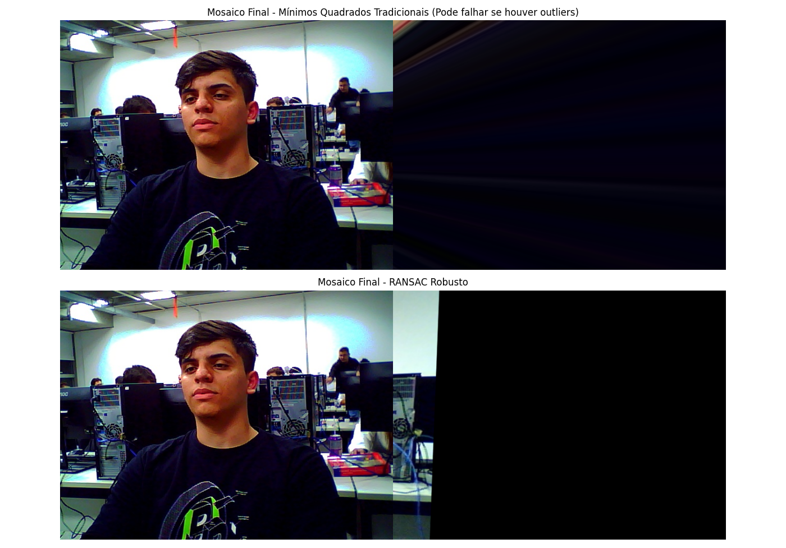
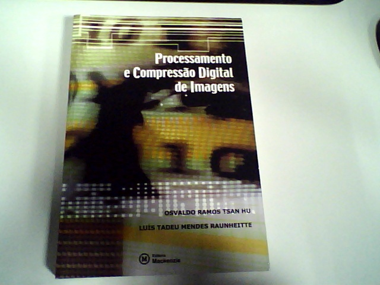
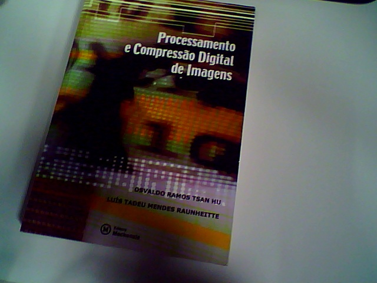
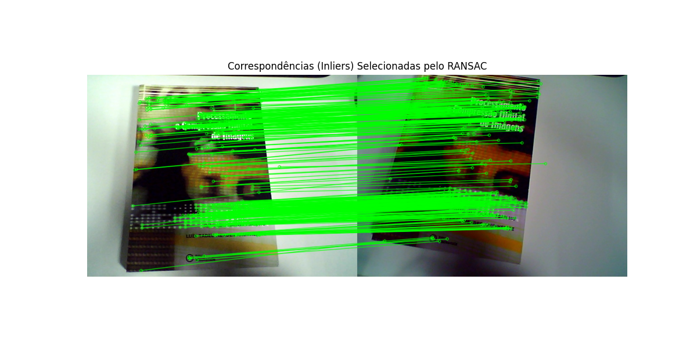
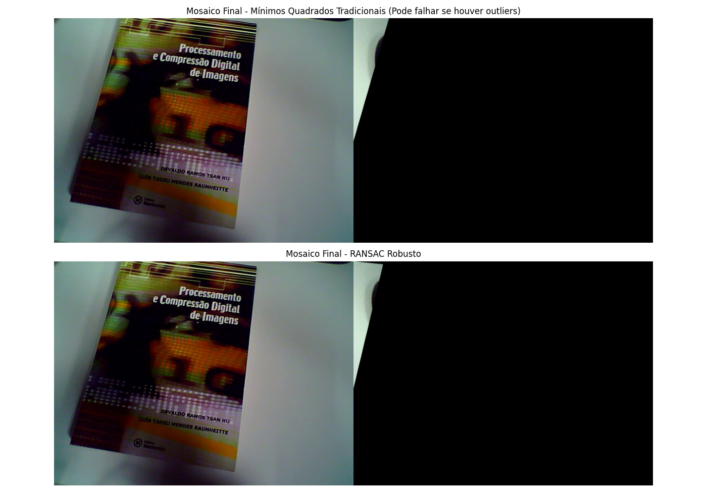
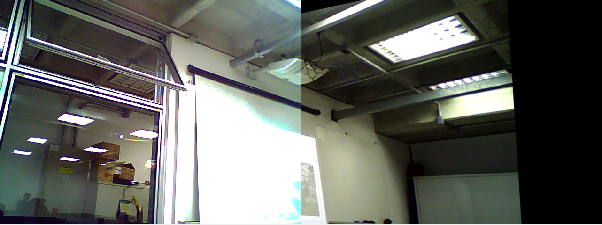

> Notebook: [`laboratorios/lab3/lab3.ipynb`](https://github.com/kaykyb/ufabc-cv/blob/main/laboratorios/lab3/lab3.ipynb)

**Autores:**

- Kayky de Brito dos Santos
- André Marques da Silva
- Rafael de Souza Coelho

**Data de realização dos experimentos:** 17 de junho de 2026

**Data de publicação do relatório:** 28 de junho de 2026

## Introdução

Este relatório descreve os experimentos do Laboratório 3 de Visão Computacional, dedicado ao alinhamento de imagens bidimensionais por meio de homografia 2D e à construção de mosaicos (*image stitching*). O objetivo é entender como duas vistas parcialmente sobrepostas de um mesmo plano podem ser combinadas numa única imagem, e como tornar esse processo robusto a correspondências erradas (*outliers*) geradas pelo ruído natural dos sensores e por ambiguidades visuais da cena.

Para isso usamos o detector SIFT para extrair e parear características entre as imagens, o teste de razão de Lowe para descartar pares ambíguos, e comparamos dois métodos de estimação da matriz de homografia: mínimos quadrados clássicos (que usa todos os pontos) e mínimos quadrados robustos via RANSAC (que isola os inliers antes de ajustar o modelo). Os experimentos foram conduzidos em dois cenários, uma pessoa e um livro, e fechamos com um mosaico gerado ao vivo a partir de duas webcams.

## Fundamentação Teórica

### Feature Matching

O ponto de partida do alinhamento é encontrar correspondências entre as duas imagens. Detectores e descritores locais como o **SIFT (Scale-Invariant Feature Transform)** localizam pontos de interesse repetíveis e os representam por um vetor de 128 dimensões invariante a escala, rotação e mudanças moderadas de iluminação. De posse dos descritores das duas imagens, um *matcher* (força bruta ou FLANN) busca, para cada descritor da primeira imagem, os dois mais próximos na segunda. O **teste de razão de Lowe** então só aceita o melhor candidato quando ele é significativamente melhor que o segundo (`m.distance < 0.75 * n.distance`), eliminando boa parte das correspondências ambíguas antes de qualquer etapa geométrica.

### Homografia 2D

Uma **homografia** é uma transformação projetiva que relaciona dois planos. Em coordenadas homogêneas ela é descrita por uma matriz 3x3:

$$
\begin{bmatrix} x' \\ y' \\ w' \end{bmatrix} =
\begin{bmatrix} h_{00} & h_{01} & h_{02} \\ h_{10} & h_{11} & h_{12} \\ h_{20} & h_{21} & h_{22} \end{bmatrix}
\begin{bmatrix} x \\ y \\ 1 \end{bmatrix}
$$

Ela é definida a menos de um fator de escala, o que deixa 8 graus de liberdade. Como cada correspondência de pontos fornece duas equações (uma em $x$, outra em $y$), são necessários no mínimo **4 pares de pontos** para resolver o sistema. Quando há mais de 4 pares, o sistema é sobredeterminado e resolvido por mínimos quadrados.

### RANSAC

Mínimos quadrados clássicos ajustam o modelo a *todos* os pontos, então um único *outlier* grosseiro pode distorcer toda a solução. O **RANSAC (Random Sample Consensus)** ataca esse problema amostrando aleatoriamente conjuntos mínimos de 4 pontos, estimando a homografia candidata e contando quantos dos demais pontos concordam com ela dentro de um limiar de reprojeção (usamos 5 pixels). Após várias iterações, a melhor hipótese é a que reúne mais inliers, e a matriz final é reestimada apenas sobre esse conjunto consistente. O resultado é uma estimativa robusta mesmo com uma fração elevada de correspondências falsas.

---

## Procedimentos experimentais

### Captura com duas webcams

Primeiro escrevemos um programa simples que abre as duas webcams ao mesmo tempo, mostra os dois fluxos e salva um par de imagens (`imagem1.jpg` e `imagem2.jpg`) quando a tecla `x` é pressionada. Cada câmera capta o mesmo objeto de um ângulo ligeiramente diferente, garantindo a sobreposição de pelo menos 50% exigida pelo enunciado.

```python
cap1 = cv.VideoCapture(0)
cap2 = cv.VideoCapture(1)

while True:
    ret1, frame1 = cap1.read()
    ret2, frame2 = cap2.read()
    cv.imshow('Camera 0', frame1)
    cv.imshow('Camera 1', frame2)

    key = cv.waitKey(1) & 0xFF
    if key == ord('q'):
        break
    if key == ord('x'):
        # salva imagem1.jpg e imagem2.jpg
        ...
```

### A) Alinhamento e mosaico em imagens estáticas

O pipeline offline carrega o par de imagens, detecta as características com SIFT e pareia com força bruta seguida do teste de Lowe:

```python
sift = cv2.SIFT_create()
kp1, des1 = sift.detectAndCompute(gray1, None)
kp2, des2 = sift.detectAndCompute(gray2, None)

bf = cv2.BFMatcher()
matches_brutos = bf.knnMatch(des1, des2, k=2)

bons_matches = [m for m, n in matches_brutos if m.distance < 0.75 * n.distance]
```

Em seguida estimamos a homografia de **duas** formas, para poder compará-las: mínimos quadrados clássicos (`method=0`, usa todos os pontos) e RANSAC (`cv2.RANSAC`, com limiar de reprojeção de 5 px), que também devolve a máscara de inliers:

```python
H_ls, _ = cv2.findHomography(src_pts, dst_pts, method=0)
H_ransac, mask_ransac = cv2.findHomography(src_pts, dst_pts, cv2.RANSAC, 5.0)

inliers_count = int(np.sum(mask_ransac))
outliers_count = len(mask_ransac) - inliers_count
```

Por fim, projetamos a primeira imagem no plano da segunda com `cv2.warpPerspective` e colamos a segunda imagem por cima da zona de projeção, formando o mosaico:

```python
img1_warped_ransac = cv2.warpPerspective(img1, H_ransac, (width, height))
mosaico_ransac = img1_warped_ransac.copy()
mosaico_ransac[0:img2.shape[0], 0:img2.shape[1]] = img2
```

#### A.1) Cenário com uma pessoa

As duas fotos de origem, capturadas pelas duas webcams com leve rotação lateral:

| Câmera 0 | Câmera 1 |
| --- | --- |
|  |  |

O SIFT validou **90** correspondências após o teste de Lowe. Destas, o RANSAC manteve apenas **31 inliers** e descartou **59 outliers**. As correspondências aceitas (em verde) concentram-se sobre a pessoa, que é a região com textura estável entre as duas vistas:



Comparando os mosaicos, o método clássico e o RANSAC produzem resultados parecidos neste caso, mas as matrizes (analisadas adiante) revelam que o ajuste clássico ficou bem mais distorcido:



#### A.2) Cenário com um livro

O segundo cenário usa um livro de capa rica em texto e padrões, fotografado de dois ângulos:

| Câmera 0 | Câmera 1 |
| --- | --- |
|  |  |

Aqui o SIFT encontrou **417** correspondências, das quais o RANSAC reteve **379 inliers** e descartou apenas **38 outliers**. A densidade de correspondências corretas é muito maior, como mostra o emaranhado de linhas verdes sobre a capa do livro:



Com tão poucos outliers, os dois métodos convergem para mosaicos praticamente idênticos:



### B) Mosaico ao vivo com duas webcams

Para a parte B adaptamos o pipeline para rodar em tempo real, lendo as duas webcams dentro de um único laço. A cada frame rodamos SIFT, teste de Lowe e, quando há ao menos 4 bons matches, estimamos a homografia **somente com RANSAC** (por robustez e desempenho) e projetamos o mosaico na janela:

```python
if len(bons_matches) >= 4:
    H_ransac, mask_ransac = cv2.findHomography(src_pts, dst_pts, cv2.RANSAC, 5.0)
    if H_ransac is not None:
        mosaico_ransac = cv2.warpPerspective(frame1, H_ransac, (width, height))
        mosaico_ransac[0:frame2.shape[0], 0:frame2.shape[1]] = frame2
        cv2.imshow("Mosaico em Tempo Real (RANSAC)", mosaico_ransac)
```

O resultado é um mosaico do ambiente do laboratório montado quadro a quadro. Dá para perceber a emenda vertical onde a vista da câmera 0 (à esquerda, mais clara) encontra a projeção da câmera 1 (à direita):



## Análise e discussão

### 1) Proporção de outliers

Aplicando $\%\text{Outliers} = \left(1 - \dfrac{\text{Inliers}}{\text{Total de Matches}}\right) \times 100$:

- **Pessoa:** $\left(1 - \dfrac{31}{90}\right) \times 100 \approx \mathbf{65{,}6\%}$ de outliers.
- **Livro:** $\left(1 - \dfrac{379}{417}\right) \times 100 \approx \mathbf{9{,}1\%}$ de outliers.

A diferença é enorme e tem explicação visual clara. No cenário da pessoa, o fundo é o laboratório, cheio de **texturas repetitivas** (fileiras de monitores AOC idênticos, cabos, gabinetes) e de uma **parede branca quase sem textura** com reflexos das luminárias. Esses padrões repetidos geram descritores SIFT muito parecidos em posições diferentes, o que produz falsos positivos: o matcher casa um monitor com outro monitor equivalente. Já a capa do livro é uma superfície plana, única e ricamente texturizada, então quase todo par corresponde de fato ao mesmo ponto físico, derrubando a taxa de outliers para um dígito.

### 2) Comparação das matrizes H_ls e H_ransac

**Por que $h_{22}$ é normalizado para 1,0?** A homografia é definida a menos de um fator de escala (multiplicar a matriz inteira por uma constante não muda o mapeamento em coordenadas homogêneas, pois o resultado é reprojetado dividindo por $w'$). Isso deixa apenas 8 graus de liberdade numa matriz de 9 elementos. Para fixar essa ambiguidade de escala, convenciona-se travar $h_{22} = 1{,}0$, e os outros 8 elementos passam a ser determinados de forma única.

**Diferença nos vetores de translação** ($h_{02}$ horizontal, $h_{12}$ vertical):

| Cenário | $h_{02}$ (LS) | $h_{02}$ (RANSAC) | $\lvert\Delta h_{02}\rvert$ | $h_{12}$ (LS) | $h_{12}$ (RANSAC) | $\lvert\Delta h_{12}\rvert$ |
| --- | --- | --- | --- | --- | --- | --- |
| Pessoa | 317,89 | 101,41 | **216,48** | 253,11 | 22,17 | **230,94** |
| Livro | 42,46 | 41,74 | **0,72** | -64,11 | -60,72 | **3,39** |

No cenário da pessoa, com 65% de outliers, os mínimos quadrados clássicos foram fisicamente "puxados" pelas correspondências erradas: a translação estimada está deslocada em mais de **200 pixels** em ambos os eixos em relação ao RANSAC. Como o método clássico tenta minimizar o erro de *todos* os pontos ao mesmo tempo, os outliers, que têm resíduos enormes, dominam a soma e empurram a solução para um ponto que não corresponde ao movimento real da câmera. No cenário do livro, com apenas 9% de outliers, os dois métodos praticamente coincidem (diferença abaixo de 4 px), mostrando que, quando os dados são limpos, RANSAC e mínimos quadrados convergem.

### 3) Restrição de modelo e robótica

Como a matriz de homografia tem 8 graus de liberdade e cada correspondência de pontos 2D fornece **duas** equações lineares independentes (uma para $x'$, outra para $y'$), o número mínimo absoluto de pares é $8 / 2 = \mathbf{4}$ pontos. É a quantidade que torna o sistema exatamente determinado.

Numa aplicação de robótica móvel, por exemplo um drone mapeando um terreno plano, se o robô focar numa superfície **completamente uniforme** (areia, asfalto liso, parede branca) o SIFT não encontra pontos de interesse, ou encontra pontos ambíguos e indistinguíveis. Sem correspondências confiáveis, o sistema fica abaixo dos 4 pares ou produz uma configuração degenerada, e a matriz de homografia se torna mal-condicionada ou singular (impossível de inverter de forma estável). Na prática, a odometria/navegação baseada em visão **perde a referência**: o robô não consegue estimar seu próprio deslocamento entre frames, o que pode causar deriva na localização ou perda total de rastreamento. É por isso que sistemas reais combinam visão com outros sensores (IMU, GPS, LiDAR).

### 4) Artefatos visuais na costura

Observando os mosaicos, a emenda aparece como uma **linha vertical nítida** na fronteira direita da segunda imagem, onde a vista original encontra abruptamente a projeção da primeira imagem. No mosaico ao vivo das webcams isso fica evidente: o lado esquerdo é visivelmente mais claro que o direito, criando uma descontinuidade de iluminação na junção. Isso ocorre porque a costura é feita por simples sobreposição (`mosaico[...] = img2`), sem nenhuma transição entre as regiões, e as duas câmeras têm exposição e balanço de branco diferentes.

A literatura de Szeliski (*Computer Vision: Algorithms and Applications*) trata isso na seção de *compositing*. Uma técnica clássica de pós-processamento é o **multi-band blending** (mistura por múltiplas bandas, de Burt e Adelson), que decompõe cada imagem numa **pirâmide Laplaciana** e mistura cada banda de frequência com uma janela de transição de largura adequada: as baixas frequências (iluminação geral) são misturadas suavemente numa faixa larga, suprimindo a diferença de brilho, enquanto as altas frequências (detalhes e bordas) são misturadas numa faixa estreita, evitando o efeito fantasma (*ghosting*). Alternativas mais simples incluem o *feathering*/*alpha blending* (média ponderada linear na zona de sobreposição) e a correção de ganho/exposição antes da costura.

## Conclusões

Os experimentos mostraram, de forma concreta, por que a robustez importa no alinhamento de imagens. O contraste entre os dois cenários foi didático: um ambiente com texturas repetitivas e superfícies lisas (a pessoa no laboratório) gerou 65% de outliers e fez os mínimos quadrados clássicos errarem a translação por mais de 200 pixels, enquanto um alvo plano e bem texturizado (o livro) reduziu os outliers a 9% e fez os dois métodos convergirem. O RANSAC se mostrou indispensável justamente no caso difícil, isolando o subconjunto consistente de correspondências antes de ajustar a homografia.

Vimos também as limitações práticas do pipeline: a costura por sobreposição direta deixa uma emenda visível e descontinuidades de iluminação, que técnicas de *blending* multibanda resolveriam, e a dependência de textura na cena, que tem implicações diretas para navegação robótica baseada em visão. O domínio desse pipeline (SIFT, teste de Lowe, homografia e RANSAC) é a base para aplicações de panorama, realidade aumentada e mapeamento que pretendemos explorar no trabalho final.

## Declaração de uso de Inteligência Artificial Generativa

Em atendimento à Portaria CNPq 2664/2026, declaramos que ferramentas de IA generativa foram utilizadas como apoio na **organização e redação** deste relatório (estruturação do texto e revisão de clareza). Todo o código foi escrito e executado pela equipe, os experimentos e capturas foram realizados pelos autores, e os resultados numéricos e suas interpretações foram conferidos e validados pela equipe, que se responsabiliza integralmente pelo conteúdo final.

## Referências

- [1] OpenCV. _Feature Matching + Homography to find Objects._ <https://docs.opencv.org/4.x/d1/de0/tutorial_py_feature_homography.html>

- [2] LearnOpenCV. _Homography Examples using OpenCV (Python/C++)._ <https://learnopencv.com/homography-examples-using-opencv-python-c/>

- [3] GeeksforGeeks. _Image Stitching with OpenCV._ <https://www.geeksforgeeks.org/computer-vision/image-stitching-with-opencv/>

- [4] R. Szeliski. _Computer Vision: Algorithms and Applications._ 2ª ed., Springer, 2022.

- [5] Material da disciplina UFABC, Visão Computacional, Laboratório 3.
