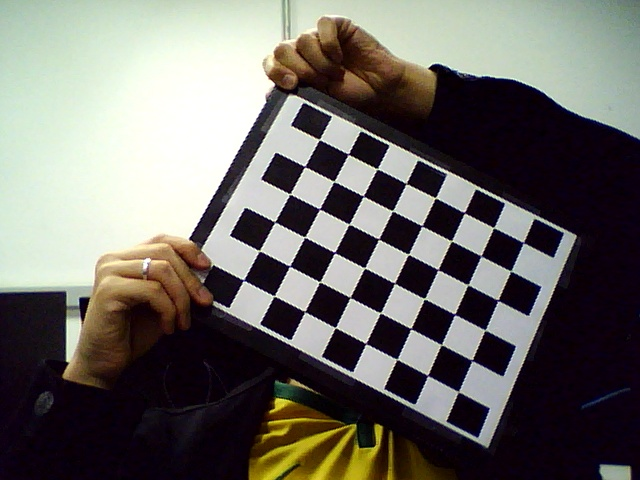
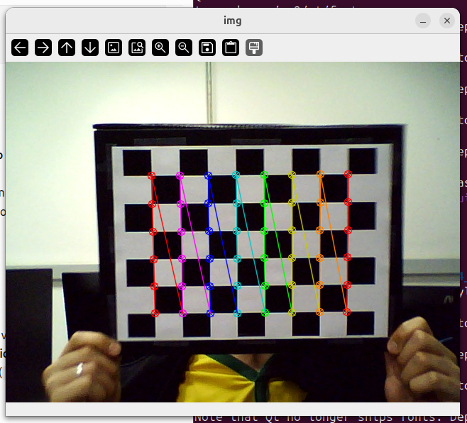
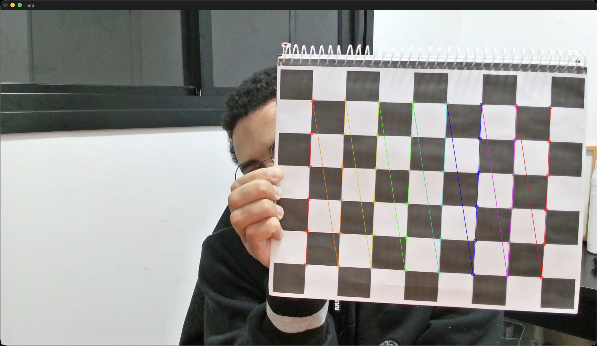
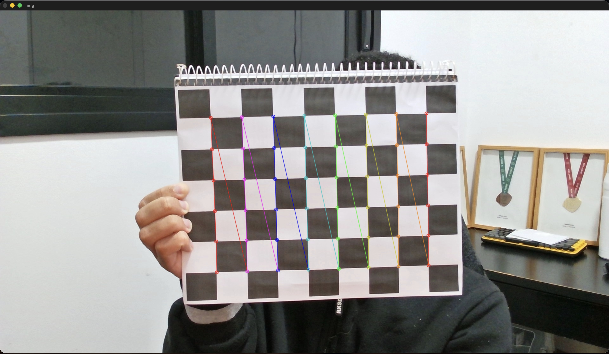
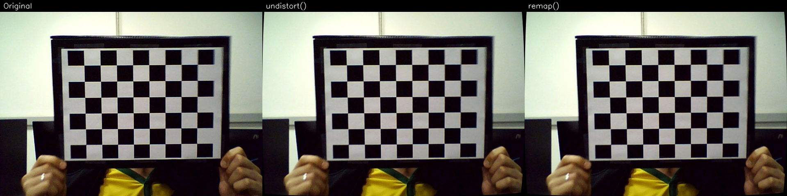
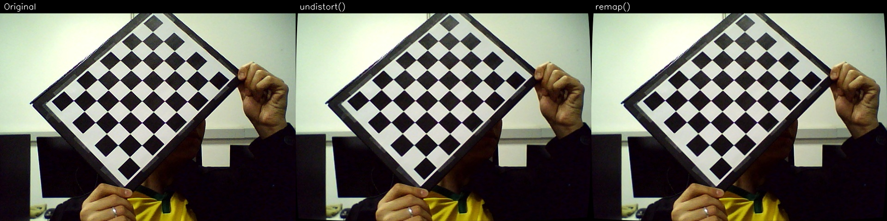

> Notebook: [`laboratorios/lab4/lab4.ipynb`](https://github.com/kaykyb/ufabc-cv/blob/main/laboratorios/lab4/lab4.ipynb)

**Autores:**

- Kayky de Brito dos Santos
- André Marques da Silva
- Rafael de Souza Coelho

Equipe 8 - "Sem Título"

**Data de realização dos experimentos:** 29 de junho de 2026

**Data de publicação do relatório:** 5 de julho de 2026

## Introdução

Este relatório descreve os experimentos do Laboratório 4 de Visão Computacional, dedicado à **calibração de câmeras**. Calibrar uma câmera significa estimar os parâmetros do modelo matemático que descreve como um ponto do mundo tridimensional é projetado no plano da imagem. Esses parâmetros se dividem em dois grupos: os **intrínsecos**, que dependem apenas da própria câmera e da lente (distância focal, ponto principal, distorção), e os **extrínsecos**, que descrevem a posição e a orientação da câmera em relação à cena.

Usamos o padrão de tabuleiro de xadrez (_checkerboard_) como referência, por ser um objeto plano com geometria conhecida e cantos fáceis de detectar com precisão sub-pixel. Os experimentos seguem a sequência do enunciado: primeiro calibramos a câmera a partir de um conjunto de imagens de exemplo fornecido, depois capturamos e calibramos a nossa própria webcam, calibramos ainda uma segunda câmera pessoal para comparação e, por fim, aplicamos os parâmetros obtidos para **corrigir a distorção radial** das imagens com as funções `cv.undistort()` e `cv.remap()`.

## Fundamentação Teórica

### Formação da imagem

Em coordenadas homogêneas, a projeção de um ponto 3D em um pixel $(u, v)$ é escrita como:

$$
s \begin{bmatrix} u \\ v \\ 1 \end{bmatrix} = K \, [\, R \mid t \,] \begin{bmatrix} X \\ Y \\ Z \\ 1 \end{bmatrix}
$$

onde $K$ contém os parâmetros intrínsecos e $[\,R \mid t\,]$ os extrínsecos.

### Parâmetros intrínsecos: a matriz K

A matriz de parâmetros intrínsecos tem a forma:

$$
K = \begin{bmatrix} f_x & s & c_x \\ 0 & f_y & c_y \\ 0 & 0 & 1 \end{bmatrix}
$$

- $f_x, f_y$ são as **distâncias focais** expressas em pixels.
- $c_x, c_y$ formam o **ponto principal**, a projeção do centro óptico no sensor, idealmente próximo ao centro da imagem.
- $s$ é o **skew** (cisalhamento), que mede a não ortogonalidade entre os eixos do sensor.
- A razão $f_y / f_x$ é o **aspect ratio** (relação de aspecto do pixel).

### Parâmetros extrínsecos: R e t

$R$ é uma matriz de rotação 3x3 e $t$ um vetor de translação 3x1. Juntos, eles descrevem a **transformação** que leva o sistema de coordenadas do mundo (fixado no tabuleiro) para o sistema de coordenadas da câmera. $R$ diz como a câmera está orientada em relação ao padrão e $t$ diz onde está o padrão em relação à câmera. Como o padrão aparece em uma pose diferente em cada foto, existe **um par $(R, t)$ por imagem**, enquanto $K$ e os coeficientes de distorção são únicos para a câmera.

### Distorção das lentes: o vetor dist

Lentes reais introduzem distorções. A mais visível é a **distorção radial**, que curva linhas retas tanto mais perto quanto mais longe do centro. O OpenCV modela isso com o vetor:

$$
\text{dist} = (k_1,\ k_2,\ p_1,\ p_2,\ k_3)
$$

onde $k_1, k_2, k_3$ são os coeficientes de distorção **radial** e $p_1, p_2$ os de distorção **tangencial** (causada por lente e sensor não perfeitamente paralelos). A correção reverte esse deslocamento, devolvendo às linhas retas do mundo sua aparência reta na imagem.

---

## Procedimentos experimentais

A detecção do tabuleiro usa `cv2.findChessboardCorners` seguida de `cv2.cornerSubPix` para refinar os cantos com precisão sub-pixel, e a calibração propriamente dita é feita por `cv2.calibrateCamera`, que devolve `ret, mtx (K), dist, rvecs, tvecs`.

Para obter a matriz de rotação $R$ 3x3 apresentada abaixo, convertemos cada vetor com `cv2.Rodrigues()`.

### A) Calibração com as imagens de exemplo fornecidas

O programa `L4_cal.py` percorre todas as imagens `.jpg` da pasta, detecta os cantos do tabuleiro e chama `calibrateCamera`. Executamos:

```bash
python3 L4_cal.py
```

O laço central do programa:

```python
CHECKERBOARD = (6, 8)
objpoints, imgpoints = [], []
objp = np.zeros((1, CHECKERBOARD[0] * CHECKERBOARD[1], 3), np.float32)
objp[0, :, :2] = np.mgrid[0:CHECKERBOARD[0], 0:CHECKERBOARD[1]].T.reshape(-1, 2)

for fname in glob.glob('*.jpg'):
    gray = cv2.cvtColor(cv2.imread(fname), cv2.COLOR_BGR2GRAY)
    ret, corners = cv2.findChessboardCorners(gray, CHECKERBOARD, ...)
    if ret:
        objpoints.append(objp)
        corners2 = cv2.cornerSubPix(gray, corners, (11, 11), (-1, -1), criteria)
        imgpoints.append(corners2)

ret, mtx, dist, rvecs, tvecs = cv2.calibrateCamera(
    objpoints, imgpoints, gray.shape[::-1], None, None)
```

### B) Captura e calibração da nossa webcam

Com o programa `L4_chess.py` capturamos entre 10 e 15 imagens do tabuleiro pela webcam, salvando uma a cada tecla `s` pressionada. Ajustamos o nome do arquivo de saída para o integrante Rafael, obtendo 15 imagens (`rafael_0.jpg` … `rafael_14.jpg`):

```python
if k == ord('s'):
    cv.imwrite("rafael_" + str(i) + ".jpg", frame)
    i = i + 1
```

Um dos quadros capturados, com o tabuleiro em uma pose típica:



Em seguida rodamos `L4_cal.py` sobre essas imagens, com o número de quadrados ajustado para `(6, 8)` conforme a observação do enunciado. A detecção dos cantos, desenhada por `cv2.drawChessboardCorners`, confirma que os 6x8 cantos internos foram localizados corretamente:



### C) Calibração de uma segunda câmera pessoal

Repetimos o procedimento com uma segunda câmera pessoal: a webcam do Kayky, um dispositivo diferente (e de maior resolução) da webcam usada no item (B). Capturamos 13 imagens do padrão e rodamos `L4_cal.py` sobre elas. A detecção dos 6x8 cantos internos nessa webcam:

| Detecção de cantos, pose 1                           | Detecção de cantos, pose 2                           |
| ---------------------------------------------------- | ---------------------------------------------------- |
|  |  |

### D) Correção de distorção das imagens

A correção de distorção foi elaborada em Jupyter Notebook. Antes de corrigir, refinamos a matriz da câmera com `cv.getOptimalNewCameraMatrix()`, que recebe um parâmetro de escala livre ($\alpha = 1$ mantém todos os pixels originais e devolve também a ROI válida). Depois aplicamos os **dois métodos** oferecidos pelo OpenCV, `cv.undistort()` e o _remapping_ com `cv.remap()`, usando os parâmetros de calibração da câmera do item (B):

```python
h, w = img.shape[:2]
newK, roi = cv.getOptimalNewCameraMatrix(K, dist, (w, h), 1, (w, h))

# Método 1: undistort direto
undistorted = cv.undistort(img, K, dist, None, newK)

# Método 2: remapping
mapx, mapy = cv.initUndistortRectifyMap(K, dist, None, newK, (w, h), 5)
remapped = cv.remap(img, mapx, mapy, cv.INTER_LINEAR)
```

## Análise e discussão

### A) Parâmetros obtidos com as imagens de exemplo

Calibração a partir das 13 imagens de exemplo detectadas:

**Matriz K (intrínsecos):**

$$
K_A = \begin{bmatrix} 536{,}07 & 0 & 342{,}37 \\ 0 & 536{,}02 & 235{,}54 \\ 0 & 0 & 1 \end{bmatrix}
$$

**Coeficientes de distorção `dist`** $(k_1, k_2, p_1, p_2, k_3)$:

$$
\text{dist}_A = (-0{,}2651,\ -0{,}0467,\ 0{,}00183,\ -0{,}000315,\ 0{,}2523)
$$

**Rotação e translação (primeira imagem, exemplo).** Convertendo o `rvec` da primeira pose com `Rodrigues`:

$$
R_A = \begin{bmatrix} -0{,}010 & 0{,}962 & 0{,}272 \\ -0{,}986 & 0{,}036 & -0{,}164 \\ -0{,}168 & -0{,}270 & 0{,}948 \end{bmatrix}
\qquad
t_A = \begin{bmatrix} -2{,}962 \\ 0{,}572 \\ 16{,}830 \end{bmatrix}
$$

**Significado dos parâmetros.** Como detalhado na fundamentação: $K$ reúne os intrínsecos (foco em pixels $f_x, f_y$, ponto principal $c_x, c_y$ e skew), sendo fixa para a câmera; $R$ é a orientação e $t$ a posição do padrão em relação à câmera naquela foto; e `dist` são os coeficientes que modelam a distorção radial ($k_1, k_2, k_3$) e tangencial ($p_1, p_2$) da lente.

### B) Parâmetros da nossa webcam e comparação com o item (A)

Calibração a partir das 15 imagens da webcam (`rafael_*.jpg`):

**Matriz K:**

$$
K_B = \begin{bmatrix} 686{,}34 & 0 & 305{,}47 \\ 0 & 684{,}21 & 234{,}34 \\ 0 & 0 & 1 \end{bmatrix}
$$

**Coeficientes de distorção `dist`:**

$$
\text{dist}_B = (0{,}0606,\ -0{,}5541,\ -0{,}00278,\ 0{,}000999,\ 2{,}1731)
$$

**Rotação e translação (primeira imagem):**

$$
R_B = \begin{bmatrix} 0{,}010 & -1{,}000 & -0{,}008 \\ 0{,}998 & 0{,}010 & -0{,}069 \\ 0{,}069 & -0{,}008 & 0{,}998 \end{bmatrix}
\qquad
t_B = \begin{bmatrix} 4{,}481 \\ -1{,}941 \\ 17{,}443 \end{bmatrix}
$$

**Parâmetros derivados da nossa webcam:**

| Parâmetro                  | Valor                                    |
| -------------------------- | ---------------------------------------- |
| Focal length               | $f_x = 686{,}34$ px, $f_y = 684{,}21$ px |
| Aspect ratio ($f_y / f_x$) | $0{,}9969$                               |
| Skew ($s$)                 | $0{,}0$                                  |
| Principal point            | $(305{,}47,\ 234{,}34)$ px               |

**Comentário sobre os resultados.** O _aspect ratio_ de $0{,}9969$, praticamente 1, indica que os pixels do sensor são essencialmente quadrados, o que é esperado em webcams modernas. O _skew_ nulo confirma que os eixos do sensor são ortogonais, então não há cisalhamento a corrigir. O _principal point_ $(305{,}47,\ 234{,}34)$ fica muito próximo do centro geométrico da imagem de $640\times480$, que seria $(320,\ 240)$, um pequeno desalinhamento de montagem da lente em relação ao sensor, totalmente dentro do normal.

**Comparação com o item (A).** As duas calibrações diferem de forma coerente com o fato de serem câmeras distintas:

- **Distância focal:** a webcam tem $f \approx 685$ px contra $\approx 536$ px do exemplo. Como a focal em pixels depende do tamanho do sensor e da lente, câmeras diferentes produzem valores diferentes; não é um "erro", e sim uma propriedade física de cada câmera.
- **Distorção:** o exemplo tem $k_1 = -0{,}265$, enquanto a webcam tem $k_1 = +0{,}061$ mas um $k_3 = 2{,}17$ elevado. Coeficientes de alta ordem grandes costumam indicar que a distorção é mais difícil de modelar ou que faltou variedade de poses/cobertura das bordas nas imagens de calibração, algo a melhorar com mais capturas cobrindo os cantos do quadro.
- **Ponto principal:** ambos ficam perto do centro das respectivas imagens, como esperado.

**Por que um $R$ e um $t$ por imagem?** Porque $R$ e $t$ são parâmetros **extrínsecos**: descrevem a pose (orientação e posição) do padrão de calibração em relação à câmera, e essa pose muda a cada foto, já que movemos o tabuleiro. Os intrínsecos ($K$, `dist`) são propriedades fixas da câmera e por isso são únicos. No sistema de coordenadas envolvido, $R$ e $t$ formam a transformação rígida que converte um ponto do **sistema de coordenadas do mundo** (fixado no tabuleiro) para o **sistema de coordenadas da câmera**; ter uma pose por imagem é justamente o que dá a `calibrateCamera` observações suficientes, sob ângulos variados, para separar os efeitos intrínsecos dos extrínsecos e estimar $K$ e `dist` de forma confiável.

### C) Parâmetros da segunda câmera e comparação com o item (B)

Calibração da segunda câmera pessoal (webcam do Kayky, imagens de $1920\times1080$), a partir de 13 imagens do padrão:

**Matriz K:**

$$
K_C = \begin{bmatrix} 1543{,}44 & 0 & 972{,}89 \\ 0 & 1550{,}10 & 576{,}45 \\ 0 & 0 & 1 \end{bmatrix}
$$

**Coeficientes de distorção `dist`:**

$$
\text{dist}_C = (0{,}1050,\ -0{,}5146,\ -0{,}000761,\ -0{,}002627,\ 0{,}4863)
$$

**Rotação e translação (primeira imagem):**

$$
R_C = \begin{bmatrix} 0{,}041 & 0{,}994 & 0{,}101 \\ -0{,}999 & 0{,}043 & -0{,}021 \\ -0{,}026 & -0{,}100 & 0{,}995 \end{bmatrix}
\qquad
t_C = \begin{bmatrix} 0{,}095 \\ 2{,}302 \\ 14{,}777 \end{bmatrix}
$$

**Parâmetros derivados:** focal $f_x = 1543{,}44$ px e $f_y = 1550{,}10$ px, _aspect ratio_ $f_y/f_x = 1{,}0043$, _skew_ $0{,}0$ e _principal point_ $(972{,}89,\ 576{,}45)$.

**Comparação com o item (B).** As diferenças em relação à webcam do item (B) são coerentes com serem duas webcams fisicamente distintas, de resoluções diferentes:

- **Distância focal:** a webcam do Kayky tem $f \approx 1547$ px, mais que o dobro dos $\approx 685$ px da webcam do item (B). A focal em pixels cresce com a resolução do sensor: como esta webcam captura em $1920\times1080$ (contra $640\times480$), a mesma abertura angular corresponde a muito mais pixels, elevando $f_x, f_y$. Não é "mais zoom", e sim mais pixels cobrindo o mesmo campo de visão.
- **Ponto principal:** $(972{,}89,\ 576{,}45)$ fica próximo do centro da imagem $1920\times1080$, que seria $(960,\ 540)$, novamente um pequeno desvio de montagem, como na webcam do item (B).
- **Aspect ratio e skew:** _aspect ratio_ de $1{,}0043$ (praticamente 1) e _skew_ nulo, confirmando pixels quadrados e eixos ortogonais, como esperado.
- **Distorção:** o perfil é parecido com o da webcam do item (B) no sinal de $k_1$ ($+0{,}105$) e no $k_2$ negativo ($-0{,}515$), mas o $k_3$ é bem menor ($0{,}49$ contra $2{,}17$). Um $k_3$ mais comportado indica que a distorção da webcam do Kayky foi mais fácil de modelar, provavelmente por conta da maior resolução e da nitidez das capturas, que deixaram a detecção dos cantos mais estável (visível nas figuras de detecção acima).

### D) Correção da distorção radial

Aplicamos a correção a duas imagens da webcam do Rafael, usando a matriz $K_B$ e o vetor $\text{dist}_B$ do item (B). O `getOptimalNewCameraMatrix` devolveu uma nova focal $\approx 692{,}7$ px e uma ROI válida de $(6, 8, 624, 462)$, o que mostra que a correção descarta uma fina faixa das bordas onde não há informação após reprojetar os pixels.

Cada figura mostra, lado a lado, a imagem original, o resultado de `undistort()` e o resultado de `remap()`:





Repetimos a correção com a segunda webcam, agora usando a matriz $K_C$ e o vetor $\text{dist}_C$ do item (C) sobre uma imagem da webcam do Kayky. Aqui o `getOptimalNewCameraMatrix` devolveu uma nova focal $\approx 1518{,}3$ px e ROI $(7, 15, 1904, 1051)$:


**Comparação e análise.** Em ambas as câmeras os dois métodos produzem **resultados visualmente idênticos**, e isso é esperado: `undistort()` é, internamente, uma composição de `initUndistortRectifyMap()` + `remap()` em uma única chamada.

Quanto ao efeito da correção em si, ele é sutil em ambas as câmeras porque a distorção radial é moderada, mas visível nas bordas: as linhas do tabuleiro que na imagem original apresentam leve curvatura ficam mais retas após a correção, e as extremidades da imagem são levemente "empurradas" para dentro, deixando a pequena margem preta/cortada correspondente à ROI. A correção é justamente o que se deseja antes de medições métricas, reconstrução 3D ou montagem de mosaicos, tarefas em que assumir o modelo pinhole ideal exige que a distorção da lente já tenha sido removida.

> **Placeholder:** o enunciado pede pelo menos duas imagens por cada integrante da equipe, uma da webcam e outra de uma câmera diferente. Já temos a correção da webcam do **Rafael** e da webcam do **Kayky** acima; falta capturar e adicionar aqui as imagens do **André**, além de uma imagem de uma câmera diferente (não-webcam) por integrante, com a mesma análise de correção lado a lado.

## Conclusões

Os experimentos permitiram percorrer o pipeline completo de calibração de câmeras e entender, na prática, o significado de cada parâmetro do modelo. Vimos que os **intrínsecos** ($K$ e os coeficientes de distorção) são propriedades fixas de cada câmera, enquanto os **extrínsecos** ($R, t$) descrevem a pose do padrão em cada imagem, o que explica por que há um par $(R, t)$ por foto. A comparação entre a câmera de exemplo e a nossa webcam deixou claro que distância focal e distorção variam de câmera para câmera por razões físicas de sensor e lente, e a análise dos parâmetros derivados (aspect ratio ~1, skew nulo, ponto principal próximo do centro) confirmou o comportamento esperado de uma webcam.

## Declaração de uso de Inteligência Artificial Generativa

Em atendimento à Portaria CNPq 2664/2026, declaramos que ferramentas de IA generativa foram utilizadas como apoio na **organização e redação** deste relatório (estruturação do texto e revisão de clareza) e no **cálculo dos parâmetros derivados** a partir das matrizes de calibração (conversão de `rvec` para $R$, razão de aspecto, e execução da rotina de correção de distorção com `undistort`/`remap`). Todas as capturas de imagem e execuções de calibração foram realizadas pela equipe, e os resultados numéricos e suas interpretações foram conferidos e validados pelos autores, que se responsabilizam integralmente pelo conteúdo final.

## Referências

- [1] LearnOpenCV. _Geometry of Image Formation._ <https://learnopencv.com/geometry-of-image-formation/>

- [2] LearnOpenCV. _Camera Calibration using OpenCV._ <https://learnopencv.com/camera-calibration-using-opencv/>

- [3] OpenCV. _Camera Calibration (Python tutorial)._ <https://docs.opencv.org/4.x/dc/dbb/tutorial_py_calibration.html>

- [4] J.-Y. Bouguet. _Camera Calibration Toolbox for Matlab._ <http://robots.stanford.edu/cs223b04/JeanYvesCalib/>

- [5] Wikipedia. _Pinhole camera model._ <https://en.wikipedia.org/wiki/Pinhole_camera_model>

- [6] Material da disciplina UFABC, Visão Computacional, Laboratório 4.
