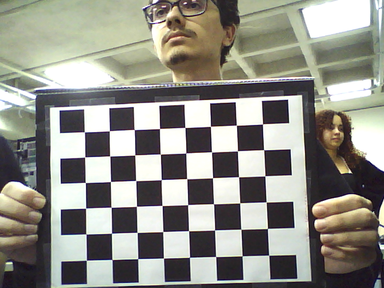
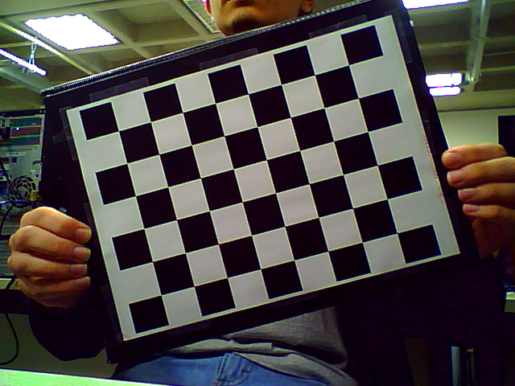
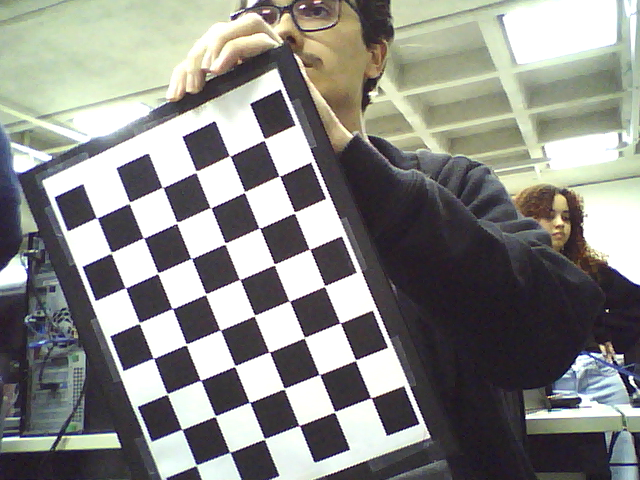
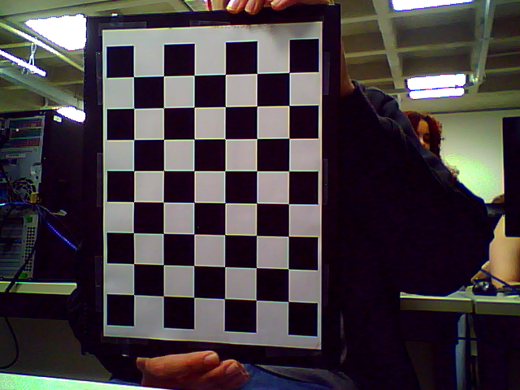

> Código e dados: [`laboratorios/lab5/`](https://github.com/kaykyb/ufabc-cv/tree/main/laboratorios/lab5)

**Autores:**

- Kayky de Brito dos Santos
- André Marques da Silva
- Rafael de Souza Coelho

Equipe 8 - "Sem Título"

**Data de realização dos experimentos:** 8 de julho de 2026

**Data de publicação do relatório:** 15 de julho de 2026

## Introdução

Este relatório descreve os experimentos do Laboratório 5 de Visão Computacional, dedicado à **câmera estéreo**. A visão humana é binocular: os dois olhos capturam a mesma cena de pontos de vista ligeiramente deslocados, e é dessa diferença (a **paralaxe**) que o cérebro extrai a sensação de profundidade. Uma imagem isolada é apenas uma projeção plana do mundo, sem informação direta de distância; ao acrescentar uma segunda captura feita de um ponto de vista deslocado, torna-se possível cruzar os raios que passam pelos centros ópticos das duas câmeras e recuperar, por **triangulação**, a posição tridimensional dos pontos da cena.

Os experimentos seguem a sequência do enunciado: primeiro estudamos a teoria de estereoscopia e **geometria epipolar**, com os parâmetros conjuntos de duas câmeras; depois construímos uma câmera estereoscópica simples com duas webcams idênticas do laboratório; e por fim executamos o pipeline completo de **calibração estéreo** e geração de imagem 3D anáglifa, primeiro com o código e as imagens de exemplo do LearnOpenCV e depois com imagens de calibração capturadas pela nossa própria câmera, encerrando com a **gravação de um vídeo 3D** em MP4.

## Fundamentação Teórica

### Triangulação e geometria epipolar

Para triangular um ponto 3D $X$ é preciso conhecer a pose relativa das duas câmeras e encontrar a **correspondência** do ponto entre as duas imagens: onde o mesmo ponto físico aparece na vista esquerda e na direita. Procurar essa correspondência na imagem inteira seria caro e ambíguo, como vimos no Laboratório 3 com o *feature matching*. A **geometria epipolar** resolve isso restringindo a busca a uma única linha, o que reduz drasticamente o espaço de procura.

Respondendo às questões do enunciado:

- **Epípolos:** o epípolo de uma imagem é a projeção, nessa imagem, do centro óptico da **outra** câmera. Toda linha epipolar de uma imagem passa pelo seu epípolo.
- **Plano epipolar:** é o plano definido por três pontos: o ponto 3D observado $X$ e os dois centros ópticos $C_1$ e $C_2$. Cada ponto da cena define o seu próprio plano epipolar, e todos eles contêm a reta que liga $C_1$ a $C_2$ (a *baseline*).
- **Linha epipolar:** é a interseção do plano epipolar com o plano de cada imagem. Dado um ponto $x$ na imagem esquerda, o seu correspondente $x'$ na imagem direita está necessariamente sobre a linha epipolar associada, e é só nela que precisamos buscar.

### Matriz fundamental

A **matriz fundamental** $F$ codifica toda a geometria epipolar de um par de imagens. É uma matriz 3x3, de posto 2, que relaciona pontos correspondentes em coordenadas de pixel:

$$
x'^{\top} F \, x = 0
$$

onde $x$ e $x'$ são as projeções do mesmo ponto 3D nas duas imagens, em coordenadas homogêneas. O produto $F x$ devolve os coeficientes da linha epipolar na segunda imagem.

Quanto aos seus **parâmetros**: $F$ combina os parâmetros **extrínsecos** do par (a rotação $R$ e a translação $t$ entre as câmeras) com os parâmetros **intrínsecos** de cada uma (matrizes $K_1$ e $K_2$, com focais e pontos principais, vistas no Laboratório 4):

$$
F = K_2^{-\top} \, [t]_\times R \, K_1^{-1}
$$

ou seja, é a matriz essencial $E = [t]_\times R$ "envelopada" pelas matrizes intrínsecas. Uma propriedade importante é que $F$ pode ser estimada diretamente de correspondências de pontos, mesmo **sem conhecer** os parâmetros intrínsecos das câmeras.

### Disparidade estéreo

Com as duas imagens **retificadas** (transformadas para que as linhas epipolares fiquem horizontais e alinhadas), um mesmo ponto da cena aparece na mesma linha das duas imagens, mas em colunas diferentes. A **disparidade** é essa diferença horizontal de posição:

$$
d = x_{esq} - x_{dir}
$$

A disparidade é inversamente proporcional à profundidade: para uma *baseline* $B$ e distância focal $f$,

$$
Z = \frac{f \cdot B}{d}
$$

Objetos próximos têm disparidade grande e objetos distantes têm disparidade pequena. É exatamente o princípio da paralaxe da visão humana, e é o que permite converter um par estéreo em um mapa de profundidade.

---

## Procedimentos experimentais

### Construção da câmera estereoscópica

Seguimos os passos da seção _Steps To Create The Stereo Camera Setup_ da referência [2], usando **duas webcams USB iguais** do laboratório (capturas em $640 \times 480$) sobre uma estrutura rígida montada com material reciclável:

1. As duas webcams foram apoiadas **paralelamente** sobre a base rígida e plana, com os eixos ópticos alinhados para a frente;
2. Medimos a **distância interpupilar** do integrante Kayky, 6 cm, e usamos esse valor como distância entre os eixos ópticos das câmeras;
3. As câmeras foram **fixadas firmemente** na base, pois após a calibração elas não podem se mover uma em relação à outra: qualquer deslocamento invalida os parâmetros estimados;
4. Marcamos na base a posição de cada câmera, como guia para o caso de precisar refazer a fixação.

> **Placeholder:** adicionar as fotos do setup montado pela equipe (frente e verso), o material usado na estrutura e o nome dado à câmera.

### A) Obtenção dos códigos do exemplo

O material de partida é o projeto `stereo-camera` de Satya Mallick (LearnOpenCV), cujo código-fonte completo está disponível no GitHub do autor:

<https://github.com/spmallick/learnopencv/tree/master/stereo-camera>

O projeto contém três códigos em Python (`calibrate.py`, `capture_images.py` e `movie3d.py`), suas contrapartes em C++ e a pasta `data/` com imagens e vídeos de exemplo. No laboratório, salvamos os arquivos em uma pasta com o nome de um dos integrantes e os apagamos do computador ao final da aula, conforme o enunciado.

### B) Execução do exemplo com as imagens fornecidas

Primeiro executamos o pipeline com os dados que acompanham o projeto:

```bash
python3 calibrate.py   # calibração estéreo com as imagens de exemplo
python3 movie3d.py     # geração e apresentação da imagem 3D anáglifa
```

O `calibrate.py` percorre os pares de imagens do tabuleiro nas pastas `data/stereoL/` e `data/stereoR/`, detecta os cantos com `cv2.findChessboardCorners`, refina com `cv2.cornerSubPix` e calibra cada câmera individualmente com `cv2.calibrateCamera`, exatamente como no Laboratório 4. Em seguida faz a **calibração estéreo** com `cv2.stereoCalibrate` (usando a flag `CALIB_FIX_INTRINSIC`, que mantém as intrínsecas fixas e estima apenas a relação entre as câmeras), a **retificação** com `cv2.stereoRectify` e calcula os mapas de retificação com `cv2.initUndistortRectifyMap`, salvando-os em `data/params_py.xml`.

O `movie3d.py` lê esse XML, aplica `cv2.remap` aos dois fluxos e monta o **anáglifo** vermelho/ciano: os canais azul e verde vêm da imagem direita e o canal vermelho vem da imagem esquerda. Com os óculos 3D anáglifos (lente vermelha no olho esquerdo e ciano no direito), cada olho recebe a imagem da câmera correspondente e o cérebro reconstrói a profundidade.

Já nessa etapa notamos que o anáglifo gerado com a calibração de exemplo não fica estável para o nosso conjunto de câmeras: os parâmetros são do setup de quem gravou os dados originais, e cada par de câmeras tem intrínsecas e pose relativa próprias. Isso evidencia a necessidade de uma **calibração própria**, feita na parte seguinte.

### C) Calibração da câmera construída pela equipe

Adaptamos os três programas ao nosso experimento, renomeando-os com o nome do integrante André, conforme pede o enunciado. As principais alterações foram o tamanho do padrão, o prefixo dos arquivos gravados e os índices das câmeras.

#### Captura das imagens de calibração

```bash
python3 capture_images_andre.py
```

O programa (adaptado do [`capture_images.py`](https://github.com/spmallick/learnopencv/tree/master/stereo-camera) original) mostra as duas webcams ao vivo com um contador regressivo de 3 segundos; a cada ciclo, se os cantos do tabuleiro forem detectados **simultaneamente nas duas imagens**, o par é salvo em `data/stereoL/` e `data/stereoR/` com o prefixo `Andre_img`, o nome do integrante, como pede o enunciado. O trecho central da captura:

```python
retR, cornersR = cv2.findChessboardCorners(grayR, (8, 6), None)
retL, cornersL = cv2.findChessboardCorners(grayL, (8, 6), None)

if (retR == True) and (retL == True) and timer <= 0:
    count += 1
    cv2.imwrite(output_path + 'stereoR/Andre_img%d.png' % count, frameR)
    cv2.imwrite(output_path + 'stereoL/Andre_img%d.png' % count, frameL)
```

Usamos o mesmo padrão de tabuleiro da aula anterior, com **8x6 cantos internos**, e capturamos **13 pares** de imagens (`Andre_img1.png` a `Andre_img13.png`), dentro da faixa de 10 a 15 pedida pelo enunciado, variando a posição e a inclinação do tabuleiro entre as capturas. Dois dos pares capturados:

| Câmera esquerda                     | Câmera direita                     |
| ----------------------------------- | ---------------------------------- |
|  |  |
|  |  |

#### Calibração estéreo

```bash
python3 calibrate_andre.py
```

O programa (adaptado do [`calibrate.py`](https://github.com/spmallick/learnopencv/tree/master/stereo-camera) original) foi ajustado para o padrão de 8x6 cantos internos e para ler os nossos 13 pares com o prefixo `Andre_img`:

```python
objp = np.zeros((8*6, 3), np.float32)
objp[:, :2] = np.mgrid[0:8, 0:6].T.reshape(-1, 2)

for i in tqdm(range(1, 14)):
    imgL = cv2.imread(pathL + "Andre_img%d.png" % i)
    imgR = cv2.imread(pathR + "Andre_img%d.png" % i)
    ...
```

A execução segue o mesmo pipeline descrito no item (B): calibração individual, `stereoCalibrate`, `stereoRectify` (com `rectify_scale = 1`, que preserva todos os pixels) e geração dos mapas de retificação, salvos em `data/params_py.xml`.

#### Visualização ao vivo

```bash
python3 movie3d_andre.py
```

Alteramos o programa (adaptado do [`movie3d.py`](https://github.com/spmallick/learnopencv/tree/master/stereo-camera) original) para ler **diretamente das duas webcams** (`cv2.VideoCapture(0)` e `cv2.VideoCapture(1)`), em vez dos vídeos de exemplo, aplicando os nossos mapas de retificação e exibindo o anáglifo ao vivo em uma janela de 700x700:

```python
Left_nice  = cv2.remap(imgL, Left_Stereo_Map_x,  Left_Stereo_Map_y,  cv2.INTER_LANCZOS4, cv2.BORDER_CONSTANT, 0)
Right_nice = cv2.remap(imgR, Right_Stereo_Map_x, Right_Stereo_Map_y, cv2.INTER_LANCZOS4, cv2.BORDER_CONSTANT, 0)

output = Right_nice.copy()
output[:, :, 0] = Right_nice[:, :, 0]  # azul  (olho direito)
output[:, :, 1] = Right_nice[:, :, 1]  # verde (olho direito)
output[:, :, 2] = Left_nice[:, :, 2]   # vermelho (olho esquerdo)
```

Durante toda essa etapa as webcams permaneceram fixas na base, sem movimento relativo entre elas.

### D) Gravação do vídeo 3D

Para gravar o vídeo criamos o `movie3d_andre_gravacao.py` a partir do programa de visualização ao vivo, acrescentando um `cv2.VideoWriter` (codec XVID, 24 fps, quadros de 700x700) e um tempo fixo de gravação, após o qual o programa encerra sozinho:

```python
fourcc = cv2.VideoWriter_fourcc(*'XVID')
video = cv2.VideoWriter('video3D.avi', fourcc, fps, (largura, altura))

while True:
    ...
    video.write(output)
    if (time.time() - inicio) >= tempo_gravacao:
        break
```

Gravamos primeiro em **AVI** (contêiner mais resistente a interrupções durante a escrita com o OpenCV) e depois convertemos para **MP4** com o `ffmpeg`, atendendo ao formato pedido pelo enunciado. O vídeo final tem **13 segundos**, dentro da faixa de 10 a 20 segundos solicitada. O resultado:

<video controls width="100%">
  <source src="video3D.mp4" type="video/mp4">
</video>

## Análise e discussão

### B) Parâmetros necessários para a câmera estéreo

Consultando a teoria de calibração e correção de distorção (Laboratório 4) e o exemplo executado, os parâmetros necessários para uma câmera estéreo são:

**Parâmetros internos de cada câmera:**

- Matriz intrínseca $K$ de cada câmera (distâncias focais $f_x, f_y$ e ponto principal $c_x, c_y$);
- Coeficientes de distorção $(k_1, k_2, p_1, p_2, k_3)$ de cada lente, que corrigem as distorções radial e tangencial.

**Parâmetros externos do par:**

- Matriz de rotação $R$ e vetor de translação $T$ entre as duas câmeras (a transformação rígida que leva o sistema de coordenadas de uma câmera ao da outra).

**Matrizes derivadas:**

- Matriz essencial $E$, que relaciona pontos correspondentes em coordenadas normalizadas (câmeras calibradas);
- Matriz fundamental $F$, que faz o mesmo em coordenadas de pixel, sem exigir calibração prévia.

**Parâmetros de retificação:**

- Transformações de retificação de cada câmera e matrizes de projeção retificadas, calculadas por `stereoRectify`, além da matriz $Q$ de reprojeção de disparidade para profundidade;
- Mapas de retificação (um par $x/y$ por câmera), pré-calculados por `initUndistortRectifyMap`, que aplicados com `remap` corrigem e alinham as imagens.

**Existe arquivo necessário para a execução?** Sim. O `movie3d.py` (e as nossas variantes) depende do arquivo **`data/params_py.xml`**, gerado previamente pelo `calibrate.py`. Sem esse arquivo a retificação não pode ser aplicada e o programa não funciona. Além dele, a etapa (B) usa as imagens e vídeos de exemplo da pasta `data/`.

### C) Parâmetros e valores obtidos para a nossa câmera

O processo de calibração da nossa câmera estéreo estima, nesta ordem:

1. **Câmera esquerda:** matriz intrínseca $K_L$ (3x3), coeficientes de distorção $\text{dist}_L$ (1x5), um par de vetores de rotação e translação por imagem do tabuleiro, e a nova matriz ótima $K_L^{novo}$ com sua região de interesse (ROI);
2. **Câmera direita:** os mesmos parâmetros, $K_R$, $\text{dist}_R$, poses por imagem, $K_R^{novo}$ e ROI;
3. **Calibração estéreo:** matriz de rotação $R$ (3x3) e vetor de translação $T$ (3x1) entre as câmeras, matriz essencial $E$ e matriz fundamental $F$ (3x3 cada);
4. **Retificação:** transformações de retificação $R_1$ e $R_2$, matrizes de projeção $P_1$ e $P_2$, matriz $Q$ de disparidade para profundidade e as respectivas ROIs;
5. **Mapas de retificação:** `Left_Stereo_Map` e `Right_Stereo_Map`, cada um com um par de matrizes $(x, y)$ do tamanho da imagem ($480 \times 640$), que mapeiam cada pixel da imagem retificada de volta ao pixel de origem na imagem original.

Como o `calibrate_andre.py` original não imprime os valores intermediários (apenas salva os mapas finais), reexecutamos o mesmo pipeline sobre os 13 pares versionados em `laboratorios/lab5/data/` para extraí-los. Os mapas resultantes coincidem com os do `data/params_py.xml` gravado no laboratório (diferenças de no máximo 1 unidade de quantização), confirmando que os valores abaixo são os da calibração efetivamente usada no experimento.

**Calibração individual.** Os erros RMS de reprojeção foram de $0{,}232$ px (esquerda) e $0{,}216$ px (direita), valores bons para webcams, indicando que as imagens do tabuleiro e a detecção dos cantos estavam saudáveis. As matrizes intrínsecas e os coeficientes de distorção:

$$
K_L = \begin{bmatrix} 754{,}67 & 0 & 324{,}52 \\ 0 & 754{,}90 & 255{,}49 \\ 0 & 0 & 1 \end{bmatrix}
\qquad
K_R = \begin{bmatrix} 696{,}60 & 0 & 301{,}78 \\ 0 & 695{,}24 & 211{,}51 \\ 0 & 0 & 1 \end{bmatrix}
$$

$$
\text{dist}_L = (0{,}0506,\ -0{,}1584,\ -0{,}0022,\ 0{,}0004,\ 0{,}7846)
$$

$$
\text{dist}_R = (0{,}0722,\ -0{,}7232,\ -0{,}0019,\ -0{,}0017,\ 4{,}0169)
$$

Chama a atenção que, embora as webcams sejam do mesmo modelo, as focais diferem em ~8% ($f \approx 755$ px contra $\approx 696$ px), reforçando que cada exemplar precisa da sua própria calibração. As novas matrizes ótimas (`getOptimalNewCameraMatrix`, $\alpha = 1$) têm focais de $760{,}9$/$758{,}4$ px (ROI $(4, 4, 631, 472)$) e $710{,}2$/$699{,}0$ px (ROI $(14, 11, 605, 448)$).

**Calibração estéreo.** Aqui aparece o primeiro sinal quantitativo do problema relatado na seção seguinte: o RMS do `stereoCalibrate` foi de $\mathbf{56{,}83}$ **px**, contra menos de $0{,}25$ px das calibrações individuais (um valor saudável seria da mesma ordem). A transformação estimada entre as câmeras:

$$
R = \begin{bmatrix} 0{,}9822 & -0{,}1880 & -0{,}0029 \\ 0{,}1881 & 0{,}9818 & 0{,}0282 \\ -0{,}0024 & -0{,}0283 & 0{,}9996 \end{bmatrix}
\qquad
T = \begin{bmatrix} 1{,}3600 \\ -1{,}0308 \\ -1{,}0135 \end{bmatrix}
$$

$R$ indica uma rotação de $\approx 10{,}8°$ em torno do eixo óptico entre as duas câmeras, e $T$ (em unidades de quadrados do tabuleiro, $|T| \approx 1{,}98$) está longe do esperado para câmeras paralelas separadas apenas horizontalmente, que seria um vetor quase puro em $x$. As matrizes essencial e fundamental:

$$
E = \begin{bmatrix} 0{,}1931 & 1{,}0242 & -1{,}0018 \\ -0{,}9921 & 0{,}2290 & -1{,}3565 \\ 1{,}2682 & 1{,}1414 & 0{,}0354 \end{bmatrix}
\qquad
F = \begin{bmatrix} 1{,}39 \cdot 10^{-5} & 7{,}38 \cdot 10^{-5} & -0{,}0780 \\ -7{,}24 \cdot 10^{-5} & 1{,}68 \cdot 10^{-5} & -0{,}0561 \\ 0{,}0758 & 0{,}0325 & 1 \end{bmatrix}
$$

**Retificação.** A degeneração fica explícita nos produtos do `stereoRectify`: as matrizes de projeção retificadas resultaram com ponto principal em $(882{,}86,\ 441{,}33)$, **fora** da imagem de $640 \times 480$, a ROI retificada da câmera esquerda veio **vazia** ($(0,0,0,0)$) e a da direita reduzida a uma faixa de $433 \times 29$ px. A matriz $Q$ de reprojeção de disparidade para profundidade:

$$
Q = \begin{bmatrix} 1 & 0 & 0 & -882{,}86 \\ 0 & 1 & 0 & -441{,}33 \\ 0 & 0 & 0 & 728{,}68 \\ 0 & 0 & -0{,}5038 & 0 \end{bmatrix}
$$

**Parâmetros salvos no arquivo XML:** dos parâmetros acima, o `calibrate_andre.py` salva em `data/params_py.xml` apenas os quatro **mapas de retificação**, que são o produto final consumido pelos programas de visualização:

- `Left_Stereo_Map_x` e `Left_Stereo_Map_y`: mapeamento das coordenadas $x$ e $y$ para correção e retificação da câmera esquerda;
- `Right_Stereo_Map_x` e `Right_Stereo_Map_y`: o equivalente para a câmera direita.

Cada mapa é uma matriz $480 \times 640$ (armazenada como pares de inteiros de 16 bits, `type "2s"`). As matrizes intermediárias ($K$, dist, $R$, $T$, $E$, $F$, $Q$) não são persistidas: existem apenas em memória durante a calibração.

### D) Percepção individual e comparação entre ao vivo e gravado

O resultado ficou aquém do esperado, tanto ao vivo quanto na gravação, e as percepções individuais refletem isso:

**[Kayky]** Com os óculos anáglifos não foi possível fundir as duas imagens em uma cena única com profundidade: o anáglifo aparece visivelmente **torto**, com a cena inclinada e deformada nas bordas, e tentar forçar a fusão causa desconforto ocular em poucos segundos. Refizemos a calibração diversas vezes e o resultado se manteve.

**[André]** As imagens retificadas parecem rotacionadas uma em relação à outra, como se o "horizonte" de cada olho estivesse em ângulos diferentes, e os objetos aparecem duplicados sem convergir. Como o problema persistiu em todas as tentativas de recalibração, mesmo variando bem as poses do tabuleiro, a suspeita é de erro no script, e não nas imagens de calibração.

**[Rafael]** Além da imagem torta, as duas câmeras estão claramente **fora de sincronia**: quando algo se move na cena, os canais vermelho e ciano mostram instantes diferentes do movimento, com um canal atrasado em relação ao outro. No vídeo gravado isso fica ainda mais evidente do que ao vivo.

**Comparação e análise.** Tentamos recalibrar diversas vezes e o anáglifo continuou torto, o que indica que o problema não está na qualidade das imagens de calibração, e sim no pipeline. Os números do item (C) quantificam isso: as calibrações individuais fecham com RMS de $\approx 0{,}22$ px, mas a estéreo salta para $56{,}8$ px, com uma rotação de $10{,}8°$ em torno do eixo óptico entre as câmeras, um $T$ longe de uma *baseline* puramente horizontal e uma retificação degenerada (ROI esquerda vazia, ponto principal projetado para fora da imagem). Ou seja, as câmeras são individualmente boas, mas os **pares** de imagens não são consistentes com uma geometria estéreo rígida. Ao inspecionar os scripts encontramos uma causa provável: no `capture_images_andre.py` a captura foi feita com `CamL_id = 1` e `CamR_id = 0`, mas o `movie3d_andre.py` e o `movie3d_andre_gravacao.py` abrem `CamL = cv2.VideoCapture(0)` e `CamR = cv2.VideoCapture(1)`, ou seja, com os **índices esquerda/direita trocados** em relação à calibração. Com isso, o mapa de retificação calculado para a câmera esquerda é aplicado à direita e vice-versa; como `stereoRectify` embute em cada mapa uma rotação própria para aquela câmera, aplicá-los invertidos produz exatamente a cena inclinada e deformada que observamos, e nenhuma recalibração resolve, porque o erro é reintroduzido na visualização.

Já a falta de sincronismo tem causa independente: as duas webcams USB são lidas **sequencialmente** com `CamR.read()` e `CamL.read()`, sem nenhum disparo (*trigger*) de hardware comum, então cada olho recebe um instante diferente da cena, e o descompasso varia com a carga do barramento USB. A geometria epipolar pressupõe que as duas imagens sejam simultâneas; com movimento na cena, o atraso entre os canais gera disparidades falsas que o cérebro não consegue interpretar como profundidade. Na gravação o efeito piora porque o `VideoWriter` fixa 24 fps enquanto a captura real oscila, acumulando o atraso relatado. O dessincronismo também contamina a **calibração**: se o tabuleiro se moveu entre as leituras esquerda e direita de um mesmo "par", aquele par viola a geometria rígida que o `stereoCalibrate` assume, o que ajuda a explicar o RMS estéreo de $56{,}8$ px convivendo com calibrações individuais de $0{,}22$ px.

Como correção, o próximo passo é igualar os índices das câmeras entre captura e visualização (ou regravar a calibração com os índices da visualização), validar a retificação desenhando linhas epipolares horizontais sobre um par retificado e medir o erro de reprojeção da calibração; para o sincronismo, ler os frames em *threads* separadas e descartar pares com defasagem alta já atenuaria o problema.

### E) Aplicação no Trabalho Final

O nosso trabalho final é o [Programa de Reconhecimento de Valores de Cédulas](), um sistema fixo no ponto de venda que reconhece cédulas do Real aproximadas da câmera e anuncia o valor por áudio, voltado a comerciantes com baixa visão. A câmera estereoscópica construída neste laboratório pode contribuir com o sistema em três pontos técnicos:

1. **Gatilho por profundidade.** Como a usuária não enxerga para enquadrar a nota, o sistema precisa decidir sozinho quando há uma cédula "apresentada". Com o par estéreo calibrado, a disparidade ($Z = fB/d$) permite detectar que um objeto entrou na zona útil de leitura (por exemplo, entre 15 e 40 cm da câmera) e disparar a classificação apenas nesse momento, evitando leituras espúrias do movimento do caixa ao fundo.
2. **Segmentação da cédula pelo fundo.** O balcão de um comércio é um fundo visualmente poluído, como vimos no Laboratório 3 com os falsos positivos do ambiente. Um mapa de disparidade denso separa o plano próximo (a mão com a cédula) do plano distante (balcão, cliente, prateleiras) por um simples limiar de profundidade, entregando à rede neural um recorte limpo da nota e reduzindo falsos positivos.
3. **Verificação de tamanho físico.** Conhecendo a profundidade $Z$ da cédula e as dimensões da sua projeção na imagem, é possível estimar o tamanho **real** do objeto (via matriz $Q$ da retificação). Isso cria uma checagem de plausibilidade barata contra fraudes grosseiras, como apresentar a foto de uma nota na tela de um celular, cujo tamanho físico não corresponde ao de uma cédula verdadeira.

O custo de hardware permanece baixo (duas webcams em vez de uma, com *baseline* fixa de 6 cm), e o requisito do projeto de que as câmeras fiquem **fixas** no ponto de venda é exatamente a condição que a calibração estéreo exige para permanecer válida.

> **Placeholder:** adicionar o desenho/diagrama do posicionamento da câmera estéreo no caixa (vista lateral com a zona útil de leitura), como pede o enunciado.

## Conclusões

Os experimentos percorreram o caminho completo da visão estéreo: da teoria (geometria epipolar, matriz fundamental, disparidade) à prática (construção física da câmera, calibração estéreo e geração de conteúdo 3D anáglifo ao vivo e gravado). A execução com os dados de exemplo deixou clara a necessidade de calibrar o próprio conjunto de câmeras, já que os parâmetros intrínsecos e a pose relativa são únicos de cada montagem.

O resultado final, porém, não alcançou o efeito 3D esperado: o anáglifo ficou torto e as câmeras dessincronizadas, mesmo após diversas recalibrações. O lado positivo é que a investigação foi didática: a persistência do defeito frente a novas calibrações nos levou a procurar o erro no pipeline, e não nos dados, e os números confirmaram (calibrações individuais com RMS de $0{,}22$ px contra $56{,}8$ px na estéreo, com retificação degenerada). Encontramos ainda uma troca dos índices esquerda/direita das câmeras entre o script de captura e os de visualização, que faz os mapas de retificação serem aplicados às câmeras erradas. A experiência reforça duas lições da visão estéreo: a retificação é um par casado (cada mapa pertence a uma câmera específica, e trocá-los corrompe a geometria) e a simultaneidade das capturas é uma premissa, não um detalhe, já que webcams USB lidas em sequência produzem disparidades falsas em cenas com movimento.

Como evolução, além de corrigir os índices e revalidar a retificação com linhas epipolares e erro de reprojeção, valeria sincronizar a leitura dos frames por *threads*. São pontos que pretendemos levar para a aplicação da câmera estéreo no trabalho final.

## Declaração de uso de Inteligência Artificial Generativa

Em atendimento à Portaria CNPq 2664/2026, declaramos que a ferramenta de IA generativa foi utilizada como apoio na **organização e redação** deste relatório (estruturação do texto e revisão de clareza) e no **debug do pipeline de calibração** sobre as imagens capturadas pela equipe, para extração dos valores numéricos apresentados no item (C) da análise (validados contra o arquivo XML gerado no laboratório). Todas as capturas, a construção da câmera, as execuções de calibração e as gravações foram realizadas pela equipe, e o conteúdo final foi conferido e validado pelos autores, que se responsabilizam integralmente por ele.

## Referências

- [1] LearnOpenCV. _Introduction to Epipolar Geometry and Stereo Vision._ <https://learnopencv.com/introduction-to-epipolar-geometry-and-stereo-vision/>

- [2] LearnOpenCV. _Making a Low-Cost Stereo Camera Using OpenCV._ <https://learnopencv.com/making-a-low-cost-stereo-camera-using-opencv/> (código em <https://github.com/spmallick/learnopencv/tree/master/stereo-camera>)

- [3] LearnOpenCV. _Understanding Lens Distortion._ <https://learnopencv.com/understanding-lens-distortion/>

- [4] C. Loop e Z. Zhang. _Computing Rectifying Homographies for Stereo Vision._ IEEE Conference on Computer Vision and Pattern Recognition, 1999.

- [5] LearnOpenCV. _Geometry of Image Formation._ <https://learnopencv.com/geometry-of-image-formation/>

- [6] CNPq. _Portaria nº 2664/2026._ <http://memoria2.cnpq.br/web/guest/view/-/journal_content/56_INSTANCE_0oED/10157/23142775>

- [7] Material da disciplina UFABC, Visão Computacional, Laboratório 5.
