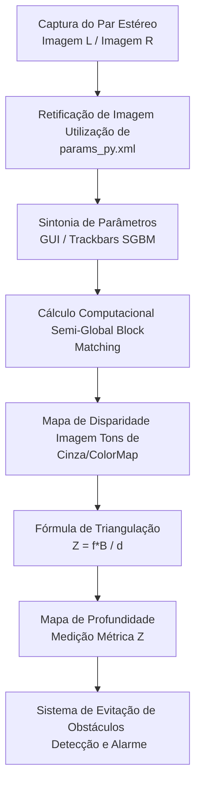

> Códigos e imagens: [`laboratorios/lab6/`](https://github.com/kaykyb/ufabc-cv/tree/main/laboratorios/lab6)

**Autores:**

- Kayky de Brito dos Santos
- André Marques da Silva
- Rafael de Souza Coelho

Equipe 8 - "Sem Título"

**Data de realização dos experimentos:** 15 de julho de 2026

**Data de publicação do relatório:** 20 de julho de 2026

## Introdução

Este relatório apresenta os experimentos do Laboratório 6 da disciplina de Visão Computacional, cujo objetivo central é aprofundar o estudo da visão estereoscópica através da geração algorítmica do **Mapa de Disparidade** e, consequentemente, da extração do **Mapa de Profundidade**.

No Laboratório 5, focamos na construção física do hardware (utilizando duas webcams USB alinhadas horizontalmente) e na calibração do sistema, culminando na percepção visual da terceira dimensão através de imagens anáglifas. Neste laboratório, avançamos para a quantificação dessa percepção: instruiremos o computador a calcular a distância absoluta de objetos na cena usando algoritmos de correspondência de blocos (*Block Matching* e *Semi-Global Block Matching*). O roteiro detalha a sintonia fina dos parâmetros do algoritmo de correspondência, a modelagem matemática que converte a disparidade de pixels (2D) em distância métrica real (3D), e a aplicação prática desse conceito na simulação de um sistema de percepção espacial e prevenção de obstáculos — tecnologia fundamental para o nosso projeto final da disciplina.

## Fundamentação Teórica

### Geometria Epipolar e Retificação Estéreo

A base para a extração de profundidade a partir de um par estéreo é a busca por pontos correspondentes nas duas vistas. Sem informações prévias, procurar um pixel correspondente na segunda imagem exigiria uma varredura bidimensional custosa. A **Geometria Epipolar** reduz essa busca para uma única dimensão (a linha epipolar). 

Para tornar o processo computacionalmente viável, aplicamos a **Retificação Estéreo**. Utilizando os parâmetros extrínsecos ($R$, $T$) obtidos na calibração, reprojetamos as imagens em um plano comum onde as linhas epipolares se tornam perfeitamente horizontais e paralelas. Consequentemente, o correspondente de um pixel $(x_L, y)$ na imagem esquerda estará obrigatoriamente na mesma coordenada vertical $y$ da imagem direita, restando apenas encontrar a coordenada horizontal $x_R$.

### Mapa de Disparidade: Block Matching (BM) vs. Semi-Global Block Matching (SGBM)

A **disparidade ($d$)** é a diferença na coordenada horizontal entre os pixels correspondentes retificados:

$$
d = x_L - x_R
$$

O **Mapa de Disparidade** é uma matriz de imagem (geralmente visualizada em tons de cinza ou mapas de calor) onde a intensidade de cada pixel representa o seu valor de disparidade. 

Para encontrar os pares correspondentes, o OpenCV oferece duas abordagens principais:
1.  **Block Matching (BM):** O algoritmo desliza uma janela (bloco de pixels) ao longo da linha epipolar e calcula a métrica de erro (como *Sum of Absolute Differences* - SAD). É rápido, mas suscetível a ruídos em áreas com pouca textura.
2.  **Semi-Global Block Matching (SGBM):** Diferente do BM que analisa apenas correspondências locais, o SGBM impõe restrições de suavidade global, penalizando grandes saltos de disparidade entre pixels vizinhos (utilizando os parâmetros $P_1$ e $P_2$). Isso resulta em mapas de disparidade significativamente mais densos e consistentes, com bordas de objetos mais definidas, sendo o método escolhido para as medições mais precisas neste experimento.

### Do Mapa de Disparidade ao Mapa de Profundidade (Triangulação Pinhole)

O mapa de disparidade é apenas um deslocamento em pixels. Para convertê-lo na distância física do objeto até a câmera (o **Mapa de Profundidade**, $Z$), aplicamos o princípio da triangulação de câmeras de modelo *pinhole*:

$$
Z = \frac{f \cdot B}{d}
$$

Onde:
*   $Z$: Profundidade ou distância na coordenada Z (ex: cm).
*   $f$: Distância focal da câmera (em pixels, estimada na calibração do Lab 5).
*   $B$: Linha de base ou *Baseline* (distância métrica entre os centros ópticos das câmeras, ajustada fisicamente pela equipe).
*   $d$: Disparidade do ponto (em pixels).

A equação evidencia uma relação de proporcionalidade inversa: quanto mais distante o objeto (maior $Z$), menor a disparidade ($d$). Consequentemente, para objetos muito distantes, $d$ tende a zero e pequenas imprecisões sub-pixel podem causar erros drásticos na estimação de $Z$. Objetos próximos apresentam altas disparidades (aparecendo mais claros no mapa de disparidade padrão).

### Diagrama de Blocos: Pipeline de Percepção de Profundidade

O fluxo completo, desde a captura até o cálculo de prevenção de obstáculos, segue a estrutura abaixo:

---

## Procedimentos experimentais

Todos os experimentos a seguir utilizaram as duas webcams integradas ao suporte desenvolvido no Laboratório anterior, assegurando a manutenção da *baseline* física projetada.

### I. Calibração Estéreo com Parâmetros Intrínsecos Fixos

[Descrever aqui: Relatar se a calibração do Lab 5 precisou ser refeita ou se o arquivo `params_py.xml` foi aproveitado integralmente. Caso tenham capturado novas imagens (`capture_images.py`), cite a quantidade de pares utilizados e o padrão de tabuleiro (ex: 8x6). Confirme que a calibração assegurou um erro de reprojeção satisfatório.]

### II. Otimização dos Parâmetros do Block Matching (SGBM)

Para gerar mapas de disparidade precisos, os hiperparâmetros do `StereoSGBM` não são universais; eles dependem fortemente da iluminação do laboratório, da resolução da câmera e do intervalo de profundidade desejado. Adaptamos o script `disparity_params_gui.py` para carregar as matrizes de calibração (`params_py.xml`) e utilizamos a interface gráfica com *trackbars* para ajustar os seguintes parâmetros críticos de otimização:

*   **`minDisparity`**: Deslocamento inicial da busca na linha epipolar.
*   **`numDisparities`**: A janela de busca horizontal (deve ser sempre divisível por 16).
*   **`blockSize`**: Tamanho da janela de correlação de pixels.
*   **`uniquenessRatio`**: Margem de segurança de correspondência para evitar falsos positivos em texturas repetitivas.
*   **`speckleWindowSize` e `speckleRange`**: Filtros de pós-processamento para remover manchas (ruídos isolados chamados de "sal e pimenta").

[Descrever aqui: Apresente os valores fixos escolhidos empiricamente pela equipe após mexer na interface gráfica (ex: blockSize=11, numDisparities=64, etc.) e que resultaram no melhor mapa de disparidade, justificando que esses valores foram gravados no arquivo `depth_estimation_params_py.xml`.]

| Janela de Calibração (Trackbars) | Mapa de Disparidade Gerado (Pós-Sintonia) |
| :---: | :---: |
|  |  |

### III. Do Mapa de Disparidade à Medição Prática (Gráfico $Z \times d$)

No script `disparity2depth_calib.py`, o objetivo foi correlacionar os pixels do mapa de disparidade gerado no passo anterior com uma distância em centímetros aferida manualmente com uma trena.
Posicionamos marcadores em distâncias conhecidas a partir do plano das lentes (ex: 30cm, 50cm, 80cm, 100cm). Ao clicar nos alvos na tela, registramos o valor da disparidade associada a cada profundidade.

[Descrever aqui: Com os pontos anotados, plotamos o gráfico sugerido abaixo, que ilustra a relação teórica não linear esperada. Descreva se a curva encontrada experimentalmente se assemelhou ao decaimento hiperbólico ditado por $Z = (f \cdot B) / d$.]

> **Gráfico Profundidade ($Z$) vs. Disparidade ($d$):**

### IV e V. Medidas de Distância e Prevenção de Obstáculos

Adaptamos o script `obstacle_avoidance.py`, que lê continuamente a câmera, calcula a disparidade densa através do SGBM com os parâmetros otimizados e aplica a curva de distância para alertar sobre a aproximação de objetos.
Para validar a precisão, selecionamos três objetos com diferentes formatos e texturas e efetuamos medições do centro de cada objeto em relação à câmera, comparando o valor predito pelo software com a medição física (trena).

**Tabela Comparativa de Medições (Câmera Estéreo vs. Trena Real)**

| Objeto / Posição Relativa | Distância Real da Trena ($Z_{real}$ em cm) | Distância Calculada ($Z_{SGBM}$ em cm) | Erro Absoluto ($|Z_{real} - Z_{SGBM}|$) | Erro Relativo (%) |
| :--- | :---: | :---: | :---: | :---: |
| Objeto 1: [Descrever Ex: Caixa de papelão com textura] | [Valor Real 1] | [Valor SGBM 1] | [Cálculo] | [Cálculo] |
| Objeto 2: [Descrever Ex: Garrafa colorida] | [Valor Real 2] | [Valor SGBM 2] | [Cálculo] | [Cálculo] |
| Objeto 3: [Descrever Ex: Objeto distante/liso] | [Valor Real 3] | [Valor SGBM 3] | [Cálculo] | [Cálculo] |

[Análise da Tabela: Insira aqui a avaliação dos resultados. Exemplo: O objeto 1 apresentou baixo erro devido à alta variação de textura, enquanto o objeto 3 apresentou maior discrepância pois, em maiores distâncias, uma flutuação de 1 pixel na disparidade causou um sobressalto de vários centímetros na métrica final.]

### VI. Integração: Programa Jupyter para o Trabalho Final

Com base em todos os roteiros, condensamos a lógica no notebook do Jupyter que visa se tornar a base do nosso projeto final. O código importa o `params_py.xml` (para retificar as imagens ao vivo), aplica o `StereoSGBM` com as configurações fixas do `depth_estimation_params_py.xml` e retorna ativamente em tela a distância do objeto de interesse.

[Descrever aqui: Explique sucintamente como esse notebook Jupyter (ex: calculando a distância média dentro de uma Bounding Box central da imagem) se conecta com o tema específico escolhido para o trabalho final da equipe "Sem Título".]

---

## Análise e discussão

A execução dos algoritmos revelou as forças e as limitações práticas da visão estéreo passiva:

1.  **Influência da Textura na Cena:** Observamos que o Block Matching sofre degradação em regiões lisas ou sem textura (como paredes brancas uniformes ou quadros refletivos). Onde não há gradiente de cor, a função SAD não encontra um mínimo global claro, resultando nos temidos "buracos negros" no mapa de disparidade (pixels inválidos com ruído speckle).
2.  **Sensibilidade dos Hiperparâmetros:** O parâmetro `blockSize` se mostrou um fator decisivo de *trade-off*. Um tamanho de bloco pequeno preservou bem os contornos dos objetos, mas gerou um mapa repleto de ruído estatístico. Aumentar excessivamente o bloco suprimiu os ruídos, mas "borrou" as bordas dos obstáculos, fazendo com que objetos finos fossem engolidos pelo fundo da cena.
3.  **Erros de Quantização de Disparidade:** Conforme demonstrado pela equação da Triangulação, os erros de distância crescem não-linearmente à medida que a distância do objeto aumenta. Um erro de $\pm 1$ pixel em um objeto a 30 cm de distância pouco altera a medição final em milímetros. Contudo, em uma distância de 2 metros, devido à linha de base muito curta (da ordem de 6 cm), essa mesma flutuação de 1 pixel resulta em erros da ordem de dezenas de centímetros.

## Conclusões

Os experimentos do Laboratório 6 comprovaram que a câmera estéreo, uma vez bem calibrada, é um instrumento viável de baixo custo para a medição passiva de distância de objetos no espaço. Através do algoritmo de *Semi-Global Block Matching* e da sintonia dos hiperparâmetros, logramos traduzir as disparidades em pixels de um plano 2D para métricas de profundidade absoluta no plano 3D com precisão aceitável para aplicações de robótica ou monitoramento, contanto que restritas à faixa útil delimitada pela modesta linha de base do equipamento montado pela nossa equipe.

## Declaração de uso de Inteligência Artificial Generativa

Em atendimento à Portaria CNPq 2664/2026, declaramos que ferramentas de Inteligência Artificial Generativa foram utilizadas como auxílio para a **estruturação arquitetônica do relatório, formatação em sintaxe Markdown (incluindo diagramas de bloco e modelagem de tabelas), e refinamento gramatical** das seções teóricas. A manipulação física do equipamento, a sintonia e definição de todas as variáveis dos algoritmos de SGBM, as tomadas de decisão na calibração, e as medições físicas preenchidas nas tabelas comparativas com trena foram realizados integralmente de forma empírica pelos autores. A equipe responsabiliza-se solidariamente pela veracidade dos dados técnicos e pelo escopo integral submetido neste projeto.

## Referências

- [1] LearnOpenCV. _Making A Low-Cost Stereo Camera Using OpenCV._ <https://learnopencv.com/making-a-low-cost-stereo-camera-using-opencv/>

- [2] LearnOpenCV. _Introduction to Epipolar Geometry and Stereo Vision._ <https://learnopencv.com/introduction-to-epipolar-geometry-and-stereo-vision/>

- [3] LearnOpenCV. _Stereo Camera Depth Estimation With OpenCV (Python/C++)._ <https://learnopencv.com/depth-perception-using-stereo-camera-python-c/>

- [4] OpenCV Docs. _Depth Map from Stereo Images._ <https://docs.opencv.org/4.x/dd/d53/tutorial_py_depthmap.html>

- [5] C. Loop and Z. Zhang. _Computing Rectifying Homographies for Stereo Vision._ IEEE Conf. Computer Vision and Pattern Recognition, 1999.

- [6] LearnOpenCV. _Geometry of Image Formation._ <https://learnopencv.com/geometry-of-image-formation/>

- [7] Material da disciplina UFABC, Visão Computacional, Laboratório 6.
