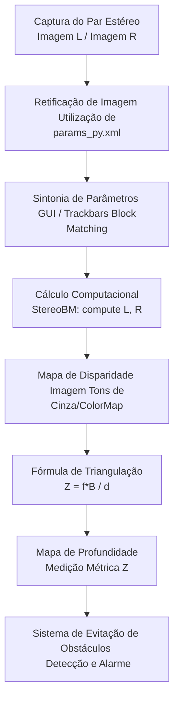
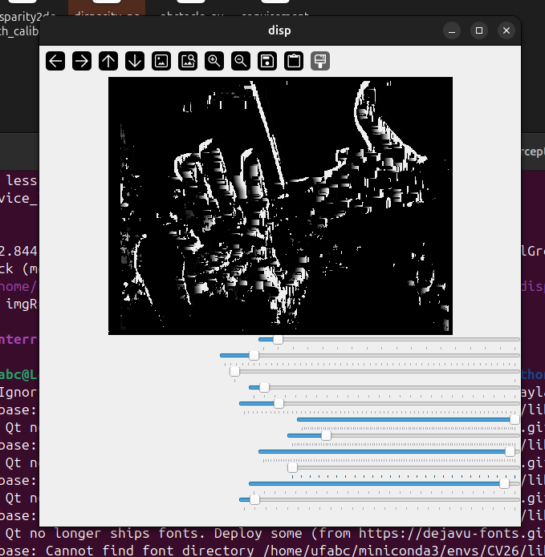
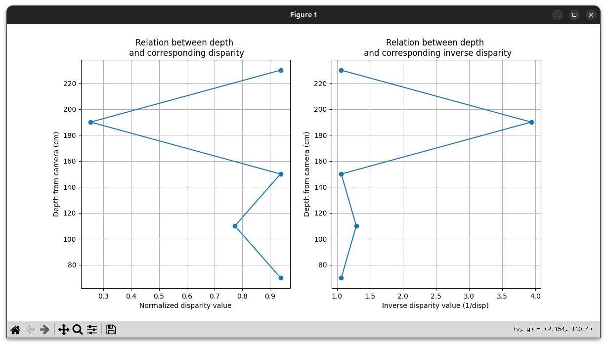
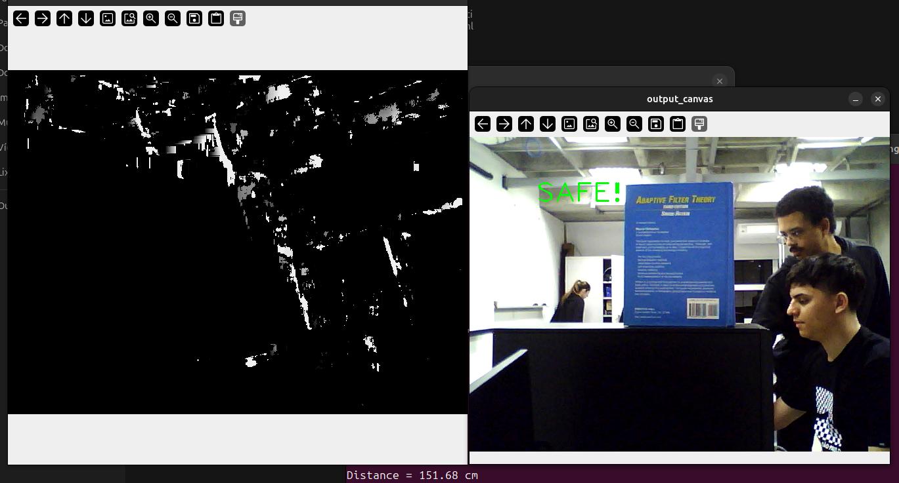

> Códigos e dados: [`laboratorios/lab6/`](https://github.com/kaykyb/ufabc-cv/tree/main/laboratorios/lab6). O pipeline completo está consolidado no notebook [`lab6.ipynb`](https://github.com/kaykyb/ufabc-cv/blob/main/laboratorios/lab6/lab6.ipynb).

**Autores:**

- Kayky de Brito dos Santos
- André Marques da Silva
- Rafael de Souza Coelho

Equipe 8 - "Sem Título"

**Data de realização dos experimentos:** 15 de julho de 2026

**Data de publicação do relatório:** 20 de julho de 2026

## Introdução

Este relatório descreve os experimentos do Laboratório 6 de Visão Computacional, dedicado à extração de distância a partir de um par estéreo. No Laboratório 5 construímos a câmera estereoscópica (duas webcams USB sobre uma base rígida) e a calibramos, chegando ao anáglifo 3D. Ali paramos na percepção qualitativa da profundidade; aqui damos o passo seguinte e quantificamos essa percepção, instruindo o computador a calcular a distância absoluta de objetos na cena.

O roteiro segue a sequência do enunciado: reaproveitamos a calibração da aula anterior, sintonizamos por interface gráfica os parâmetros do algoritmo de correspondência de blocos (*Block Matching*) do OpenCV para gerar o **Mapa de Disparidade**, aplicamos a triangulação que converte a disparidade em pixels (2D) na distância métrica real (3D) do **Mapa de Profundidade**, levantamos o gráfico de profundidade contra disparidade e, por fim, executamos o programa de prevenção de obstáculos que mede continuamente a distância de um objeto. É uma capacidade diretamente aplicável ao nosso trabalho final, que depende de decidir quando um objeto está próximo o bastante para ser processado.

Adiantamos que os resultados carregam a herança do problema diagnosticado no Lab 5: a calibração estéreo ficou degenerada (as câmeras esquerda e direita foram capturadas com os índices trocados em relação à visualização), e isso se reflete diretamente na qualidade dos mapas de disparidade obtidos aqui. Optamos por relatar os resultados como saíram, com a análise honesta das suas limitações, em vez de forçar números que não temos.

## Fundamentação Teórica

### Geometria Epipolar e Retificação Estéreo

A base para a extração de profundidade a partir de um par estéreo é a busca por pontos correspondentes nas duas vistas. Sem informações prévias, procurar um pixel correspondente na segunda imagem exigiria uma varredura bidimensional custosa. A **Geometria Epipolar** reduz essa busca para uma única dimensão (a linha epipolar). 

Para tornar o processo computacionalmente viável, aplicamos a **Retificação Estéreo**. Utilizando os parâmetros extrínsecos ($R$, $T$) obtidos na calibração, reprojetamos as imagens em um plano comum onde as linhas epipolares se tornam perfeitamente horizontais e paralelas. Consequentemente, o correspondente de um pixel $(x_L, y)$ na imagem esquerda estará obrigatoriamente na mesma coordenada vertical $y$ da imagem direita, restando apenas encontrar a coordenada horizontal $x_R$.

### Mapa de Disparidade: Block Matching (BM) vs. Semi-Global Block Matching (SGBM)

A **disparidade ($d$)** é a diferença na coordenada horizontal entre os pixels correspondentes retificados:

$$
d = x_L - x_R
$$

O **Mapa de Disparidade** é uma matriz de imagem (geralmente visualizada em tons de cinza ou mapas de calor) onde a intensidade de cada pixel representa o seu valor de disparidade. 

Para encontrar os pares correspondentes, o OpenCV oferece duas abordagens principais:
1.  **Block Matching (BM):** O algoritmo desliza uma janela (bloco de pixels) ao longo da linha epipolar e calcula a métrica de erro (como *Sum of Absolute Differences* - SAD). É rápido, mas suscetível a ruídos em áreas com pouca textura.
2.  **Semi-Global Block Matching (SGBM):** Diferente do BM, que analisa apenas correspondências locais, o SGBM impõe restrições de suavidade global, penalizando grandes saltos de disparidade entre pixels vizinhos (utilizando os parâmetros $P_1$ e $P_2$). Isso resulta em mapas de disparidade mais densos e consistentes, com bordas de objetos mais definidas.

Neste experimento, o programa de sintonia fornecido pela referência [3] (`disparity_param_gui.py`) instancia o **Block Matching** via [`cv2.StereoBM_create()`](https://github.com/kaykyb/ufabc-cv/blob/main/laboratorios/lab6/disparity_param_gui.py), e foi esse o método efetivamente usado por nós. Registramos a comparação com o SGBM na fundamentação porque ela explica boa parte do ruído observado nos nossos mapas (o BM é o mais suscetível a regiões sem textura), e o SGBM fica como caminho natural de melhoria para o trabalho final.

### Do Mapa de Disparidade ao Mapa de Profundidade (Triangulação Pinhole)

O mapa de disparidade é apenas um deslocamento em pixels. Para convertê-lo na distância física do objeto até a câmera (o **Mapa de Profundidade**, $Z$), aplicamos o princípio da triangulação de câmeras de modelo *pinhole*:

$$
Z = \frac{f \cdot B}{d}
$$

Onde:
*   $Z$: Profundidade ou distância na coordenada Z (ex: cm).
*   $f$: Distância focal da câmera (em pixels, estimada na calibração do Lab 5).
*   $B$: Linha de base ou *Baseline* (distância métrica entre os centros ópticos das câmeras, ajustada fisicamente pela equipe).
*   $d$: Disparidade do ponto (em pixels).

A equação evidencia uma relação de proporcionalidade inversa: quanto mais distante o objeto (maior $Z$), menor a disparidade ($d$). Consequentemente, para objetos muito distantes, $d$ tende a zero e pequenas imprecisões sub-pixel podem causar erros drásticos na estimação de $Z$. Objetos próximos apresentam altas disparidades (aparecendo mais claros no mapa de disparidade padrão).

### Diagrama de Blocos: Pipeline de Percepção de Profundidade

O fluxo completo, desde a captura até o cálculo de prevenção de obstáculos, segue a estrutura abaixo:


```mermaid
graph TD
    A[Captura do Par Estéreo <br> Imagem L / Imagem R] --> B[Retificação de Imagem <br> Utilização de params_py.xml]
    B --> C[Sintonia de Parâmetros <br> GUI / Trackbars Block Matching]
    C --> D[Cálculo Computacional <br> StereoBM: compute L, R]
    D --> E[Mapa de Disparidade <br> Imagem Tons de Cinza/ColorMap]
    E --> F[Fórmula de Triangulação <br> Z = f*B / d]
    F --> G[Mapa de Profundidade <br> Medição Métrica Z]
    G --> H[Sistema de Evitação de Obstáculos <br> Detecção e Alarme]
```

---

## Procedimentos experimentais

Todos os experimentos a seguir utilizaram as duas webcams fixas no suporte construído no Laboratório anterior, mantendo a *baseline* física projetada. Os cinco programas do roteiro (captura, calibração, sintonia do Block Matching, calibração disparidade para profundidade e prevenção de obstáculos) foram adaptados do repositório de Satya Mallick, a LearnOpenCV (referência [3]), e consolidados por nós em um único notebook, o [`lab6.ipynb`](https://github.com/kaykyb/ufabc-cv/blob/main/laboratorios/lab6/lab6.ipynb), que fixa os IDs das câmeras em 0 (esquerda) e 1 (direita) e unifica os caminhos dos arquivos de parâmetros trocados entre as etapas. As três primeiras etapas também estão disponíveis como scripts `.py` independentes na mesma pasta [`laboratorios/lab6/`](https://github.com/kaykyb/ufabc-cv/tree/main/laboratorios/lab6).

### I. Calibração Estéreo com Parâmetros Intrínsecos Fixos

Refizemos a captura e a calibração do zero, repetindo o procedimento do Lab 5 seguindo a seção *Step 2: Performing stereo calibration with fixed intrinsic parameters* da referência [1]. Primeiro rodamos a etapa de captura ([`capture_images.py`](https://github.com/kaykyb/ufabc-cv/blob/main/laboratorios/lab6/capture_images.py), célula 1 do notebook), que mostra as duas webcams ao vivo com um contador regressivo e, quando os cantos do tabuleiro de **9x6 cantos internos** são detectados simultaneamente nas duas imagens, salva o par em `data/stereoL/` e `data/stereoR/`. Capturamos **28 pares** (`img1.png` a `img28.png`), versionados em [`data/`](https://github.com/kaykyb/ufabc-cv/tree/main/laboratorios/lab6/data).

Em seguida rodamos o [`calibrate.py`](https://github.com/kaykyb/ufabc-cv/blob/main/laboratorios/lab6/calibrate.py), que é o mesmo pipeline do Lab 5: calibra cada câmera individualmente, faz a calibração estéreo com `cv2.stereoCalibrate` usando a flag `CALIB_FIX_INTRINSIC` (que mantém as intrínsecas fixas e estima apenas $R$, $T$, $E$ e $F$ entre as câmeras) e retifica com `cv2.stereoRectify`, gravando os mapas de retificação em [`data/params_py.xml`](https://github.com/kaykyb/ufabc-cv/blob/main/laboratorios/lab6/data/params_py.xml):

```python
flags = cv2.CALIB_FIX_INTRINSIC
retS, new_mtxL, distL, new_mtxR, distR, Rot, Trns, Emat, Fmat = cv2.stereoCalibrate(
    obj_pts, img_ptsL, img_ptsR, new_mtxL, distL, new_mtxR, distR,
    imgL_gray.shape[::-1], criteria_stereo, flags,
)
```

Como discutido em detalhe na análise do [Laboratório 5](), essa calibração estéreo herda um problema de fundo: os índices esquerda/direita das câmeras foram trocados entre a captura e a visualização, o que degenera a retificação. Não conseguimos sanar isso a tempo desta aula, e o arquivo `params_py.xml` usado aqui é o resultado dessa calibração imperfeita. Isso condiciona tudo o que vem a seguir, e voltaremos ao ponto na análise.

### II. Sintonia dos Parâmetros do Block Matching

Os hiperparâmetros do Block Matching não são universais: dependem da iluminação, da resolução e da faixa de profundidade da cena. Seguindo a seção *Block Matching For Dense Stereo Correspondence* da referência [3], adaptamos o [`disparity_param_gui.py`](https://github.com/kaykyb/ufabc-cv/blob/main/laboratorios/lab6/disparity_param_gui.py) para carregar as matrizes de retificação do nosso `params_py.xml` e ajustamos os parâmetros ao vivo por *trackbars*. O núcleo do programa retifica os dois quadros, lê os parâmetros da interface e recomputa a disparidade a cada iteração:

```python
stereo = cv2.StereoBM_create()
# ... lê trackbars e aplica stereo.setNumDisparities(...), setBlockSize(...), etc.
disparity = stereo.compute(Left_nice, Right_nice)
disparity = disparity.astype(np.float32)
disparity = (disparity / 16.0 - minDisparity) / numDisparities  # normaliza para [0, 1]
```

Os parâmetros mais decisivos na sintonia foram:

*   **`numDisparities`**: largura da janela de busca horizontal (múltiplo de 16), que define a faixa de profundidades detectável.
*   **`blockSize`**: tamanho da janela de correlação, o principal *trade-off* entre ruído e definição de bordas.
*   **`preFilterCap` e `textureThreshold`**: pré-filtro e limiar de textura do BM, que descartam regiões lisas sem correspondência confiável.
*   **`uniquenessRatio`**: margem mínima entre a melhor e a segunda melhor correspondência, para evitar casamentos ambíguos em texturas repetitivas.
*   **`speckleWindowSize` e `speckleRange`**: pós-filtro que remove manchas isoladas ("sal e pimenta").

Ao encerrar (tecla `ESC`), o programa grava os valores sintonizados, junto da constante de profundidade `M`, em [`data/depth_estmation_params_py.xml`](https://github.com/kaykyb/ufabc-cv/blob/main/laboratorios/lab6/data/depth_estmation_params_py.xml), que é reaproveitado nos passos seguintes.

A imagem abaixo mostra a interface em operação, com a cena de teste (as mãos de um integrante à frente das câmeras) e os *trackbars* de cada parâmetro. Já aqui fica evidente a fragilidade do BM sobre a nossa calibração: o mapa de disparidade sai esparso, com grandes áreas pretas (pixels inválidos) e correspondência confiável apenas nas bordas de maior contraste.



### III. Do Mapa de Disparidade à Medição Prática (Gráfico $Z \times d$)

Seguindo a seção *From disparity map to depth map* da referência [3], usamos o `disparity2depth_calib.py` (célula 4 do [`lab6.ipynb`](https://github.com/kaykyb/ufabc-cv/blob/main/laboratorios/lab6/lab6.ipynb), adaptado do [código original](https://github.com/spmallick/learnopencv/tree/master/Depth-Perception-Using-StereoCamera) para ler o nosso `params_py.xml`) para correlacionar a disparidade lida na tela com a distância real medida com trena. Posicionamos um alvo em distâncias conhecidas a partir do plano das lentes e, para cada uma, clicamos no alvo para registrar a disparidade associada. As distâncias amostradas foram **70, 110, 150, 190 e 230 cm**.

Na prática, essa etapa ajusta a constante $M = f \cdot B$ da triangulação, de modo que a profundidade seja recuperada por $Z = M / d$. O valor obtido foi gravado no `depth_estmation_params_py.xml` (`M = 39.075`).

O gráfico gerado relaciona a profundidade medida com a disparidade normalizada (à esquerda) e com o seu inverso (à direita):



O comportamento esperado seria uma curva monotônica, com a disparidade caindo conforme a profundidade aumenta (e, no gráfico da direita, os pontos de $1/d$ se alinhando em uma reta que passa pela origem, já que $Z \propto 1/d$). Não foi o que observamos: os pontos ficaram dispersos e não monotônicos, com destaque para a amostra de 190 cm, que destoa completamente das vizinhas. Isso é coerente com os mapas de disparidade ruidosos da etapa anterior, e portanto com a calibração degenerada herdada do Lab 5: sem uma retificação correta, a disparidade lida em cada ponto não corresponde de forma confiável à profundidade real, e o ajuste de $M$ perde precisão.

### IV e V. Medidas de Distância e Prevenção de Obstáculos

Seguindo a seção *Obstacle avoidance system* da referência [3], executamos o `obstacle_avoidance.py` (célula 5 do [`lab6.ipynb`](https://github.com/kaykyb/ufabc-cv/blob/main/laboratorios/lab6/lab6.ipynb), adaptado do [código original](https://github.com/spmallick/learnopencv/tree/master/Depth-Perception-Using-StereoCamera) para ler o nosso `params_py.xml` e o `depth_estmation_params_py.xml`). O programa lê as câmeras ao vivo, recomputa a disparidade com o Block Matching sintonizado, converte para distância pela curva $Z = M / d$ e classifica a cena em zonas (`SAFE!`, entre outras) conforme a proximidade do objeto mais próximo. A imagem abaixo mostra uma leitura durante o experimento, com o mapa de disparidade à esquerda, a imagem retificada à direita, o rótulo `SAFE!` e a distância estimada impressa no rodapé (`Distance = 151.68 cm`):



Como pede o enunciado (item V), a validação deveria comparar, para pelo menos três objetos, a distância calculada com a distância real medida por trena, calculando o erro absoluto e relativo. Aqui esbarramos na limitação já relatada: com a calibração degenerada, o mapa de disparidade sai esparso e ruidoso (visível na metade esquerda da imagem acima), e as leituras de distância flutuam demais para constituir uma medição confiável. A própria leitura de 151,68 cm da captura oscilava a cada quadro para o mesmo objeto parado. Por integridade, preferimos não preencher a tabela com números que não refletem uma medição válida.

> **Placeholder:** refazer a tabela comparativa (três objetos, $Z_{real}$ com trena, $Z_{BM}$, erro absoluto e relativo) após corrigir a troca de índices das câmeras e revalidar a retificação, conforme apontado na análise do Lab 5.

| Objeto | $Z_{real}$ (trena, cm) | $Z_{BM}$ (cm) | Erro absoluto (cm) | Erro relativo (%) |
| :--- | :---: | :---: | :---: | :---: |
| Objeto 1 | _a medir_ | _a medir_ | | |
| Objeto 2 | _a medir_ | _a medir_ | | |
| Objeto 3 | _a medir_ | _a medir_ | | |

### VI. Integração: Programa para o Trabalho Final

O item VI pede um programa completo em Jupyter que forneça a distância da câmera estéreo a um objeto específico, ligado ao tema do trabalho final. Atendemos a esse item consolidando as cinco etapas em um único notebook, o [`lab6.ipynb`](https://github.com/kaykyb/ufabc-cv/blob/main/laboratorios/lab6/lab6.ipynb): a célula de configuração fixa os IDs das câmeras (0 e 1) e os caminhos dos arquivos, e as células seguintes vão da captura até a medição de distância ao vivo, carregando o `params_py.xml` para retificar os quadros e aplicando o Block Matching com os parâmetros fixos do `depth_estmation_params_py.xml`. A distância reportada pela célula de prevenção de obstáculos é justamente a que serviria de **gatilho por profundidade** no nosso [trabalho final](), um sistema de reconhecimento de valores de cédulas para comerciantes com baixa visão: disparar a classificação apenas quando um objeto entra na zona útil de leitura (por exemplo, entre 15 e 40 cm da câmera), evitando processar o fundo da cena.

Vale a ressalva de integridade já feita nas seções anteriores: o notebook executa o pipeline de ponta a ponta, mas os valores absolutos de distância permanecem pouco confiáveis enquanto a calibração estéreo herdada do Lab 5 não for corrigida (troca de índices das câmeras e retificação degenerada). A correção dessa calibração é o próximo passo da equipe antes de acoplar o gatilho por profundidade ao trabalho final.

---

## Análise e discussão

A execução expôs, na ordem de importância, os seguintes fatores:

1.  **Calibração como fator dominante.** O limitante principal dos nossos resultados não foi o algoritmo de disparidade, e sim a calibração estéreo herdada do Lab 5. Como a retificação estava degenerada (índices esquerda/direita trocados entre captura e visualização, o que projeta o ponto principal para fora da imagem e esvazia a ROI de uma das câmeras), as linhas epipolares não ficam de fato alinhadas, e a busca por correspondência ao longo da linha parte de uma premissa violada. Todos os efeitos abaixo são amplificados por isso: o mapa esparso da Seção II e a curva $Z \times d$ não monotônica da Seção III são sintomas do mesmo problema de base.
2.  **Influência da textura na cena.** O Block Matching se degrada em regiões lisas ou sem textura: onde não há gradiente, a métrica SAD não encontra um mínimo claro, produzindo os "buracos" pretos (pixels inválidos com ruído *speckle*) bem visíveis nas capturas das mãos e da cena de obstáculos. O BM é justamente o algoritmo mais sensível a isso, e um SGBM, com suas restrições de suavidade global, atenuaria parte desses vazios.
3.  **Sensibilidade dos hiperparâmetros.** O `blockSize` foi o *trade-off* mais decisivo: blocos pequenos preservam contornos mas enchem o mapa de ruído estatístico, enquanto blocos grandes suprimem o ruído mas borram as bordas, fazendo objetos finos serem engolidos pelo fundo. O `textureThreshold` e o `uniquenessRatio` ajudaram a descartar correspondências duvidosas, ao custo de deixar o mapa ainda mais esparso.
4.  **Erros de quantização da disparidade.** Mesmo com calibração perfeita, a equação $Z = f B / d$ amplia erros com a distância: um erro de $\pm 1$ pixel a 30 cm quase não altera a medida, mas a 2 m, com uma *baseline* curta (da ordem de 6 cm), a mesma flutuação de 1 pixel vira dezenas de centímetros. Isso explica por que a leitura da Seção IV oscilava tanto para um objeto parado a ~1,5 m.

## Conclusões

Os experimentos do Laboratório 6 percorreram o pipeline completo de estimação de profundidade: recalibramos a câmera estéreo, sintonizamos por interface gráfica o Block Matching do OpenCV, geramos mapas de disparidade, ajustamos a constante da triangulação para converter disparidade em distância e executamos o programa de prevenção de obstáculos, que forneceu leituras de distância ao vivo. Do ponto de vista de execução do roteiro, o caminho foi percorrido de ponta a ponta.

Do ponto de vista de precisão, porém, os resultados ficaram aquém do esperado, e por um motivo que já conhecíamos: a calibração estéreo degenerada, herdada do Lab 5, se propaga por toda a cadeia. Os mapas de disparidade saíram esparsos, a curva profundidade contra disparidade não seguiu o decaimento monotônico previsto e as medições de distância oscilaram demais para serem validadas contra a trena. Optamos por relatar isso abertamente, sem preencher tabelas com números que não sustentam uma medição confiável.

A lição que levamos é clara e reforça a do laboratório anterior: em visão estéreo, a qualidade da retificação é pré-condição para tudo o que vem depois, e nenhum ajuste de parâmetros do Block Matching compensa uma calibração torta. O próximo passo, também necessário para usar a câmera no trabalho final, é corrigir a troca de índices das câmeras, revalidar a retificação com linhas epipolares horizontais e só então refazer as medições quantitativas e versionar o notebook de integração.

## Declaração de uso de Inteligência Artificial Generativa

Em atendimento à Portaria CNPq 2664/2026, declaramos que ferramentas de Inteligência Artificial Generativa foram utilizadas como apoio na **organização e redação** deste relatório (estruturação do texto, formatação em Markdown, incluindo o diagrama de blocos, e revisão de clareza das seções teóricas). A manipulação física do equipamento, a captura das imagens de calibração, a sintonia dos parâmetros do Block Matching, as execuções de cada script e as leituras de distância registradas nas capturas de tela foram realizadas integralmente de forma empírica pelos autores. Nenhum dado de medição foi gerado ou preenchido por IA; os pontos em aberto estão sinalizados como pendentes no texto. A equipe conferiu e validou o conteúdo final e responsabiliza-se integralmente por ele.

## Referências

- [1] LearnOpenCV. _Making A Low-Cost Stereo Camera Using OpenCV._ <https://learnopencv.com/making-a-low-cost-stereo-camera-using-opencv/>

- [2] LearnOpenCV. _Introduction to Epipolar Geometry and Stereo Vision._ <https://learnopencv.com/introduction-to-epipolar-geometry-and-stereo-vision/>

- [3] LearnOpenCV. _Stereo Camera Depth Estimation With OpenCV (Python/C++)._ <https://learnopencv.com/depth-perception-using-stereo-camera-python-c/>

- [4] OpenCV Docs. _Depth Map from Stereo Images._ <https://docs.opencv.org/4.x/dd/d53/tutorial_py_depthmap.html>

- [5] C. Loop and Z. Zhang. _Computing Rectifying Homographies for Stereo Vision._ IEEE Conf. Computer Vision and Pattern Recognition, 1999.

- [6] LearnOpenCV. _Geometry of Image Formation._ <https://learnopencv.com/geometry-of-image-formation/>

- [7] Material da disciplina UFABC, Visão Computacional, Laboratório 6.
