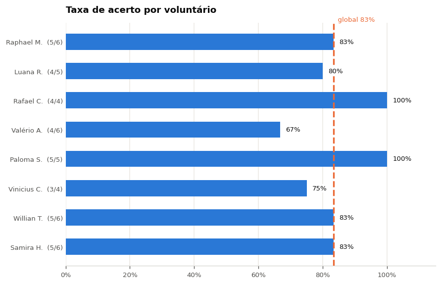
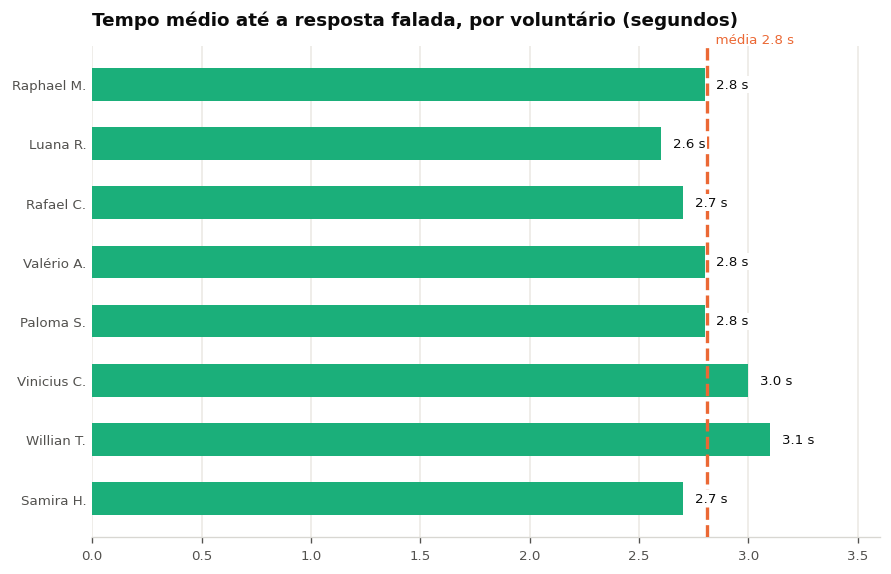

> Análise reprodutível: todos os números e gráficos desta página são gerados pelo notebook [`trabalho-final/analise_resultados.ipynb`](https://github.com/kaykyb/ufabc-cv/blob/main/trabalho-final/analise_resultados.ipynb), que lê diretamente a transcrição da enquete em [`trabalho-final/resources/`](https://github.com/kaykyb/ufabc-cv/tree/main/trabalho-final/resources).

**Equipe:** Sem Título

**Integrantes:**

- Kayky de Brito dos Santos
- André Marques da Silva
- Rafael de Souza Coelho

**Data de publicação:** 15 de agosto de 2026

**Título do trabalho:** Programa de Reconhecimento de Valores de Cédulas

## 1. Introdução

Esta é a sétima etapa do trabalho final: a **análise dos resultados**. As etapas anteriores definiram o [roteiro de testes]() e registraram a [aplicação desse roteiro com voluntários](). Aqui fechamos o ciclo: pegamos os números crus das fichas e da enquete de opinião e respondemos, com eles, se o sistema entrega o que a [modelagem funcional]() prometeu.

A sessão de testes voluntários ocorreu em **10 de agosto de 2026**, com **8 participantes** de fora da equipe. Cada voluntário executou uma sequência de tarefas do roteiro com cédulas reais, teve o resultado de cada tarefa anotado por um integrante da equipe e, ao final, preencheu uma ficha de opinião em papel. As fichas foram transcritas para a planilha analisada aqui.

Três blocos de evidência são analisados:

1. **Métricas objetivas:** taxa de acerto por voluntário e tempo médio até a resposta falada.
2. **Usabilidade percebida:** as questões Q1 a Q11 da enquete, sendo Q1 a Q10 o questionário SUS (*System Usability Scale*) e Q11 uma questão extra sobre interatividade.
3. **Feedback aberto:** Q12 a Q17, que cobrem o que mais e o que menos agradou, sugestões e a compreensão do voluntário sobre objetivo, experimentos e resultados.

## 2. Métricas Objetivas

### 2.1 Taxa de acerto

Cada tarefa executada foi classificada como correta ou incorreta pelo critério do roteiro: correta quando o sistema anunciou a denominação certa (ou permaneceu em silêncio nas tarefas de bancada vazia e de objeto que não é cédula). O número de tarefas varia entre voluntários porque nem todos completaram a lista inteira dentro da janela de 10 a 15 minutos.

O sistema acertou **35 das 42 tarefas** executadas, uma taxa global de **83,3%**. Duas sessões foram perfeitas (Rafael C. e Paloma S., 4/4 e 5/5) e a pior foi a de Valério A. (4/6, 67%). A dispersão entre voluntários é considerável, 11,4 pontos percentuais de desvio padrão, o que é esperado com apenas 8 sessões e listas de tarefas de tamanhos diferentes: uma falha isolada em uma sessão de 4 tarefas custa 25 pontos.

Importa mais o **tipo** de erro do que a contagem. As respostas abertas identificam de onde vieram as sete falhas:

- **Enquadramento incompleto:** Willian T. registrou que a "nota precisa ser colocada por completo na câmera". A localização clássica trabalha sobre o contorno do objeto claro no fundo escuro, então uma nota parcialmente fora do campo produz um recorte que a rede não reconhece.
- **Cédula fora do conjunto de treino:** Rafael C. apontou a impossibilidade de detectar notas de 200 reais, que estão fora do modelo atual por decisão explícita do roteiro.
- **Múltiplas notas simultâneas:** Paloma S. colocou duas cédulas juntas na bancada, situação não prevista pelo pipeline, que assume uma cédula por quadro.

Nenhum voluntário relatou que o sistema **falou um valor errado**. Esse é o resultado mais relevante da análise: a decisão de projeto registrada na modelagem funcional, de preferir o silêncio ao palpite, se sustentou na prática. As falhas observadas foram de omissão, não de confusão entre denominações, e o custo de uma omissão para a usuária (reposicionar a nota) é muito menor que o de um valor errado anunciado no caixa.

### 2.2 Tempo até a resposta

O tempo foi cronometrado do instante em que a cédula toca a bancada até o anúncio falado do valor, e cada voluntário tem aqui a média das suas tarefas. Ele mede a latência percebida, não a latência de inferência: inclui o tempo do voluntário acomodar a nota e o intervalo do laço de detecção até a estabilização.

A latência percebida foi de **2,81 segundos em média**, com todas as sessões entre 2,6 e 3,1 segundos. O desvio padrão de 0,16 s é pequeno: o sistema é **previsível**, e previsibilidade importa mais que velocidade bruta em uma interface sem retorno visual, porque é o que permite à usuária saber quando desistir e reposicionar a nota. Nenhum voluntário citou lentidão em Q13 (o que menos gostou), e três citaram a rapidez espontaneamente em Q12 ("velocidade de resposta", "muito rápido", "agilidade e precisão").

## 3. Usabilidade Percebida (SUS)

As questões Q1 a Q10 formam o **System Usability Scale**, aplicado na sua forma padrão: itens ímpares com afirmação positiva, itens pares com afirmação negativa, resposta de 1 (discordo totalmente) a 5 (concordo totalmente). A pontuação de cada voluntário soma `resposta - 1` nos itens positivos e `5 - resposta` nos negativos, multiplicando o total por 2,5, o que produz um valor de 0 a 100. O valor **não** é uma porcentagem: a referência da literatura é que **68 corresponde à média** dos sistemas avaliados.

O SUS médio foi **96,6**, com todas as oito sessões acima de 87 e quatro delas com pontuação máxima. A leitura honesta é que a escala está **saturada**: com um sistema de um gesto só (encostar a nota na bancada) e já configurado e rodando pela equipe, o SUS tem pouca margem para discriminar. O valor confirma a ausência de atrito, sem servir como medida fina de qualidade.

Os três itens mais baixos são os informativos:

- **Q10** ("precisei aprender muitas coisas antes de usar", 3,50) empata como pior item, puxado por uma única resposta 5 de Samira H., isolada em meio a respostas 1. Como a mesma voluntária deu notas altas em todo o resto e escreveu "amei tudo" em Q13, é provável que seja inversão de escala no preenchimento em papel, um risco conhecido de itens negativos em ficha impressa.
- **Q1** ("gostaria de usar com frequência", 3,50) é o outro item no fundo da lista, com 3 de Paloma S. e 4 de Valério A. e Samira H. Faz sentido: nenhum dos voluntários tem deficiência visual, então a utilidade percebida no dia a dia é naturalmente menor que a facilidade percebida.
- **Q6** ("várias inconsistências no sistema", 3,75) recebeu 2 de Paloma S. e Willian T., exatamente os dois voluntários que esbarraram em limitações reais: duas notas ao mesmo tempo e nota parcialmente fora do campo. O item negativo capturou justamente as falhas que as métricas objetivas apontaram.

Os demais itens ficaram na pontuação máxima ou muito perto dela, incluindo Q4 e Q8, que medem a necessidade de suporte técnico e a complicação de uso, ambos com 4,00. A Q11, fora do SUS, recebeu nota 5 de todos os oito voluntários.

## 4. Filmagens

Conforme previsto nas condições do roteiro, as sessões foram gravadas em vídeo com autorização dos voluntários, enquadrando a bancada e a tela e não o rosto do participante. A gravação consolidada dos testes está disponível [neste link](https://drive.google.com/file/d/1yOA3MfrLPN_YoBceT549B1oJ8bXyz385/view).

## 5. Coleta de Feedback

As questões abertas Q12 a Q14 coletam a impressão livre e as sugestões. Agrupando os temas recorrentes:

| Menções | Tema | Quem citou |
| --- | --- | --- |
| 4 | Elogio: velocidade da resposta | Raphael M., Luana R., Valério A., Samira H. |
| 3 | Elogio: robustez (nota amassada, dobrada, ângulos) | Valério A., Willian T., Samira H. |
| 3 | Pedido: somar ou contar várias notas de uma vez | Paloma S., Willian T., Samira H. |
| 2 | Elogio: anúncio falado do valor | Rafael C., Vinicius C. |
| 1 | Elogio: rejeita o que não é cédula | Luana R. |
| 1 | Pedido: cobrir a cédula de 200 reais | Rafael C. |
| 1 | Pedido: aceitar nota parcialmente no campo | Willian T. |
| 1 | Pedido: integrar com outros sistemas | Valério A. |
| 1 | Dúvida sobre a aplicabilidade do sistema | Vinicius C. |

No lado positivo, os dois atributos mais citados são exatamente os dois que a modelagem funcional colocou como centrais: a **velocidade da resposta** e o **anúncio falado** do valor, que Vinicius C. chamou de "o diferencial". A **robustez** apareceu de forma não solicitada em três fichas, sempre associada às tarefas mais difíceis do roteiro. Luana R. destacou que o sistema "não reconhece fotos", ou seja, notou e valorizou o comportamento de rejeição da tarefa T9, que era uma das hipóteses de risco do roteiro.

No lado negativo, a crítica dominante não é sobre qualidade e sim sobre **alcance**: três voluntários pediram, de forma independente, a contagem ou soma de várias cédulas de uma vez. Isso é uma extensão de escopo, não um defeito, mas é significativo que tenha sido o pedido mais frequente, porque corresponde ao uso real de conferir um maço de notas em vez de uma nota isolada. Os demais pedidos são limitações já conhecidas e documentadas.

A observação de Vinicius C. sobre aplicabilidade merece registro por ser a única voz destoante. Ela é consistente com o perfil dos voluntários, todos videntes, e reforça a limitação metodológica discutida na seção 7.

### 5.1 Compreensão do sistema pelos voluntários

As questões Q15 a Q17 pedem que o voluntário descreva, com as próprias palavras, o objetivo do sistema, os experimentos que fez e os resultados que obteve. Elas funcionam como verificação independente: se a descrição coincide com o que o sistema realmente faz, a interação se explicou sozinha, sem tutorial.

Sete dos oito voluntários descreveram o objetivo em termos de identificar ou reconhecer o valor de cédulas. A oitava resposta, de Paloma S., foi "acessibilidade", que não cita cédulas mas identifica a **finalidade** do sistema, e Luana R. chegou à mesma leitura sem ter sido informada ("muito interessante para pessoas com deficiência visual"). Duas das oito pessoas, portanto, inferiram o propósito de acessibilidade apenas usando o sistema.

As descrições de experimento em Q16 confirmam que o roteiro foi seguido (várias cédulas, uma de cada vez, denominações diferentes, notas dobradas e em ângulos), e as de Q17 são uniformemente positivas, com as ressalvas já contabilizadas nas métricas objetivas. Vale notar a formulação de Samira H., "reconheceu quase todas as notas, em diferentes ângulos e posições", que é uma descrição mais fiel dos 83% de acerto global do que as respostas que dizem "todas".

## 6. Confronto com as Metas da Modelagem Funcional

| Meta | Resultado medido | Situação |
| --- | --- | --- |
| Taxa de acerto no uso real | 83,3% (35/42 tarefas) | Atendido |
| Ausência de valor falado errado | 0 ocorrências relatadas | Atendido |
| Latência percebida | 2,81 s (desvio padrão 0,16 s) | Atendido |
| Usabilidade sem treinamento | SUS 96,6 de 100 | Atendido |
| Interatividade percebida (Q11) | 5,00 de 5 | Atendido |
| Cobertura de denominações | 6 de 7 (falta a de 200 reais) | Parcial |
| Múltiplas cédulas simultâneas | Fora do escopo atual | Não atendido |

## 7. Conclusões e Próximos Passos

Os testes com voluntários confirmam a hipótese central do projeto: **o sistema é utilizável sem instrução prévia e é conservador nos seus erros**. Uma pessoa que nunca viu o programa coloca a nota na bancada, ouve o valor em menos de 3 segundos e descreve corretamente o que o sistema faz. Nas 42 tarefas executadas, as 7 falhas foram todas de omissão, com causas identificadas e nenhuma confusão entre denominações, que era o risco grave mapeado na modelagem funcional.

As três frentes de trabalho que os resultados apontam, em ordem de retorno:

1. **Contagem de múltiplas cédulas.** É o pedido mais frequente do feedback (3 de 8 voluntários) e a única falha estrutural observada. Exige tratar mais de um contorno por quadro na localização e acumular os valores anunciados, sem mudar o modelo de classificação.
2. **Cobertura da cédula de 200 reais.** Limitação conhecida e de solução direta: coletar e rotular exemplares, retreinar a rede e revalidar a matriz de confusão.
3. **Retorno de posicionamento.** O caso da nota parcialmente fora do campo hoje resulta em silêncio, indistinguível para a usuária de "não reconheci". Um aviso falado curto para bancada vazia ou cédula cortada resolveria o problema apontado por Willian T. e é o ajuste mais relevante para o público que depende só do áudio.

Fica também uma correção de método para uma eventual próxima rodada de testes: recrutar pelo menos um participante com deficiência visual e aplicar a enquete em formato digital, com a escala rotulada item a item.
