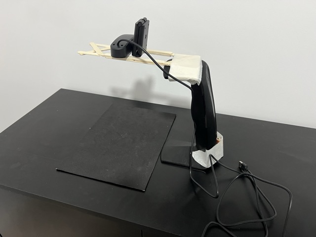
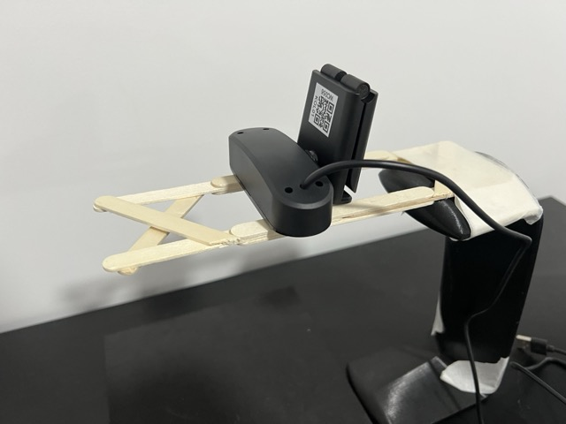
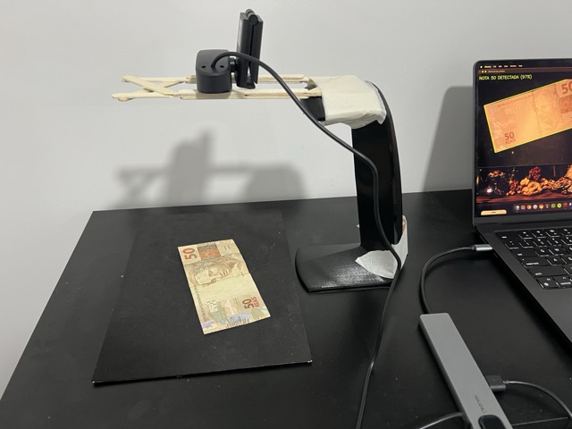
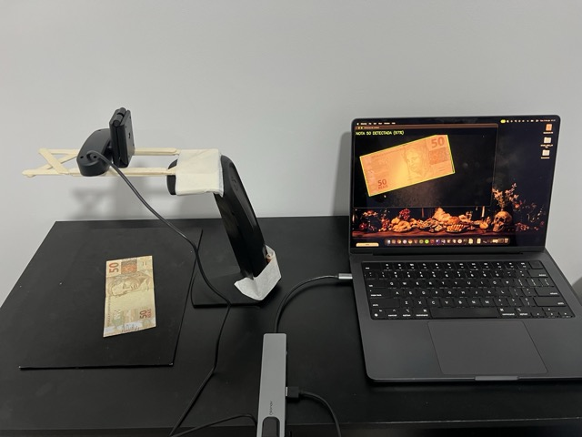
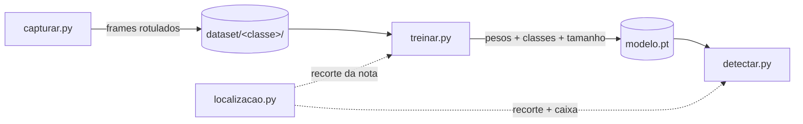
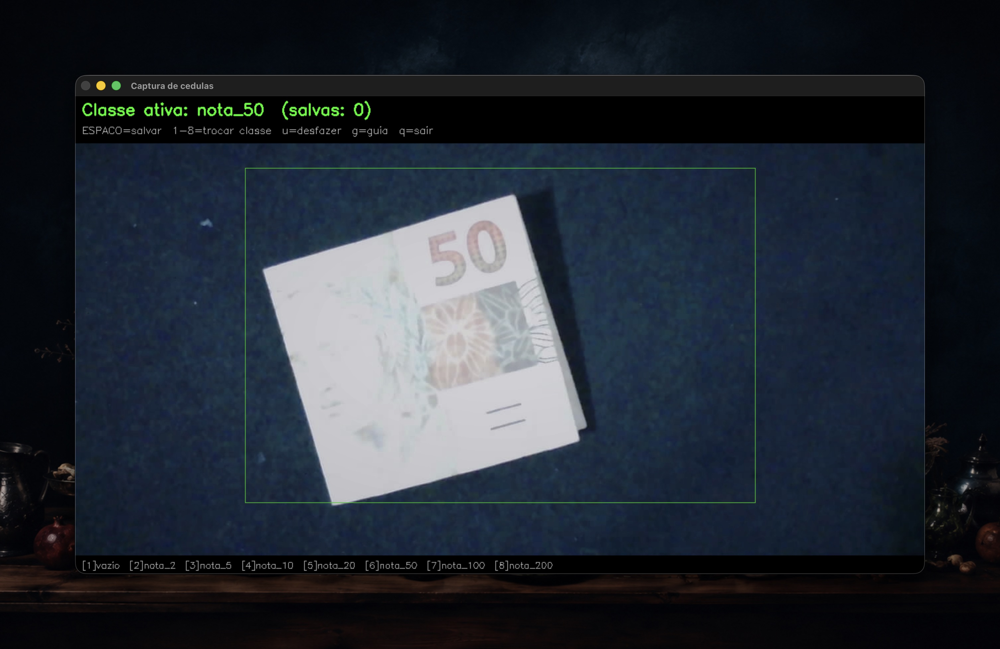
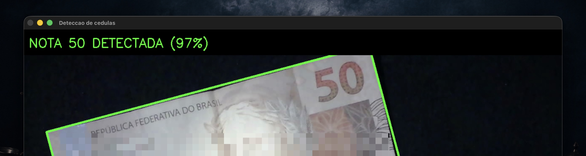

**Equipe:** Sem Título

**Integrantes:**

- Kayky de Brito dos Santos
- André Marques da Silva
- Rafael de Souza Coelho

**Data de publicação:** 4 de agosto de 2026

**Título do trabalho:** Programa de Reconhecimento de Valores de Cédulas

## 1. Introdução

Esta é a quarta etapa do trabalho final e cobre o entregável de **maquetes, câmeras, hardware, fotos e software (manual e código)**. Depois de definir [o tema](), ouvir os usuários na [fase de empatia]() e fechar o contrato de implementação na [modelagem funcional](), aqui apresentamos o que foi construído de fato: a bancada física em que o sistema opera, o equipamento de captura, o computador que executa tudo e os quatro módulos de software que hoje cobrem o ciclo completo de dataset, treino e detecção ao vivo.

Também registramos, com honestidade de engenharia, onde a implementação divergiu da modelagem da etapa anterior e o que ainda falta para o protótipo final.

> 📖 **O manual de uso do software está no arquivo [`README.md` da pasta `trabalho-final/`](https://github.com/kaykyb/ufabc-cv/blob/main/trabalho-final/README.md) do repositório.** A seção de software desta página traz um resumo dos passos, mas o manual completo (montagem, todas as flags de cada script e solução de problemas) é o README.

## 2. Maquete

A maquete reproduz, em escala de bancada, o balcão de caixa descrito nas entrevistas: uma superfície fixa sobre a qual a cédula é apresentada, com a câmera olhando para baixo a partir de um suporte fixo.

A montagem é deliberadamente caseira, no espírito de maquete de baixo custo: a câmera é sustentada por um **suporte de headphone**, com um **extensor de palitos de sorvete** fixado no topo fazendo o papel de braço horizontal que segura a câmera sobre a bancada. Como o peso da câmera na ponta do braço desequilibraria o conjunto, uma **pilha posicionada atrás serve de contrapeso**, mantendo o suporte estável durante as sessões de captura.

Três decisões definem a maquete:

- **Bancada preta fosca.** O fundo escuro e uniforme faz da cédula a única região clara da cena. Isso permite localizar a nota com visão computacional clássica (limiar de Otsu, descrito na seção de software) antes de qualquer rede neural, barateando e tornando mais previsível o restante do pipeline.
- **Câmera fixa em suporte.** A câmera não se move durante o uso, exatamente como na modelagem funcional: toda a exigência de enquadramento sai do usuário e vai para a montagem. O braço do suporte posiciona a câmera acima da bancada, apontada para a área útil.
- **Área útil central.** O software de captura desenha uma guia verde cobrindo a região central do quadro (60% da largura por 70% da altura), que delimita onde a cédula deve ficar. A guia é apenas visual e não aparece nas imagens salvas.







## 3. Câmera

A captura é feita com uma **webcam USB (modelo WC056)** conectada ao notebook. Alguns pontos práticos que saíram da experiência com essa câmera e estão refletidos no código:

- **Seleção por nome, não por índice.** No macOS, a ordem dos índices de câmera do OpenCV (backend AVFoundation) muda conforme os dispositivos conectados. O software consulta o `system_profiler` do sistema e procura a câmera pelo nome ("WC056" por padrão), caindo para o índice 0 se não encontrar. O índice também pode ser forçado com `--camera N`.
- **Resolução nativa.** Por padrão nenhuma resolução é forçada: usa-se a resolução nativa reportada pela câmera, que é impressa no terminal na abertura. Flags `--largura/--altura` permitem forçar outro valor quando necessário.
- **Exposição e white balance.** A câmera opera em modo automático por padrão, o que varia a aparência das imagens entre sessões de captura. O script oferece `--travar`, `--exposicao` e `--wb-temp` para fixar esses parâmetros, mas o AVFoundation nem sempre aceita esses comandos via OpenCV; o script lê os valores de volta e avisa quando o travamento não funcionou. Nesses casos a alternativa adotada foi fixar a iluminação da cena e absorver a variação restante com data augmentation de cor no treino.

## 4. Hardware

Nesta etapa todo o processamento roda em um **notebook Mac com Apple Silicon**, que concentra três papéis:

| Papel | Como o hardware é usado |
| --- | --- |
| Captura do dataset | Leitura da webcam USB via OpenCV (AVFoundation) e gravação dos frames em disco |
| Treino da CNN | GPU integrada via **MPS** (Metal Performance Shaders), selecionada automaticamente pelo código; com fallback para CUDA ou CPU em outras máquinas |
| Detecção ao vivo | Inferência quadro a quadro no mesmo dispositivo, com exibição do resultado na tela |

O conjunto físico completo é: notebook, webcam USB, o suporte caseiro da câmera (suporte de headphone, extensor de palitos de sorvete e pilha de contrapeso), bancada com forro preto fosco e a iluminação do ambiente. Não há hardware embarcado nesta etapa; a portabilidade do conjunto para um dispositivo dedicado é uma possibilidade de trabalho futuro, não um requisito do protótipo.



## 5. Software

O código-fonte completo está na pasta [`trabalho-final/`](https://github.com/kaykyb/ufabc-cv/tree/main/trabalho-final) deste repositório, junto com o modelo treinado (`modelo.pt`), o `requirements.txt` e o **manual de uso ([`README.md`](https://github.com/kaykyb/ufabc-cv/blob/main/trabalho-final/README.md))**. O software está dividido em quatro módulos Python, cada um com uma responsabilidade única:

| Arquivo | Responsabilidade |
| --- | --- |
| `capturar.py` | Ferramenta interativa de captura de imagens para o dataset |
| `localizacao.py` | Localização da cédula por visão clássica (Otsu + contornos), sem rede |
| `treinar.py` | Treino de uma CNN pequena, do zero, sobre o dataset capturado |
| `detectar.py` | Detecção ao vivo: localiza, classifica e exibe o resultado no feed da câmera |



O ponto central do desenho é que **treino e detecção enxergam a mesma coisa**: o mesmo módulo de localização recorta a nota tanto nas imagens de treino quanto no feed ao vivo, eliminando a diferença de distribuição entre os dois momentos.

### 5.1. O que mudou em relação à modelagem funcional

Duas divergências conscientes em relação à [etapa 3]():

- **Localização por Otsu em vez de Canny.** A modelagem previa realce de bordas (Canny + morfologia) para achar a cédula. Com a maquete de bancada preta, um limiar de Otsu sobre a imagem em tons de cinza separa a nota do fundo de forma mais simples e estável; a abertura morfológica remove ruído e o maior contorno é a nota. O bloco funcional é o mesmo (localizar e recortar a ROI), com um método mais adequado ao cenário físico construído.
- **Classificação do quadro inteiro delegada ao recorte.** Quando a localização não encontra contorno relevante (bancada vazia), o sistema responde "vazio" diretamente, sem passar pela rede, o que economiza inferência e reduz falsos positivos.

Seguem para a próxima etapa, conforme a modelagem: a **correção de distorção com os parâmetros de calibração**, o **anúncio em áudio (TTS)** e a **estabilização entre quadros**. O corte por confiança já existe na detecção (limiar ajustável, padrão 80%).

### 5.2. Dataset capturado

O dataset atual, capturado inteiramente na maquete com a ferramenta `capturar.py`, tem **1.393 imagens** distribuídas assim:

| Classe | Imagens |
| --- | --- |
| vazio (bancada sem nota) | 207 |
| nota_2 | 200 |
| nota_5 | 195 |
| nota_10 | 200 |
| nota_20 | 130 |
| nota_50 | 271 |
| nota_100 | 190 |

A classe `nota_200` está prevista no software (tecla 8 da captura), mas ainda não foi capturada; a coluna correspondente entra no dataset assim que tivermos um exemplar da cédula disponível. Cada classe cobre frente e verso, rotações e posições variadas dentro da área útil.

> Observação: por decisão da equipe, as imagens do dataset de treinamento não são reproduzidas nesta página nem versionadas no repositório (a pasta `trabalho-final/dataset/` fica apenas nas máquinas da equipe).

### 5.3. Manual de uso

> 📖 **ATENÇÃO: o manual de uso completo está no [`README.md` da pasta `trabalho-final/`](https://github.com/kaykyb/ufabc-cv/blob/main/trabalho-final/README.md)**, incluindo a montagem física da maquete, a tabela completa de flags de cada script e a seção de solução de problemas. O que segue abaixo é o resumo dos três passos do fluxo.

#### Instalação

Requisitos: Python 3.10+ e as dependências do projeto. Todos os comandos abaixo são executados de dentro da pasta `trabalho-final/` do repositório:

```bash
cd trabalho-final
pip install -r requirements.txt
```

O `requirements.txt` cobre OpenCV, NumPy, PyTorch, Torchvision e Pillow.

#### Passo 1: capturar o dataset

Com a maquete montada e a câmera conectada:

```bash
python capturar.py                 # abre a câmera WC056, classe inicial nota_50
python capturar.py --classe vazio  # começa capturando o fundo vazio
python capturar.py --camera 1      # força outro índice de câmera
```

A janela mostra o feed com um HUD: a classe ativa, o contador de imagens salvas e a guia verde de enquadramento. As teclas durante a execução:

| Tecla | Ação |
| --- | --- |
| `ESPAÇO` | Salva o frame atual na classe ativa (sem o HUD) |
| `1` a `8` | Troca a classe ativa (vazio, nota_2, ..., nota_200) |
| `u` | Desfaz: apaga o último arquivo salvo |
| `g` | Liga/desliga a guia de enquadramento |
| `q` / `ESC` | Sai |

As imagens são salvas em `dataset/<classe>/` com nome único por timestamp. O fluxo típico de uma sessão: posicionar a nota, girar/mover/virar entre um `ESPAÇO` e outro, trocar de classe com as teclas numéricas e repetir.



#### Passo 2: treinar o modelo

```bash
python treinar.py                 # padrões: 25 épocas, batch 32, imagens 192x192
python treinar.py --epocas 30     # treina por mais tempo
python treinar.py --tamanho 160   # entrada menor (mais rápido)
```

O script separa 20% do dataset para validação (split reprodutível por semente), aplica data augmentation apenas no treino e salva em `modelo.pt` o melhor modelo segundo a acurácia de validação. O checkpoint guarda os pesos, os nomes das classes e o tamanho de entrada, então a detecção reconstrói tudo sozinha a partir do arquivo.

#### Passo 3: detecção ao vivo

```bash
python detectar.py                 # câmera WC056, modelo.pt, limiar 0.8
python detectar.py --limiar 0.9    # exige mais confiança para acusar detecção
```

A cada quadro o sistema recorta a nota, classifica o recorte e mostra a previsão com a confiança. Quando a classe prevista é uma cédula com confiança acima do limiar, a tela destaca "NOTA X DETECTADA" e desenha a caixa rotacionada em volta da nota. `q` ou `ESC` encerra.



### 5.4. Código

O código completo dos quatro módulos, na versão usada para capturar o dataset e treinar o modelo desta etapa. Os mesmos arquivos estão em [`trabalho-final/`](https://github.com/kaykyb/ufabc-cv/tree/main/trabalho-final) no repositório.

#### `localizacao.py`

O coração da parte clássica: Otsu separa a nota clara do fundo preto, abertura morfológica limpa o ruído e o maior contorno acima da área mínima é a nota. Treino e detecção importam as mesmas funções.

```python
"""
Localizacao da cedula por visao computacional classica (sem rede).

Como a nota e a unica coisa clara sobre a bancada preta, um threshold de Otsu
separa nota (branco) do fundo (preto). O maior contorno e a nota.

Usado tanto no treino (para recortar a nota antes de classificar) quanto na
deteccao (para desenhar a caixa e recortar) -- assim os dois enxergam a mesma
coisa.
"""

import cv2


def _maior_contorno(frame_bgr, area_min_frac):
    """Retorna o maior contorno claro sobre fundo preto, ou None se for pequeno."""
    cinza = cv2.cvtColor(frame_bgr, cv2.COLOR_BGR2GRAY)
    cinza = cv2.GaussianBlur(cinza, (5, 5), 0)
    _, mascara = cv2.threshold(cinza, 0, 255, cv2.THRESH_BINARY + cv2.THRESH_OTSU)

    kernel = cv2.getStructuringElement(cv2.MORPH_ELLIPSE, (7, 7))
    mascara = cv2.morphologyEx(mascara, cv2.MORPH_OPEN, kernel)

    contornos, _ = cv2.findContours(mascara, cv2.RETR_EXTERNAL, cv2.CHAIN_APPROX_SIMPLE)
    if not contornos:
        return None

    maior = max(contornos, key=cv2.contourArea)
    h, w = frame_bgr.shape[:2]
    if cv2.contourArea(maior) < area_min_frac * w * h:
        return None
    return maior


def caixa_rotacionada(frame_bgr, area_min_frac=0.02):
    """4 pontos do retangulo rotacionado (para desenhar), ou None."""
    contorno = _maior_contorno(frame_bgr, area_min_frac)
    if contorno is None:
        return None
    return cv2.boxPoints(cv2.minAreaRect(contorno)).astype(int)


def recortar_nota(frame_bgr, area_min_frac=0.02, pad=0.05):
    """Recorta a nota (bounding box com uma folga 'pad'), ou None se nao achar."""
    contorno = _maior_contorno(frame_bgr, area_min_frac)
    if contorno is None:
        return None

    x, y, w, h = cv2.boundingRect(contorno)
    H, W = frame_bgr.shape[:2]
    p = int(pad * max(w, h))
    x0, y0 = max(0, x - p), max(0, y - p)
    x1, y1 = min(W, x + w + p), min(H, y + h + p)
    return frame_bgr[y0:y1, x0:x1]
```

#### `capturar.py`

Ferramenta interativa de captura: resolve a câmera pelo nome no macOS, tenta travar exposição/white balance quando pedido, desenha o HUD e salva cada frame rotulado na pasta da classe ativa.

```python
"""
Captura de imagens para o dataset do detector de cedulas.

Cenario: camera fixa em tripe sobre uma bancada preta.
Voce posiciona a cedula (girando, movendo, virando frente/verso) e aperta
uma tecla para salvar cada frame na classe ativa.

Uso basico:
    python capturar.py                 # abre a camera 0, classe inicial nota_50
    python capturar.py --camera 1      # usa outra camera
    python capturar.py --classe vazio  # comeca capturando o fundo vazio

Teclas (durante a execucao):
    ESPACO  salva o frame atual na classe ativa
    1..8    troca a classe ativa (ver legenda na tela)
    u       desfaz (apaga o ultimo arquivo salvo)
    g       liga/desliga a guia de enquadramento central
    q/ESC   sai
"""

import argparse
import json
import os
import platform
import subprocess
from datetime import datetime

import cv2

# Ordem fixa das classes -> mapeada para as teclas 1..8.
# Editar aqui para adicionar/remover cedulas. As pastas so sao criadas
# quando voce salva a primeira imagem naquela classe.
CLASSES = [
    "vazio",
    "nota_2",
    "nota_5",
    "nota_10",
    "nota_20",
    "nota_50",
    "nota_100",
    "nota_200",
]


def listar_cameras_macos():
    """Retorna a lista de nomes de cameras no macOS, na ordem do AVFoundation.

    Essa ordem coincide com o indice usado pelo OpenCV (backend AVFoundation),
    entao a posicao na lista serve como indice para cv2.VideoCapture.
    """
    try:
        saida = subprocess.check_output(
            ["system_profiler", "SPCameraDataType", "-json"],
            text=True, stderr=subprocess.DEVNULL,
        )
        dados = json.loads(saida).get("SPCameraDataType", [])
        return [cam.get("_name", "") for cam in dados]
    except (subprocess.SubprocessError, json.JSONDecodeError, OSError):
        return []


def encontrar_camera_por_nome(nome):
    """Procura uma camera cujo nome contenha 'nome' (sem diferenciar maiusculas).

    Retorna o indice (posicao na lista) ou None se nao encontrar.
    So funciona no macOS; em outros sistemas retorna None.
    """
    if platform.system() != "Darwin" or not nome:
        return None
    nomes = listar_cameras_macos()
    for idx, n in enumerate(nomes):
        if nome.lower() in n.lower():
            return idx
    return None


def resolver_camera(args):
    """Decide qual indice de camera usar a partir dos argumentos."""
    # --camera explicito sempre tem prioridade.
    if args.camera is not None:
        return args.camera

    idx = encontrar_camera_por_nome(args.nome_camera)
    if idx is not None:
        print(f"Camera '{args.nome_camera}' encontrada no indice {idx}.")
        return idx

    print(f"Camera '{args.nome_camera}' nao encontrada; usando indice 0. "
          f"(Force com --camera N se precisar.)")
    return 0


def parse_args():
    p = argparse.ArgumentParser(description="Captura de imagens do dataset de cedulas.")
    p.add_argument("--camera", type=int, default=None,
                   help="Indice da camera. Se omitido, procura pela --nome-camera.")
    p.add_argument("--nome-camera", type=str, default="WC056",
                   help="Nome (ou parte) da camera a procurar no macOS (padrao: WC056)")
    p.add_argument("--classe", type=str, default="nota_50",
                   help="Classe ativa inicial (padrao: nota_50)")
    p.add_argument("--saida", type=str, default="dataset",
                   help="Pasta raiz do dataset (padrao: dataset)")
    p.add_argument("--largura", type=int, default=None,
                   help="Forcar largura do frame. Se omitido, usa a resolucao nativa da camera.")
    p.add_argument("--altura", type=int, default=None,
                   help="Forcar altura do frame. Se omitido, usa a resolucao nativa da camera.")
    p.add_argument("--travar", action="store_true",
                   help="Desliga auto-exposicao e auto-white-balance (fixa a imagem).")
    p.add_argument("--exposicao", type=float, default=None,
                   help="Valor manual de exposicao (implica --travar). Ajuste testando.")
    p.add_argument("--wb-temp", type=int, default=None,
                   help="Temperatura manual do white balance em Kelvin (implica --travar).")
    return p.parse_args()


def configurar_camera(cap, args):
    """Tenta travar exposicao/white balance da camera e reporta o que foi aceito.

    Obs.: o suporte a essas propriedades depende da camera e do backend do
    OpenCV. No macOS (AVFoundation) muitas nao funcionam; nesse caso a saida
    mostra que o valor nao mudou e o jeito confiavel e travar por fora
    (app 'Webcam Settings' ou uvc-util) ou fixar a iluminacao.
    """
    travar = args.travar or args.exposicao is not None or args.wb_temp is not None
    if not travar:
        return

    print("Tentando travar exposicao/white balance...")

    # 0.25 = manual na maioria dos backends; 0.75 = auto. (Semantica varia.)
    cap.set(cv2.CAP_PROP_AUTO_EXPOSURE, 0.25)
    cap.set(cv2.CAP_PROP_AUTO_WB, 0)

    if args.exposicao is not None:
        cap.set(cv2.CAP_PROP_EXPOSURE, args.exposicao)
    if args.wb_temp is not None:
        cap.set(cv2.CAP_PROP_WB_TEMPERATURE, args.wb_temp)

    # Le de volta para o usuario ver se a camera realmente aceitou.
    print(f"  auto_exposure -> {cap.get(cv2.CAP_PROP_AUTO_EXPOSURE)}")
    print(f"  exposure      -> {cap.get(cv2.CAP_PROP_EXPOSURE)}")
    print(f"  auto_wb       -> {cap.get(cv2.CAP_PROP_AUTO_WB)}")
    print(f"  wb_temperature-> {cap.get(cv2.CAP_PROP_WB_TEMPERATURE)}")
    print("  Se os valores nao mudaram, a camera/backend nao suporta via OpenCV "
          "(trave por fora: app 'Webcam Settings' / uvc-util, ou fixe a luz).")


def contar_existentes(saida, classe):
    """Quantas imagens ja existem na pasta da classe (para o contador da tela)."""
    pasta = os.path.join(saida, classe)
    if not os.path.isdir(pasta):
        return 0
    return sum(1 for f in os.listdir(pasta) if f.lower().endswith(".jpg"))


def salvar_frame(frame, saida, classe):
    """Salva o frame na pasta da classe com nome unico (timestamp + ms). Retorna o caminho."""
    pasta = os.path.join(saida, classe)
    os.makedirs(pasta, exist_ok=True)
    agora = datetime.now()
    nome = f"{classe}_{agora.strftime('%Y%m%d_%H%M%S')}_{agora.microsecond // 1000:03d}.jpg"
    caminho = os.path.join(pasta, nome)
    cv2.imwrite(caminho, frame)
    return caminho


def desenhar_hud(frame, classe_ativa, total_classe, ultimo_salvo, mostrar_guia):
    """Desenha as informacoes e a legenda de teclas sobre uma copia do frame."""
    h, w = frame.shape[:2]
    vis = frame.copy()

    # Guia de enquadramento central (nao afeta a imagem salva).
    if mostrar_guia:
        cx0, cy0 = int(w * 0.20), int(h * 0.15)
        cx1, cy1 = int(w * 0.80), int(h * 0.85)
        cv2.rectangle(vis, (cx0, cy0), (cx1, cy1), (0, 200, 0), 1)

    # Faixa escura no topo para dar contraste ao texto.
    cv2.rectangle(vis, (0, 0), (w, 70), (0, 0, 0), -1)
    cv2.putText(vis, f"Classe ativa: {classe_ativa}  (salvas: {total_classe})",
                (10, 28), cv2.FONT_HERSHEY_SIMPLEX, 0.8, (0, 255, 0), 2)
    cv2.putText(vis, "ESPACO=salvar  1-8=trocar classe  u=desfazer  g=guia  q=sair",
                (10, 56), cv2.FONT_HERSHEY_SIMPLEX, 0.5, (200, 200, 200), 1)

    # Legenda das teclas de classe no rodape.
    legenda = "  ".join(f"[{i + 1}]{c}" for i, c in enumerate(CLASSES))
    cv2.rectangle(vis, (0, h - 28), (w, h), (0, 0, 0), -1)
    cv2.putText(vis, legenda, (10, h - 9),
                cv2.FONT_HERSHEY_SIMPLEX, 0.45, (180, 180, 180), 1)

    if ultimo_salvo:
        cv2.putText(vis, f"salvo: {os.path.basename(ultimo_salvo)}",
                    (10, h - 38), cv2.FONT_HERSHEY_SIMPLEX, 0.5, (0, 255, 255), 1)

    return vis


def main():
    args = parse_args()

    if args.classe not in CLASSES:
        raise SystemExit(f"Classe '{args.classe}' invalida. Opcoes: {', '.join(CLASSES)}")

    indice_camera = resolver_camera(args)
    cap = cv2.VideoCapture(indice_camera)
    if not cap.isOpened():
        raise SystemExit(f"Nao consegui abrir a camera {indice_camera}. "
                         f"Tente outro indice com --camera.")
    # So forca a resolucao se o usuario pedir explicitamente; caso contrario,
    # mantem a resolucao nativa da camera.
    if args.largura is not None:
        cap.set(cv2.CAP_PROP_FRAME_WIDTH, args.largura)
    if args.altura is not None:
        cap.set(cv2.CAP_PROP_FRAME_HEIGHT, args.altura)

    configurar_camera(cap, args)

    classe_ativa = args.classe
    total = contar_existentes(args.saida, classe_ativa)
    ultimo_salvo = None
    mostrar_guia = True

    largura_real = int(cap.get(cv2.CAP_PROP_FRAME_WIDTH))
    altura_real = int(cap.get(cv2.CAP_PROP_FRAME_HEIGHT))
    print(f"Camera {indice_camera} aberta em {largura_real}x{altura_real}.")
    print(f"Salvando em: {os.path.abspath(args.saida)}")
    print("Janela aberta. Foco nela e use as teclas (q/ESC para sair).")

    janela = "Captura de cedulas"
    cv2.namedWindow(janela, cv2.WINDOW_NORMAL)

    try:
        while True:
            ok, frame = cap.read()
            if not ok:
                print("Falha ao ler frame da camera. Encerrando.")
                break

            vis = desenhar_hud(frame, classe_ativa, total, ultimo_salvo, mostrar_guia)
            cv2.imshow(janela, vis)

            tecla = cv2.waitKey(1) & 0xFF

            if tecla in (ord("q"), 27):  # q ou ESC
                break
            elif tecla == ord(" "):  # salvar o frame ORIGINAL (sem o HUD)
                ultimo_salvo = salvar_frame(frame, args.saida, classe_ativa)
                total += 1
                print(f"[{total}] {ultimo_salvo}")
            elif tecla == ord("g"):
                mostrar_guia = not mostrar_guia
            elif tecla == ord("u"):  # desfazer ultimo save
                if ultimo_salvo and os.path.exists(ultimo_salvo):
                    os.remove(ultimo_salvo)
                    print(f"Removido: {ultimo_salvo}")
                    total = max(0, total - 1)
                    ultimo_salvo = None
                else:
                    print("Nada para desfazer.")
            elif ord("1") <= tecla <= ord("8"):  # trocar classe
                idx = tecla - ord("1")
                if idx < len(CLASSES):
                    classe_ativa = CLASSES[idx]
                    total = contar_existentes(args.saida, classe_ativa)
                    ultimo_salvo = None
                    print(f"Classe ativa: {classe_ativa} (salvas: {total})")
    finally:
        cap.release()
        cv2.destroyAllWindows()


if __name__ == "__main__":
    main()
```

#### `treinar.py`

Treino de uma CNN compacta (3 blocos convolucionais + classificador) do zero. O transform `RecorteNota` aplica a localização clássica antes de tudo, no treino e na validação, para que o modelo sempre veja a nota recortada, igual à detecção ao vivo.

```python
"""
Treino do detector de cedulas: uma CNN pequena treinada do zero.

Le as imagens de dataset/<classe>/ (ImageFolder mapeia cada pasta para uma
classe automaticamente), separa em treino/validacao, aplica data augmentation
apenas no treino e salva o melhor modelo em modelo.pt.

Uso:
    python treinar.py                 # padroes sensatos
    python treinar.py --epocas 30     # treina por mais tempo
    python treinar.py --tamanho 160   # imagens maiores (mais lento)

O checkpoint salvo (modelo.pt) guarda os pesos, os nomes das classes e o
tamanho da imagem, para o script de deteccao reconstruir tudo sozinho.
"""

import argparse

import cv2
import numpy as np
import torch
import torch.nn as nn
from PIL import Image
from torch.utils.data import DataLoader, Subset
from torchvision import transforms
from torchvision.datasets import ImageFolder

from localizacao import recortar_nota


class RecorteNota:
    """Transform que recorta a nota (CV classica) antes do resto do pipeline.

    Recebe e devolve uma PIL Image. Se nao achar nota (ex.: bancada vazia),
    devolve a imagem original inalterada. Aplicado no treino E na validacao,
    para que o modelo sempre veja a nota recortada -- igual ao que a deteccao
    ao vivo faz.
    """

    def __init__(self, area_min=0.02):
        self.area_min = area_min

    def __call__(self, img):
        bgr = cv2.cvtColor(np.asarray(img), cv2.COLOR_RGB2BGR)
        recorte = recortar_nota(bgr, self.area_min)
        if recorte is None:
            return img
        return Image.fromarray(cv2.cvtColor(recorte, cv2.COLOR_BGR2RGB))


def parse_args():
    p = argparse.ArgumentParser(description="Treino da CNN detectora de cedulas.")
    p.add_argument("--dataset", type=str, default="dataset", help="Pasta raiz do dataset")
    p.add_argument("--saida-modelo", type=str, default="modelo.pt", help="Arquivo de saida do modelo")
    p.add_argument("--epocas", type=int, default=25, help="Numero de epocas")
    p.add_argument("--batch", type=int, default=32, help="Tamanho do batch")
    p.add_argument("--lr", type=float, default=1e-3, help="Taxa de aprendizado")
    p.add_argument("--tamanho", type=int, default=192, help="Lado da imagem (quadrada) na entrada")
    p.add_argument("--val-split", type=float, default=0.2, help="Fracao para validacao (0-1)")
    p.add_argument("--seed", type=int, default=42, help="Semente para reprodutibilidade")
    return p.parse_args()


def escolher_dispositivo():
    """Usa a GPU da Apple (MPS) se houver; senao CUDA; senao CPU."""
    if torch.backends.mps.is_available():
        return torch.device("mps")
    if torch.cuda.is_available():
        return torch.device("cuda")
    return torch.device("cpu")


def construir_transforms(tamanho):
    """Transforms de treino (com augmentation) e de validacao (limpo)."""
    # Media/desvio simples (0.5) porque a rede e treinada do zero.
    normalizar = transforms.Normalize([0.5, 0.5, 0.5], [0.5, 0.5, 0.5])

    treino = transforms.Compose([
        RecorteNota(),  # recorta a nota antes de tudo (mesma logica da deteccao)
        transforms.RandomResizedCrop(tamanho, scale=(0.7, 1.0)),
        transforms.RandomRotation(20),
        transforms.RandomHorizontalFlip(),
        transforms.RandomVerticalFlip(),
        # ColorJitter ataca a variacao de exposicao/white balance.
        # brightness como tupla (min, max): so ESCURECE (0.5x a 1.0x), nunca
        # clareia -- as fotos ja estao muito bright, entao nao faz sentido
        # aumentar o brilho e estourar ainda mais para o branco.
        # Um pouco mais de contraste ajuda a "recuperar" imagens lavadas.
        transforms.ColorJitter(brightness=(0.5, 1.0), contrast=0.4, saturation=0.2),
        transforms.ToTensor(),
        normalizar,
    ])

    validacao = transforms.Compose([
        RecorteNota(),  # mesmo recorte, sem augmentation
        transforms.Resize((tamanho, tamanho)),
        transforms.ToTensor(),
        normalizar,
    ])
    return treino, validacao


def carregar_dados(args):
    """Monta os DataLoaders de treino e validacao com o mesmo split de indices.

    Cria duas visoes do mesmo diretorio (uma com augmentation, outra sem) e
    aplica o split por indices, garantindo que a validacao nao veja augmentation.
    """
    tf_treino, tf_val = construir_transforms(args.tamanho)
    ds_treino_full = ImageFolder(args.dataset, transform=tf_treino)
    ds_val_full = ImageFolder(args.dataset, transform=tf_val)

    n = len(ds_treino_full)
    if n == 0:
        raise SystemExit(f"Nenhuma imagem encontrada em '{args.dataset}'.")

    gerador = torch.Generator().manual_seed(args.seed)
    indices = torch.randperm(n, generator=gerador).tolist()
    n_val = int(n * args.val_split)
    idx_val, idx_treino = indices[:n_val], indices[n_val:]

    ds_treino = Subset(ds_treino_full, idx_treino)
    ds_val = Subset(ds_val_full, idx_val)

    dl_treino = DataLoader(ds_treino, batch_size=args.batch, shuffle=True)
    dl_val = DataLoader(ds_val, batch_size=args.batch, shuffle=False)
    return dl_treino, dl_val, ds_treino_full.classes


class CNNPequena(nn.Module):
    """CNN compacta: 3 blocos convolucionais + classificador."""

    def __init__(self, num_classes):
        super().__init__()

        def bloco(entrada, saida):
            return nn.Sequential(
                nn.Conv2d(entrada, saida, kernel_size=3, padding=1),
                nn.BatchNorm2d(saida),
                nn.ReLU(inplace=True),
                nn.MaxPool2d(2),
            )

        self.features = nn.Sequential(
            bloco(3, 16),    # -> 16 canais, metade da resolucao
            bloco(16, 32),   # -> 32 canais
            bloco(32, 64),   # -> 64 canais
            nn.AdaptiveAvgPool2d((4, 4)),  # fixa a saida em 4x4 (independe do tamanho)
        )
        self.classifier = nn.Sequential(
            nn.Flatten(),
            nn.Linear(64 * 4 * 4, 128),
            nn.ReLU(inplace=True),
            nn.Dropout(0.4),
            nn.Linear(128, num_classes),
        )

    def forward(self, x):
        return self.classifier(self.features(x))


def rodar_epoca(modelo, loader, criterio, dispositivo, otimizador=None):
    """Roda uma epoca. Se 'otimizador' for None, roda em modo avaliacao."""
    treinando = otimizador is not None
    modelo.train() if treinando else modelo.eval()

    perda_total, acertos, total = 0.0, 0, 0
    contexto = torch.enable_grad() if treinando else torch.no_grad()
    with contexto:
        for imgs, rotulos in loader:
            imgs, rotulos = imgs.to(dispositivo), rotulos.to(dispositivo)
            if treinando:
                otimizador.zero_grad()
            saidas = modelo(imgs)
            perda = criterio(saidas, rotulos)
            if treinando:
                perda.backward()
                otimizador.step()

            perda_total += perda.item() * imgs.size(0)
            acertos += (saidas.argmax(1) == rotulos).sum().item()
            total += imgs.size(0)

    return perda_total / total, acertos / total


def main():
    args = parse_args()
    torch.manual_seed(args.seed)

    dispositivo = escolher_dispositivo()
    print(f"Dispositivo: {dispositivo}")

    dl_treino, dl_val, classes = carregar_dados(args)
    print(f"Classes: {classes}")
    n_treino, n_val = len(dl_treino.dataset), len(dl_val.dataset)  # type: ignore[arg-type]
    print(f"Treino: {n_treino} imagens | Validacao: {n_val} imagens")

    modelo = CNNPequena(num_classes=len(classes)).to(dispositivo)
    criterio = nn.CrossEntropyLoss()
    otimizador = torch.optim.Adam(modelo.parameters(), lr=args.lr)

    melhor_acc = 0.0
    for epoca in range(1, args.epocas + 1):
        perda_tr, acc_tr = rodar_epoca(modelo, dl_treino, criterio, dispositivo, otimizador)
        perda_val, acc_val = rodar_epoca(modelo, dl_val, criterio, dispositivo)

        marca = ""
        if acc_val >= melhor_acc:
            melhor_acc = acc_val
            torch.save({
                "state_dict": modelo.state_dict(),
                "classes": classes,
                "tamanho": args.tamanho,
            }, args.saida_modelo)
            marca = "  <- melhor (salvo)"

        print(f"Epoca {epoca:2d}/{args.epocas} | "
              f"treino: perda {perda_tr:.3f} acc {acc_tr:.3f} | "
              f"val: perda {perda_val:.3f} acc {acc_val:.3f}{marca}")

    print(f"\nConcluido. Melhor acuracia de validacao: {melhor_acc:.3f}")
    print(f"Modelo salvo em: {args.saida_modelo}")


if __name__ == "__main__":
    main()
```

#### `detectar.py`

Detecção ao vivo: reconstrói o modelo a partir do checkpoint, recorta a nota de cada quadro com a mesma localização do treino e só acusa detecção quando a confiança supera o limiar. Bancada vazia vira "vazio" sem passar pela rede.

```python
"""
Deteccao ao vivo: roda o modelo treinado no feed da camera em tempo real.

Carrega modelo.pt (pesos + nomes das classes + tamanho da imagem), classifica
cada frame e mostra a previsao na tela. Se a classe prevista for uma cedula
com confianca acima do limiar, destaca "DETECTADA".

Uso:
    python detectar.py                 # camera WC056, modelo.pt
    python detectar.py --limiar 0.9    # exige mais confianca para acusar deteccao

Teclas:
    q/ESC   sai
"""

import argparse

import cv2
import torch
import torch.nn.functional as F
from PIL import Image
from torchvision import transforms

# Reaproveita a arquitetura do treino, os utilitarios de camera da captura e a
# localizacao classica (mesma usada no treino para recortar a nota).
from treinar import CNNPequena, escolher_dispositivo
from capturar import resolver_camera
from localizacao import caixa_rotacionada, recortar_nota


def parse_args():
    p = argparse.ArgumentParser(description="Deteccao ao vivo de cedulas.")
    p.add_argument("--camera", type=int, default=None,
                   help="Indice da camera. Se omitido, procura pela --nome-camera.")
    p.add_argument("--nome-camera", type=str, default="WC056",
                   help="Nome (ou parte) da camera a procurar no macOS (padrao: WC056)")
    p.add_argument("--modelo", type=str, default="modelo.pt", help="Arquivo do modelo treinado")
    p.add_argument("--limiar", type=float, default=0.8,
                   help="Confianca minima para acusar deteccao de cedula (0-1)")
    p.add_argument("--area-min", type=float, default=0.02,
                   help="Area minima da nota como fracao do frame, p/ localizar (0-1)")
    return p.parse_args()


def carregar_modelo(caminho, dispositivo):
    """Carrega o checkpoint e reconstroi o modelo em modo avaliacao."""
    ckpt = torch.load(caminho, map_location=dispositivo)
    classes = ckpt["classes"]
    tamanho = ckpt["tamanho"]

    modelo = CNNPequena(num_classes=len(classes)).to(dispositivo)
    modelo.load_state_dict(ckpt["state_dict"])
    modelo.eval()
    return modelo, classes, tamanho


def construir_transform(tamanho):
    """Mesmo pre-processamento da validacao no treino (sem augmentation)."""
    return transforms.Compose([
        transforms.Resize((tamanho, tamanho)),
        transforms.ToTensor(),
        transforms.Normalize([0.5, 0.5, 0.5], [0.5, 0.5, 0.5]),
    ])


def prever(frame_bgr, modelo, transform, classes, dispositivo):
    """Classifica um frame (BGR do OpenCV). Retorna (classe, confianca)."""
    frame_rgb = cv2.cvtColor(frame_bgr, cv2.COLOR_BGR2RGB)
    tensor = transform(Image.fromarray(frame_rgb)).unsqueeze(0).to(dispositivo)
    with torch.no_grad():
        probs = F.softmax(modelo(tensor), dim=1)[0]
    idx = int(probs.argmax().item())
    return classes[idx], float(probs[idx].item())


def main():
    args = parse_args()

    dispositivo = escolher_dispositivo()
    print(f"Dispositivo: {dispositivo}")

    modelo, classes, tamanho = carregar_modelo(args.modelo, dispositivo)
    print(f"Modelo carregado. Classes: {classes} | tamanho de entrada: {tamanho}")

    transform = construir_transform(tamanho)

    indice_camera = resolver_camera(args)
    cap = cv2.VideoCapture(indice_camera)
    if not cap.isOpened():
        raise SystemExit(f"Nao consegui abrir a camera {indice_camera}. Tente --camera N.")

    janela = "Deteccao de cedulas"
    cv2.namedWindow(janela, cv2.WINDOW_NORMAL)
    print("Janela aberta. Foco nela e q/ESC para sair.")

    try:
        while True:
            ok, frame = cap.read()
            if not ok:
                print("Falha ao ler frame. Encerrando.")
                break

            # Recorta a nota (mesma logica do treino). Sem nota na bancada ->
            # 'vazio' direto, sem passar pela rede.
            recorte = recortar_nota(frame, args.area_min)
            if recorte is None:
                classe, conf = "vazio", 1.0
            else:
                classe, conf = prever(recorte, modelo, transform, classes, dispositivo)

            # Considera "deteccao" quando a classe e uma cedula com confianca alta.
            eh_cedula = classe.startswith("nota_")
            detectou = eh_cedula and conf >= args.limiar
            cor = (0, 255, 0) if detectou else (0, 165, 255) if eh_cedula else (200, 200, 200)

            # Desenha a caixa (segue a rotacao) so quando ha deteccao.
            caixa = caixa_rotacionada(frame, args.area_min) if detectou else None
            if caixa is not None:
                cv2.drawContours(frame, [caixa], 0, (0, 255, 0), 3)

            texto = f"{classe}: {conf * 100:.0f}%"
            if detectou:
                texto = f"{classe.replace('nota_', 'NOTA ')} DETECTADA ({conf * 100:.0f}%)"

            h, w = frame.shape[:2]
            cv2.rectangle(frame, (0, 0), (w, 60), (0, 0, 0), -1)
            cv2.putText(frame, texto, (12, 42),
                        cv2.FONT_HERSHEY_SIMPLEX, 1.0, cor, 2)

            cv2.imshow(janela, frame)
            if (cv2.waitKey(1) & 0xFF) in (ord("q"), 27):
                break
    finally:
        cap.release()
        cv2.destroyAllWindows()


if __name__ == "__main__":
    main()
```

## 6. Próximos Passos

Com a maquete, o dataset e o ciclo treino/detecção funcionando, a etapa seguinte fecha os blocos restantes da modelagem funcional: calibração da câmera com padrão xadrez e correção de distorção no laço ao vivo, estabilização entre quadros, anúncio do valor por síntese de voz (TTS) e a avaliação quantitativa completa (matriz de confusão por denominação, latência por quadro e teste com voluntários).
