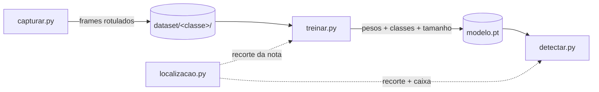

**Equipe:** Sem Título

**Integrantes:**

- Kayky de Brito dos Santos
- André Marques da Silva
- Rafael de Souza Coelho

**Data de publicação:** 4 de agosto de 2026

**Título do trabalho:** Programa de Reconhecimento de Valores de Cédulas

## 1. Introdução

Esta é a quarta etapa do trabalho final e cobre o entregável de **maquetes, câmeras, hardware, fotos e software (manual e código)**. Depois de definir [o tema](), ouvir os usuários na [fase de empatia]() e fechar o contrato de implementação na [modelagem funcional](), aqui apresentamos o que foi construído de fato: a bancada física em que o sistema opera, o equipamento de captura, o computador que executa tudo e os quatro módulos de software que hoje cobrem o ciclo completo de dataset, treino e detecção ao vivo.

Também registramos, com honestidade de engenharia, onde a implementação divergiu da modelagem da etapa anterior e o que ainda falta para o protótipo final.

> 📖 **O manual de uso do software está no arquivo [`README.md` da pasta `trabalho-final/`](https://github.com/kaykyb/ufabc-cv/blob/main/trabalho-final/README.md) do repositório.** A seção de software desta página traz um resumo dos passos, mas o manual completo (montagem, todas as flags de cada script e solução de problemas) é o README.

## 2. Maquete

A maquete reproduz, em escala de bancada, o balcão de caixa descrito nas entrevistas: uma superfície fixa sobre a qual a cédula é apresentada, com a câmera olhando para baixo a partir de um suporte fixo.

A montagem é deliberadamente caseira, no espírito de maquete de baixo custo: a câmera é sustentada por um **suporte de headphone**, com um **extensor de palitos de sorvete** fixado no topo fazendo o papel de braço horizontal que segura a câmera sobre a bancada. Como o peso da câmera na ponta do braço desequilibraria o conjunto, uma **pilha posicionada atrás serve de contrapeso**, mantendo o suporte estável durante as sessões de captura.

Três decisões definem a maquete:

- **Bancada preta fosca.** O fundo escuro e uniforme faz da cédula a única região clara da cena. Isso permite localizar a nota com visão computacional clássica (limiar de Otsu, descrito na seção de software) antes de qualquer rede neural, barateando e tornando mais previsível o restante do pipeline.
- **Câmera fixa em suporte.** A câmera não se move durante o uso, exatamente como na modelagem funcional: toda a exigência de enquadramento sai do usuário e vai para a montagem. O braço do suporte posiciona a câmera acima da bancada, apontada para a área útil.
- **Área útil central.** O software de captura desenha uma guia verde cobrindo a região central do quadro (60% da largura por 70% da altura), que delimita onde a cédula deve ficar. A guia é apenas visual e não aparece nas imagens salvas.


## 3. Câmera

A captura é feita com uma **webcam USB (modelo WC056)** conectada ao notebook. Alguns pontos práticos que saíram da experiência com essa câmera e estão refletidos no código:

- **Seleção por nome, não por índice.** No macOS, a ordem dos índices de câmera do OpenCV (backend AVFoundation) muda conforme os dispositivos conectados. O software consulta o `system_profiler` do sistema e procura a câmera pelo nome ("WC056" por padrão), caindo para o índice 0 se não encontrar. O índice também pode ser forçado com `--camera N`.
- **Resolução nativa.** Por padrão nenhuma resolução é forçada: usa-se a resolução nativa reportada pela câmera, que é impressa no terminal na abertura. Flags `--largura/--altura` permitem forçar outro valor quando necessário.
- **Exposição e white balance.** A câmera opera em modo automático por padrão, o que varia a aparência das imagens entre sessões de captura. O script oferece `--travar`, `--exposicao` e `--wb-temp` para fixar esses parâmetros, mas o AVFoundation nem sempre aceita esses comandos via OpenCV; o script lê os valores de volta e avisa quando o travamento não funcionou. Nesses casos a alternativa adotada foi fixar a iluminação da cena e absorver a variação restante com data augmentation de cor no treino.

## 4. Hardware

Nesta etapa todo o processamento roda em um **notebook Mac com Apple Silicon**, que concentra três papéis:

| Papel | Como o hardware é usado |
| --- | --- |
| Captura do dataset | Leitura da webcam USB via OpenCV (AVFoundation) e gravação dos frames em disco |
| Treino da CNN | GPU integrada via **MPS** (Metal Performance Shaders), selecionada automaticamente pelo código; com fallback para CUDA ou CPU em outras máquinas |
| Detecção ao vivo | Inferência quadro a quadro no mesmo dispositivo, com exibição do resultado na tela |

O conjunto físico completo é: notebook, webcam USB, o suporte caseiro da câmera (suporte de headphone, extensor de palitos de sorvete e pilha de contrapeso), bancada com forro preto fosco e a iluminação do ambiente. Não há hardware embarcado nesta etapa; a portabilidade do conjunto para um dispositivo dedicado é uma possibilidade de trabalho futuro, não um requisito do protótipo.


## 5. Software

O código-fonte completo está na pasta [`trabalho-final/`](https://github.com/kaykyb/ufabc-cv/tree/main/trabalho-final) deste repositório, junto com o modelo treinado (`modelo.pt`), o `requirements.txt` e o **manual de uso ([`README.md`](https://github.com/kaykyb/ufabc-cv/blob/main/trabalho-final/README.md))**. O software está dividido em quatro módulos Python, cada um com uma responsabilidade única:

| Arquivo | Responsabilidade |
| --- | --- |
| `capturar.py` | Ferramenta interativa de captura de imagens para o dataset |
| `localizacao.py` | Localização da cédula por visão clássica (Otsu + contornos), sem rede |
| `treinar.py` | Treino de uma CNN pequena, do zero, sobre o dataset capturado |
| `detectar.py` | Detecção ao vivo: localiza, classifica, exibe na tela e anuncia o valor por voz |



O ponto central do desenho é que **treino e detecção enxergam a mesma coisa**: o mesmo módulo de localização recorta a nota tanto nas imagens de treino quanto no feed ao vivo, eliminando a diferença de distribuição entre os dois momentos.

### 5.1. O que mudou em relação à modelagem funcional

Duas divergências conscientes em relação à [etapa 3]():

- **Localização por Otsu em vez de Canny.** A modelagem previa realce de bordas (Canny + morfologia) para achar a cédula. Com a maquete de bancada preta, um limiar de Otsu sobre a imagem em tons de cinza separa a nota do fundo de forma mais simples e estável; a abertura morfológica remove ruído e o maior contorno é a nota. O bloco funcional é o mesmo (localizar e recortar a ROI), com um método mais adequado ao cenário físico construído.
- **Classificação do quadro inteiro delegada ao recorte.** Quando a localização não encontra contorno relevante (bancada vazia), o sistema responde "vazio" diretamente, sem passar pela rede, o que economiza inferência e reduz falsos positivos.

O **anúncio em áudio (TTS)** previsto na modelagem já está implementado: o valor detectado é falado em voz alta (via `say` no macOS, com fallback para `espeak`), com um **debounce de 7 segundos** que evita a repetição da mesma nota a cada quadro; uma nota diferente é anunciada imediatamente. Seguem para a próxima etapa, conforme a modelagem: a **correção de distorção com os parâmetros de calibração** e a **estabilização entre quadros**. O corte por confiança já existe na detecção (limiar ajustável, padrão 80%).

### 5.2. Dataset capturado

O dataset atual, capturado inteiramente na maquete com a ferramenta `capturar.py`, tem **1.393 imagens** distribuídas assim:

| Classe | Imagens |
| --- | --- |
| vazio (bancada sem nota) | 207 |
| nota_2 | 200 |
| nota_5 | 195 |
| nota_10 | 200 |
| nota_20 | 130 |
| nota_50 | 271 |
| nota_100 | 190 |

A classe `nota_200` está prevista no software (tecla 8 da captura), mas ainda não foi capturada; a coluna correspondente entra no dataset assim que tivermos um exemplar da cédula disponível. Cada classe cobre frente e verso, rotações e posições variadas dentro da área útil.

> Observação: por decisão da equipe, as imagens do dataset de treinamento não são reproduzidas nesta página nem versionadas no repositório (a pasta `trabalho-final/dataset/` fica apenas nas máquinas da equipe).

### 5.3. Manual de uso

> 📖 **ATENÇÃO: o manual de uso completo está no [`README.md` da pasta `trabalho-final/`](https://github.com/kaykyb/ufabc-cv/blob/main/trabalho-final/README.md)**, incluindo a montagem física da maquete, a tabela completa de flags de cada script e a seção de solução de problemas. O que segue abaixo é o resumo dos três passos do fluxo.

#### Instalação

Requisitos: Python 3.10+ e as dependências do projeto. Todos os comandos abaixo são executados de dentro da pasta `trabalho-final/` do repositório:

```bash
cd trabalho-final
pip install -r requirements.txt
```

O `requirements.txt` cobre OpenCV, NumPy, PyTorch, Torchvision e Pillow.

#### Passo 1: capturar o dataset

Com a maquete montada e a câmera conectada:

```bash
python capturar.py                 # abre a câmera WC056, classe inicial nota_50
python capturar.py --classe vazio  # começa capturando o fundo vazio
python capturar.py --camera 1      # força outro índice de câmera
```

A janela mostra o feed com um HUD: a classe ativa, o contador de imagens salvas e a guia verde de enquadramento. As teclas durante a execução:

| Tecla | Ação |
| --- | --- |
| `ESPAÇO` | Salva o frame atual na classe ativa (sem o HUD) |
| `1` a `8` | Troca a classe ativa (vazio, nota_2, ..., nota_200) |
| `u` | Desfaz: apaga o último arquivo salvo |
| `g` | Liga/desliga a guia de enquadramento |
| `q` / `ESC` | Sai |

As imagens são salvas em `dataset/<classe>/` com nome único por timestamp. O fluxo típico de uma sessão: posicionar a nota, girar/mover/virar entre um `ESPAÇO` e outro, trocar de classe com as teclas numéricas e repetir.


#### Passo 2: treinar o modelo

```bash
python treinar.py                 # padrões: 25 épocas, batch 32, imagens 192x192
python treinar.py --epocas 30     # treina por mais tempo
python treinar.py --tamanho 160   # entrada menor (mais rápido)
```

O script separa 20% do dataset para validação (split reprodutível por semente), aplica data augmentation apenas no treino e salva em `modelo.pt` o melhor modelo segundo a acurácia de validação. O checkpoint guarda os pesos, os nomes das classes e o tamanho de entrada, então a detecção reconstrói tudo sozinha a partir do arquivo.

#### Passo 3: detecção ao vivo

```bash
python detectar.py                 # câmera WC056, modelo.pt, limiar 0.8
python detectar.py --limiar 0.9    # exige mais confiança para acusar detecção
python detectar.py --sem-voz       # desliga o anúncio falado
```

A cada quadro o sistema recorta a nota, classifica o recorte e mostra a previsão com a confiança. Quando a classe prevista é uma cédula com confiança acima do limiar, a tela destaca "NOTA X DETECTADA", desenha a caixa rotacionada em volta da nota e **fala o valor em voz alta** ("cinquenta reais"). A fala tem um debounce ajustável por `--debounce` (padrão: 7 segundos): a mesma nota só é repetida depois desse intervalo, mas uma nota diferente é anunciada na hora. `q` ou `ESC` encerra.


### 5.4. Código

O código-fonte completo dos quatro módulos, na versão usada nesta etapa, está publicado na pasta [`trabalho-final/`](https://github.com/kaykyb/ufabc-cv/tree/main/trabalho-final) do repositório:

- [`capturar.py`](https://github.com/kaykyb/ufabc-cv/blob/main/trabalho-final/capturar.py): ferramenta interativa de captura, com a resolução da câmera pelo nome, o travamento opcional de exposição/white balance e o HUD de captura.
- [`localizacao.py`](https://github.com/kaykyb/ufabc-cv/blob/main/trabalho-final/localizacao.py): a localização clássica da cédula (Otsu, abertura morfológica e maior contorno), compartilhada pelo treino e pela detecção.
- [`treinar.py`](https://github.com/kaykyb/ufabc-cv/blob/main/trabalho-final/treinar.py): a CNN compacta treinada do zero, com o recorte da nota aplicado antes do pipeline e data augmentation apenas no treino.
- [`detectar.py`](https://github.com/kaykyb/ufabc-cv/blob/main/trabalho-final/detectar.py): a detecção ao vivo, com o corte por confiança e o anúncio do valor por voz com debounce.

Na mesma pasta está também o [`modelo.pt`](https://github.com/kaykyb/ufabc-cv/blob/main/trabalho-final/modelo.pt) **já treinado** com o dataset desta etapa (pesos, nomes das classes e tamanho de entrada em um único checkpoint), o que permite rodar a detecção ao vivo sem repetir a captura e o treino.

## 6. Próximos Passos

Com a maquete, o dataset, o ciclo treino/detecção e o anúncio por voz funcionando, a etapa seguinte fecha os blocos restantes da modelagem funcional: calibração da câmera com padrão xadrez e correção de distorção no laço ao vivo, estabilização entre quadros e a avaliação quantitativa completa (matriz de confusão por denominação, latência por quadro e teste com voluntários).
