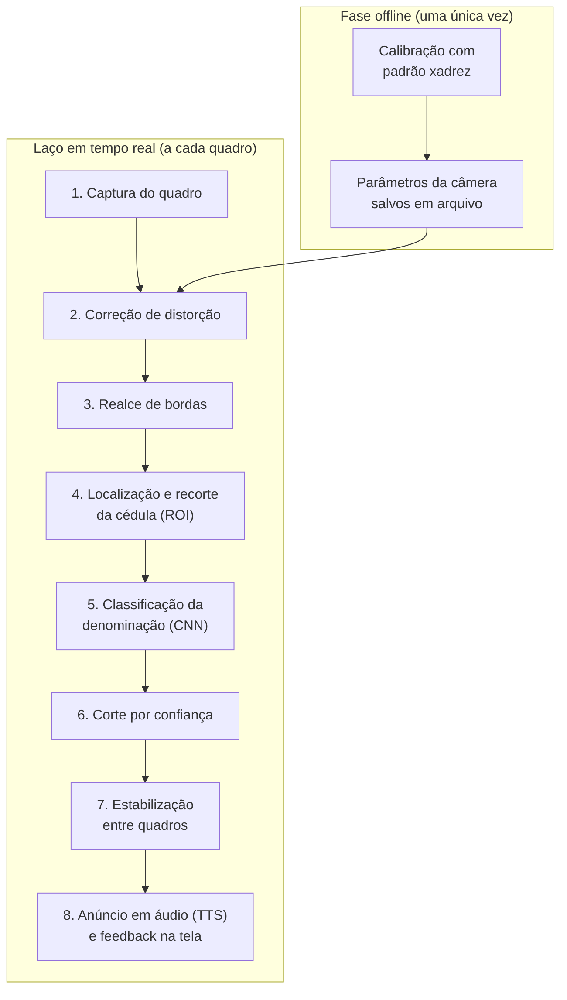
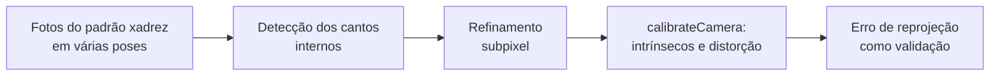

**Equipe:** Sem Título

**Integrantes:**

- Kayky de Brito dos Santos
- André Marques da Silva
- Rafael de Souza Coelho

**Data de publicação:** 15 de julho de 2026

**Título do trabalho:** Programa de Reconhecimento de Valores de Cédulas

## 1. Introdução

Este documento corresponde à terceira etapa do trabalho final (a **modelagem funcional geral**) e dá continuidade à [definição do tema](): um sistema de visão computacional em tempo real que reconhece a denominação de cédulas do Real e anuncia o valor em voz alta, pensado para comerciantes com baixa visão como a Dona Marlene, entrevistada na [fase de empatia]().

Se na etapa anterior definimos **o que** o sistema faz e **para quem**, aqui definimos **como** ele faz: o caminho que cada quadro capturado pela webcam percorre até virar um "cinquenta reais" falado pelo alto-falante, o método de calibração que sustenta esse caminho e a forma como pretendemos avaliar se o conjunto funciona de verdade. Para cada bloco funcional, descrevemos sua entrada, o processamento realizado e a saída entregue ao bloco seguinte. Esta modelagem é o contrato que guiará a implementação na etapa de desenvolvimento.

## 2. Visão Geral do Funcionamento

O sistema opera em dois momentos distintos. Antes de qualquer uso, há uma fase **offline** de calibração da câmera, feita uma única vez: dela saem os parâmetros intrínsecos e os coeficientes de distorção da webcam, salvos em arquivo. Durante o uso no balcão, roda o **laço em tempo real**, que consome esses parâmetros e processa quadro a quadro o vídeo da câmera fixa apontada para a área do caixa.

A divisão em dois momentos não é só organizacional. A interação prometida à usuária é "só encostar a nota": ela não enxerga para enquadrar, então toda a exigência de precisão geométrica foi deslocada para a fase offline, onde nós (e não ela) fazemos o trabalho cuidadoso com o padrão de calibração.

## 3. Blocos Funcionais

### 3.1. Captura do quadro

- **Entrada:** fluxo de vídeo da webcam fixa instalada sobre a área do caixa.
- **Processamento:** a cada iteração do laço, um quadro é lido do dispositivo via `cv2.VideoCapture()`. A câmera não se move e não exige nenhuma ação da usuária além de aproximar a nota.
- **Saída:** quadro colorido bruto, como matriz NumPy, ainda carregando as distorções da lente.

### 3.2. Correção de distorção

- **Entrada:** quadro bruto e os parâmetros gravados na fase de calibração.
- **Processamento:** `cv2.undistort()` aplica a matriz intrínseca e os coeficientes de distorção radial e tangencial, desfazendo o encurvamento que a lente impõe principalmente nas bordas da imagem. Como a cédula pode aparecer em qualquer ponto do campo de visão e em qualquer ângulo, essa correção é o que torna aceitável o enquadramento ruim inerente ao nosso caso de uso.
- **Saída:** quadro geometricamente fiel, base para todo o restante do laço.

### 3.3. Realce de bordas

- **Entrada:** quadro corrigido.
- **Processamento:** três operações preparam a imagem para a busca da nota: suavização Gaussiana para conter o ruído do sensor, detector de bordas de Canny para evidenciar os limites da cédula e morfologia (dilatação seguida de erosão) para fechar o contorno da nota e apagar sujeira do fundo.
- **Saída:** imagem binária em que a silhueta da cédula aparece como uma região fechada.

### 3.4. Localização e recorte da cédula (ROI)

- **Entrada:** imagem binária com os contornos realçados.
- **Processamento:** `cv2.findContours()` levanta as regiões fechadas candidatas. Nem todo contorno interessa: descartamos os de área pequena (reflexos, moedas, mãos) e os de proporção incompatível com o retângulo alongado de uma cédula. Do maior contorno que sobrevive aos filtros, recortamos a região correspondente no quadro corrigido.
- **Saída:** recorte (ROI) contendo a provável cédula.

### 3.5. Classificação da denominação (CNN)

- **Entrada:** recorte da cédula.
- **Processamento:** o recorte é redimensionado para a entrada da rede (224x224 pixels), normalizado e submetido a uma **rede neural convolucional** treinada com as sete denominações em circulação. Seguindo o requisito de robustez levantado nas entrevistas, o treino incluirá notas desgastadas, amassadas, sob iluminações diferentes e em ângulos variados, que são as condições reais do comércio de bairro.
- **Saída:** denominação prevista (R$ 2, 5, 10, 20, 50, 100 ou 200) acompanhada da probabilidade atribuída pela rede.

### 3.6. Corte por confiança

- **Entrada:** denominação prevista e sua probabilidade.
- **Processamento:** o sistema não anuncia qualquer palpite. Predições com confiança abaixo de um limiar (partiremos de 70%) são simplesmente descartadas. Errar para o lado do silêncio é uma escolha de projeto: uma nota não reconhecida pede uma nova aproximação, enquanto um valor falado errado vira prejuízo no caixa.
- **Saída:** predição aprovada, ou nada.

### 3.7. Estabilização entre quadros

- **Entrada:** sequência das predições aprovadas nos quadros recentes.
- **Processamento:** a mesma denominação precisa se repetir por N quadros consecutivos antes de ser confirmada. Os quadros borrados do movimento de aproximar a nota deixam de disparar anúncios errados ou repetidos, e cada nota apresentada gera uma única confirmação.
- **Saída:** denominação confirmada, pronta para ser anunciada.

### 3.8. Anúncio em áudio e feedback na tela

- **Entrada:** denominação confirmada e quadro corrigido.
- **Processamento:** o valor é convertido em fala por síntese de voz (TTS) e falado uma única vez por nota. Em paralelo, a tela mostra o quadro com o retângulo da detecção e o rótulo com denominação e confiança, desenhados com `cv2.rectangle()` e `cv2.putText()`.
- **Saída:** anúncio sonoro, que é a saída principal para a comerciante, e apoio visual para quem enxerga parcialmente ou para o auxiliar de caixa, como o Kauã, que hoje faz essa conferência manualmente.

## 4. Método de Calibração

A calibração é requisito mandatório do manual e, no nosso tema, também é o que viabiliza a interação por aproximação. Adotaremos o procedimento clássico com **padrão xadrez**, nos moldes do que a equipe praticou nos laboratórios da disciplina:

Capturaremos múltiplas imagens do tabuleiro em posições e inclinações variadas cobrindo todo o campo de visão da webcam. Os cantos internos são detectados com `cv2.findChessboardCorners()` e refinados em nível subpixel com `cv2.cornerSubPix()`. Com as correspondências entre pontos 3D do tabuleiro e pixels, `cv2.calibrateCamera()` estima a matriz intrínseca, os coeficientes de distorção radial e tangencial e as poses de cada vista.

A qualidade do resultado será medida pelo **erro médio de reprojeção**, em pixels, que reportaremos no relatório técnico. Os parâmetros aprovados são gravados em arquivo e carregados pelo laço em tempo real na inicialização do sistema.

## 5. Método de Avaliação Funcional

O manual é explícito: não basta o sistema "funcionar", é preciso provar que ele é robusto. Associamos uma métrica objetiva a cada parte da modelagem:

| O que avaliamos          | Métrica                                                        |
| ------------------------ | -------------------------------------------------------------- |
| Calibração               | Erro médio de reprojeção (pixels)                              |
| Classificação            | Matriz de confusão, com precisão, revocação e F1 por denominação |
| Execução em tempo real   | Latência por quadro e FPS                                      |
| Uso por pessoas reais    | Taxa de acerto e feedback no teste com voluntários             |

A matriz de confusão merece atenção especial no nosso caso: os erros não têm o mesmo peso. Confundir cédula de 50 com a de 100 é mais grave do que deixar de reconhecer uma nota. Por isso analisaremos as confusões par a par, e não apenas a acurácia global.

O teste com voluntários seguirá um roteiro de tarefas com cédulas de todas as denominações, incluindo notas desgastadas e apresentadas de forma desleixada de propósito, com registro em vídeo e coleta de dificuldades e sugestões, conforme previsto no manual.

## 6. Ligação com a Disciplina

A modelagem exercita, em um único fluxo, os principais blocos vistos na disciplina: o modelo de câmera e a correção de distorções (calibração), a filtragem espacial e a morfologia (localização da cédula), as transformações geométricas (recorte e redimensionamento) e a classificação com CNN (reconhecimento), fechando com as métricas de desempenho que estruturarão o relatório técnico das próximas etapas.
