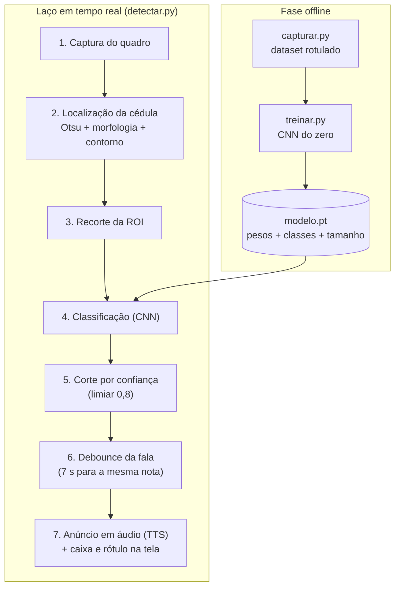
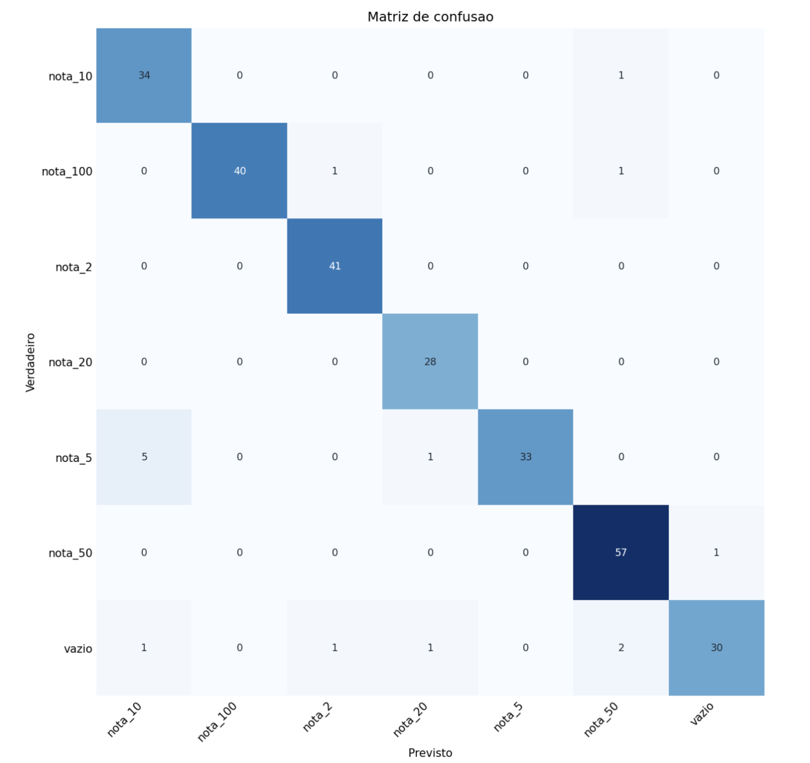
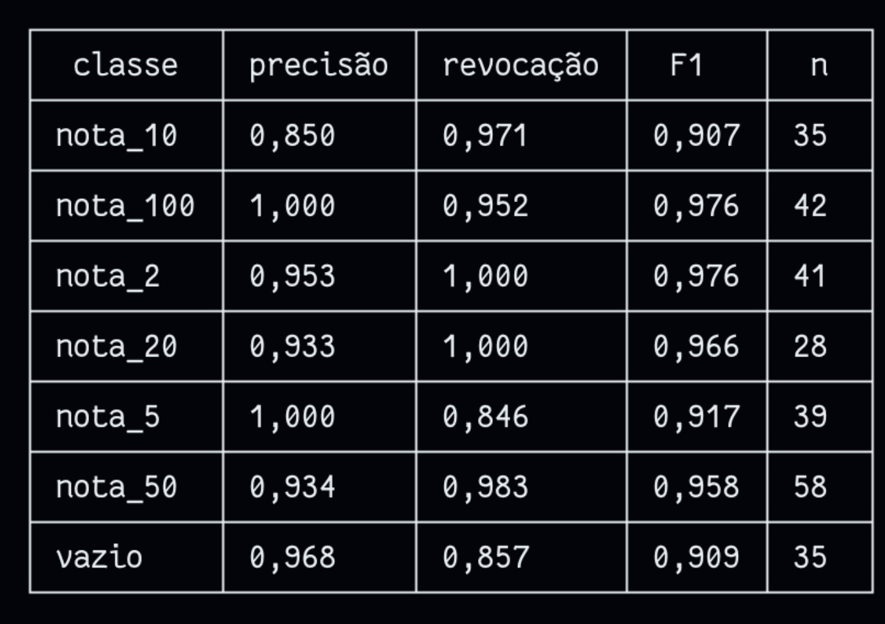
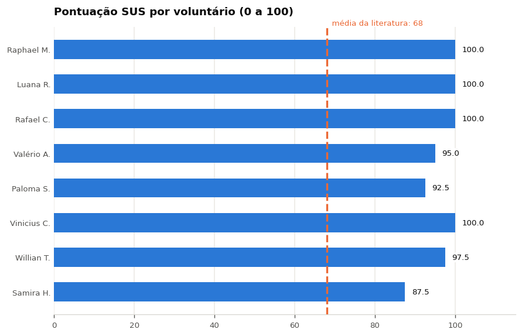
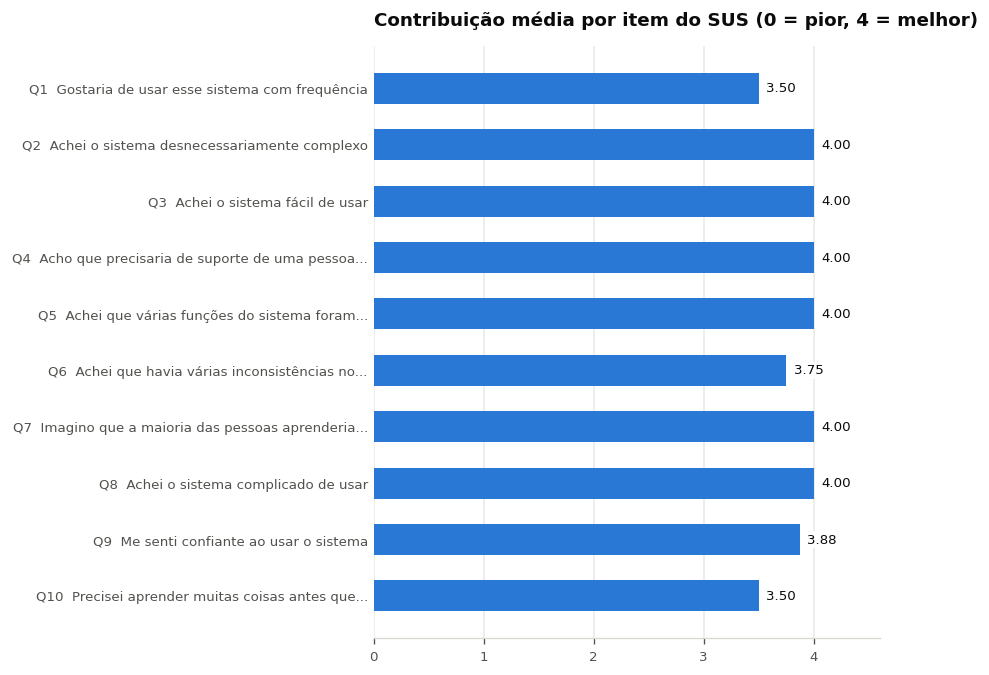

**Equipe:** Sem Título

**Integrantes:**

- Kayky de Brito dos Santos
- André Marques da Silva
- Rafael de Souza Coelho

**Data de publicação:** 16 de agosto de 2026

**Título do trabalho:** Programa de Reconhecimento de Valores de Cédulas

## 1. Resumo

Este trabalho apresenta um sistema de visão computacional em tempo real que reconhece a denominação de cédulas do Real e a anuncia em voz alta, projetado para comerciantes com baixa visão. O sistema opera sobre uma maquete de bancada com fundo preto fosco e câmera fixa: cada quadro passa por uma localização clássica da cédula (limiarização de Otsu, morfologia e maior contorno), o recorte resultante é classificado por uma rede neural convolucional compacta de 155.911 parâmetros treinada do zero sobre um dataset próprio de 1.393 imagens, e a denominação é anunciada por síntese de voz quando a confiança supera 80%. O classificador atinge **94,6% de acurácia** e **F1 macro de 0,944** no conjunto de validação de 278 imagens, sem nenhuma confusão entre as notas de 50 e 100 reais, que é o par crítico apontado na entrevista que originou o projeto. Em testes com 8 voluntários externos e 42 tarefas, o sistema acertou 83,3% das tarefas com latência percebida de 2,81 s (desvio padrão 0,16 s) e pontuação SUS de 96,6. O resultado mais relevante é qualitativo: **nenhuma das 7 falhas foi um valor errado anunciado**, todas foram omissões, o que valida a decisão de projeto de preferir o silêncio ao palpite.

**Palavras-chave:** visão computacional, redes neurais convolucionais, limiarização de Otsu, acessibilidade, reconhecimento de cédulas.

## 2. Introdução

### 2.1. Origem do problema

O tema partiu da fase de empatia, registrada no relatório de [entrevistas empáticas](). Duas entrevistas definiram o projeto:

- **Dona Marlene** (61 anos, comerciante com catarata inicial) confunde com frequência as notas de 50 e 100 reais, erra mais com luz fraca ou cédula amassada, e já recebeu notas trocadas de má fé. Como não enxerga para enquadrar a nota, exige uma interação de "só encostar".
- **Kauã** (19 anos, auxiliar de caixa) hoje supre manualmente essa limitação conferindo o dinheiro. Aponta como essenciais a simplicidade, a confiabilidade e o funcionamento com **cédulas desgastadas**, que são as que mais circulam.

Desses relatos saíram os três requisitos que estruturam todo o restante do trabalho: tolerância a apresentação mal alinhada, robustez a cédulas em condição real de circulação e saída acessível por áudio.

### 2.2. Objetivo e escopo

Construir um protótipo funcional que, a partir de uma câmera fixa sobre a área do caixa, classifique a denominação de uma cédula apresentada e anuncie o valor em voz alta, com erro conservador (silêncio em vez de valor errado). O escopo, definido na [etapa de tema](), cobre as sete denominações em circulação; o protótipo entregue cobre seis (2, 5, 10, 20, 50 e 100 reais), com a nota de 200 reais fora do dataset por indisponibilidade de exemplar.

### 2.3. Originalidade

Aplicativos de celular (Cash Reader, Seeing AI) e serviços de assistência humana (Be My Eyes) resolvem problema parecido, mas exigem segurar e mirar o aparelho, ou dependem de conexão e de um voluntário remoto. Marcações táteis falham com notas amassadas. A proposta se diferencia por ser **fixa no ponto de venda**, operada por aproximação, sem mirar, e com retorno sonoro imediato, desenhada para a rotina descrita nas entrevistas.

## 3. Arquitetura do Sistema

O sistema tem uma fase **offline** (captura do dataset e treino da rede) e um **laço em tempo real** executado no uso.

A implementação está em quatro módulos Python com responsabilidade única, descritos em detalhe na [etapa de maquete e software]():

| Arquivo | Responsabilidade |
| --- | --- |
| [`capturar.py`](https://github.com/kaykyb/ufabc-cv/blob/main/trabalho-final/capturar.py) | Captura interativa de imagens para o dataset, com HUD e guia de enquadramento |
| [`localizacao.py`](https://github.com/kaykyb/ufabc-cv/blob/main/trabalho-final/localizacao.py) | Localização da cédula por visão clássica, compartilhada por treino e detecção |
| [`treinar.py`](https://github.com/kaykyb/ufabc-cv/blob/main/trabalho-final/treinar.py) | Treino da CNN e escrita do checkpoint |
| [`detectar.py`](https://github.com/kaykyb/ufabc-cv/blob/main/trabalho-final/detectar.py) | Detecção ao vivo, corte por confiança, TTS e feedback visual |

A decisão de projeto mais importante da arquitetura é que **treino e detecção enxergam a mesma coisa**: o mesmo `localizacao.py` recorta a nota nas imagens de treino e no feed ao vivo. Isso elimina a diferença de distribuição entre os dois momentos, que é uma fonte clássica de degradação em produção.

## 4. Fundamentação Matemática

### 4.1. Localização da cédula por visão clássica

A separação nota/fundo usa **limiarização de Otsu** sobre a imagem em tons de cinza, precedida de suavização Gaussiana $5\times5$. Otsu escolhe o limiar $T$ que maximiza a variância entre classes,

$$
T^{*} = \arg\max_{T}\ \sigma_b^2(T) = \omega_0(T)\,\omega_1(T)\,\big[\mu_0(T) - \mu_1(T)\big]^2
$$

onde $\omega_0, \omega_1$ são as probabilidades acumuladas das duas classes de intensidade e $\mu_0, \mu_1$ suas médias. O método é adequado exatamente porque a maquete produz um histograma **bimodal**: bancada preta fosca de um lado, cédula clara do outro. Foi essa propriedade da maquete que permitiu trocar o Canny previsto na [modelagem funcional]() por um método mais simples e estável.

Em seguida, uma **abertura morfológica** com elemento estruturante elíptico $7\times7$,

$$
A \circ B = (A \ominus B) \oplus B
$$

remove pontos claros isolados (reflexos, sujeira) sem encolher a região da nota. Dos contornos externos obtidos por `cv2.findContours()`, o de maior área é tomado como a cédula, e é descartado se cobrir menos de 2% do quadro. A partir dele o módulo entrega duas saídas: `recortar_nota()` devolve a bounding box com folga de 5% (usada por treino e inferência) e `caixa_rotacionada()` devolve os quatro pontos de `cv2.minAreaRect()` (usada só para desenhar). Quando não há contorno aprovado, o sistema responde **"vazio" sem chamar a rede**, o que economiza inferência e reduz falso positivo.

### 4.2. Classificação por rede convolucional

A rede é uma CNN compacta treinada **do zero**, sem transfer learning, em três blocos convolucionais seguidos de um classificador:

| Estágio | Composição | Saída |
| --- | --- | --- |
| Bloco 1 | Conv $3\times3$ (3→16), BatchNorm, ReLU, MaxPool $2\times2$ | 16 canais, $96\times96$ |
| Bloco 2 | Conv $3\times3$ (16→32), BatchNorm, ReLU, MaxPool $2\times2$ | 32 canais, $48\times48$ |
| Bloco 3 | Conv $3\times3$ (32→64), BatchNorm, ReLU, MaxPool $2\times2$ | 64 canais, $24\times24$ |
| Pooling | AdaptiveAvgPool $4\times4$ | 64 canais, $4\times4$ |
| Classificador | Flatten, Linear (1024→128), ReLU, Dropout 0,4, Linear (128→7) | 7 logits |

Com entrada $192\times192$ e 7 classes, o modelo tem **155.911 parâmetros treináveis** (23.808 nas convoluções e 132.103 no classificador), contados diretamente do `modelo.pt` publicado. É um modelo deliberadamente pequeno, alinhado à recomendação do manual de que "menos é mais, desde que seja preciso": o problema tem 7 classes visualmente muito distintas em condições de iluminação e fundo controladas, e a capacidade extra de uma rede grande seria gasta em decorar o dataset.

O `AdaptiveAvgPool2d((4,4))` merece nota: ele fixa a dimensão de entrada do classificador independentemente do tamanho da imagem, o que permite treinar com `--tamanho 160` ou `192` sem tocar na arquitetura.

A saída é convertida em distribuição de probabilidade por softmax,

$$
p_c = \frac{e^{z_c}}{\sum_{k=1}^{7} e^{z_k}}
$$

e o treino minimiza a entropia cruzada $\mathcal{L} = -\log p_{y}$ com Adam ($\text{lr} = 10^{-3}$), batch 32, por 25 épocas. O split de validação é de 20%, reprodutível por semente 42, aplicado **por índices sobre duas visões do mesmo diretório**, uma com augmentation e outra sem, garantindo que a validação nunca veja imagens aumentadas. O checkpoint salvo é o da melhor acurácia de validação e guarda pesos, nomes das classes e tamanho de entrada, de modo que `detectar.py` reconstrói tudo sozinho.

O **data augmentation**, aplicado apenas no treino, foi escolhido a partir das condições reais levantadas nas entrevistas:

| Transformação | O que simula |
| --- | --- |
| `RandomResizedCrop(scale=0.7–1.0)` | Variação de distância e enquadramento parcial |
| `RandomRotation(20)` | Nota apoiada torta, sem alinhamento |
| `RandomHorizontalFlip` + `RandomVerticalFlip` | Frente/verso e nota de cabeça para baixo |
| `ColorJitter(brightness=(0.5, 1.0), contrast=0.4, saturation=0.2)` | Variação de exposição e white balance entre sessões |

O `brightness` é intencionalmente assimétrico, apenas escurecendo: as capturas já saíram claras demais da webcam em modo automático, e clarear ainda mais estouraria as regiões brancas da cédula. Esse ajuste é a compensação de software para o fato, documentado na etapa 4, de que o AVFoundation no macOS frequentemente ignora o travamento de exposição e white balance pedido via OpenCV.

### 4.3. Decisão e anúncio

A classificação vira anúncio em três filtros encadeados:

1. **Classe de cédula:** a predição precisa começar com `nota_`; `vazio` nunca gera fala.
2. **Corte por confiança:** $p_{\max} \geq 0{,}8$ (ajustável por `--limiar`). Predições abaixo do limiar são silenciadas.
3. **Debounce temporal:** a mesma denominação só é repetida após 7 segundos; uma denominação **diferente** é anunciada imediatamente.

O terceiro filtro é a forma que a "estabilização entre quadros" da modelagem funcional acabou tomando na implementação. A modelagem previa exigir $N$ quadros consecutivos com a mesma predição; o debounce por tempo resolve o problema prático que motivava aquele bloco (evitar a repetição da mesma nota a cada quadro do laço) com estado mais simples, mas **não** filtra um quadro isolado espúrio da mesma forma que a votação por maioria filtraria. É uma divergência consciente, registrada aqui como tal.

A fala usa `say` no macOS e `espeak` como alternativa, invocada por `subprocess.Popen` para não bloquear o laço de detecção. Em paralelo, a tela mostra a caixa rotacionada e o rótulo com denominação e confiança, apoio para quem enxerga parcialmente ou para o auxiliar de caixa.

## 5. Materiais e Métodos Experimentais

### 5.1. Maquete e hardware

A maquete reproduz o balcão em escala de bancada: superfície com forro **preto fosco** e câmera fixa olhando para baixo, sustentada por um suporte de headphone com um extensor de palitos de sorvete como braço horizontal e uma pilha de contrapeso. A captura usa uma **webcam USB WC056** em resolução nativa, selecionada **por nome** via `system_profiler` porque no macOS a ordem dos índices do AVFoundation muda conforme os dispositivos conectados. Todo o processamento (captura, treino e inferência) roda em um notebook Mac com Apple Silicon, com o treino usando a GPU integrada via MPS e fallback automático para CUDA ou CPU. As fotos do conjunto estão na [etapa 4]().

**Portabilidade.** O desenvolvimento e os testes com voluntários foram feitos no Mac, mas o software **roda igualmente em Ubuntu**, e nada no pipeline depende do sistema operacional. Os três pontos de contato com a plataforma são isolados e têm caminho equivalente no Linux:

| Ponto | macOS | Ubuntu |
| --- | --- | --- |
| Seleção da câmera | Por nome, consultando o `system_profiler` (a ordem dos índices do AVFoundation varia) | Por índice explícito, com `--camera N`, sobre o backend V4L2 |
| Dispositivo de treino e inferência | GPU integrada via MPS | CUDA quando há GPU NVIDIA, senão CPU, escolhido automaticamente pelo mesmo código |
| Síntese de voz | Comando `say`, nativo do sistema | `espeak`, detectado em tempo de execução e invocado da mesma forma |

A escolha do dispositivo é feita por `escolher_dispositivo()`, que testa MPS, depois CUDA e por fim CPU, então o mesmo `treinar.py` e o mesmo `detectar.py` funcionam nas duas plataformas sem alteração. O TTS é resolvido em `criar_falador()`, que devolve `say` no Darwin e `espeak` onde ele estiver instalado; se nenhum existir, o programa avisa e segue apenas com o retorno visual, sem quebrar. O restante da pilha (OpenCV, NumPy, PyTorch, Torchvision e Pillow, todos no `requirements.txt`) é multiplataforma. As instruções de instalação e as diferenças de uso estão no [manual](https://github.com/kaykyb/ufabc-cv/blob/main/trabalho-final/README.md).

### 5.2. Dataset

Capturado inteiramente na maquete com `capturar.py`, cobrindo frente e verso, rotações e posições variadas dentro da área útil:

| Classe | Imagens |
| --- | --- |
| vazio (bancada sem nota) | 207 |
| nota_2 | 200 |
| nota_5 | 195 |
| nota_10 | 200 |
| nota_20 | 130 |
| nota_50 | 271 |
| nota_100 | 190 |
| **Total** | **1.393** |

A distribuição é moderadamente desbalanceada (de 130 a 271 imagens por classe, razão 2,1 entre a maior e a menor), e o treino não aplica reponderação de classes nem amostragem balanceada. Por decisão da equipe, as imagens não são versionadas no repositório. A classe `nota_200` está prevista no software (tecla 8 da captura) mas não foi capturada, por indisponibilidade de exemplar da cédula.

### 5.3. Protocolo de teste com voluntários

O [roteiro de testes]() definiu 11 tarefas (T1 a T11) cobrindo bancada vazia, as seis denominações, verso, rotação, nota amassada, apresentação desleixada, troca de nota, objeto que não é cédula, soma de um pagamento simulado e uso livre. As condições: sistema já configurado e rodando pela equipe, condutor que não corrige nem ajuda, um integrante registrando a ficha, sessão gravada em vídeo enquadrando bancada e tela (não o rosto), duração alvo de 10 a 15 minutos.

A sessão ocorreu em **10 de agosto de 2026 com 8 voluntários externos**. As fichas de papel foram transcritas para a planilha da [etapa 6]() e analisadas no notebook da [etapa 7]().

## 6. Resultados

### 6.1. Desempenho do classificador

A rede foi avaliada sobre o **split de validação de 20%** do dataset (278 imagens, semente 42), com o mesmo pré-processamento da inferência (recorte pela localização clássica, sem augmentation) e decisão por argmax, isto é, **sem o corte por confiança** que o sistema ao vivo aplica.

| Classe | Precisão | Revocação | F1 | n |
| --- | --- | --- | --- | --- |
| nota_2 | 0,953 | 1,000 | 0,976 | 41 |
| nota_5 | 1,000 | 0,846 | 0,917 | 39 |
| nota_10 | 0,850 | 0,971 | 0,907 | 35 |
| nota_20 | 0,933 | 1,000 | 0,966 | 28 |
| nota_50 | 0,934 | 0,983 | 0,958 | 58 |
| nota_100 | 1,000 | 0,952 | 0,976 | 42 |
| vazio | 0,968 | 0,857 | 0,909 | 35 |
| **Média macro** | **0,948** | **0,944** | **0,944** | 278 |

A acurácia global é de **94,6%** (263 de 278), com F1 macro de 0,944 e F1 ponderado de 0,946. A leitura por classe é mais informativa que o número global:

- **A confusão dominante é `nota_5` prevista como `nota_10`**, com 5 ocorrências, responsável sozinha por um terço dos 15 erros e por quase toda a queda de revocação da classe `nota_5` (0,846) e de precisão da `nota_10` (0,850). O pipeline ajuda a explicar a direção do erro: o recorte da nota é **redimensionado para $192\times192$** antes de entrar na rede, o que destrói a informação de tamanho físico da cédula. Restam cor e padrão gráfico como pistas, e é justamente aí que a distinção fica mais sensível a variação de exposição e a desgaste da nota. Aumentar a amostragem dessas duas classes, em especial de exemplares desgastados, é o caminho direto de correção.
- **Nenhuma confusão entre as notas de 50 e 100 reais**, nas duas direções. Esse é o par que Dona Marlene relatou confundir na entrevista, e é a única confusão que o projeto listou como crítica desde a modelagem funcional. O classificador acerta `nota_100` com precisão 1,000 e `nota_50` com revocação 0,983.
- **Cinco falsos positivos de bancada vazia** (`vazio` previsto como alguma nota) puxam a revocação de `vazio` para 0,857. Eles são o efeito esperado da localização clássica: qualquer resíduo claro sobre o fundo preto vira um contorno que é enviado à rede. Na operação real esses casos são filtrados pelo limiar de 0,8, e a tarefa T9 do roteiro (objeto claro que não é cédula) confirmou o filtro funcionando com os voluntários.
- **Confusões entre denominações somam 9 casos em 278** (3,2%): 5 de `nota_5` para `nota_10`, 1 de `nota_5` para `nota_20`, 1 de `nota_10` para `nota_50`, 1 de `nota_100` para `nota_2` e 1 de `nota_100` para `nota_50`. Como a matriz é calculada por argmax, ela mede a **capacidade bruta do classificador**; o comportamento do sistema entregue está na seção 6.3.

Essa última distinção é importante para conciliar esta seção com a próxima. A matriz mostra que a rede, sozinha, ainda erra a denominação em 3,2% dos casos; os testes com voluntários não registraram nenhum valor errado anunciado. A diferença está no **corte por confiança de 0,8**, que converte boa parte das predições incorretas (tipicamente as de menor probabilidade) em silêncio antes de chegarem à voz. A matriz quantifica a rede; a seção 6.3 mede o sistema.

Vale a ressalva metodológica: o split de validação é aleatório sobre o mesmo dataset, capturado nas mesmas sessões, com forte correlação entre imagens vizinhas. Esses 94,6% **superestimam** o desempenho em condições novas e não substituem um conjunto de teste capturado à parte.

### 6.2. Métricas objetivas dos testes com voluntários

| Métrica | Valor |
| --- | --- |
| Tarefas executadas | 42 (8 voluntários) |
| Acertos | 35 |
| Taxa de acerto global | **83,3%** |
| Desvio padrão entre voluntários | 11,4 pontos percentuais |
| Latência percebida média | **2,81 s** (desvio padrão 0,16 s) |
| Faixa de latência entre sessões | 2,6 s a 3,1 s |
| Valores errados anunciados | **0** |

A latência medida é **percebida**: o cronômetro roda do instante em que a cédula toca a bancada até o anúncio falado, incluindo o tempo do voluntário acomodar a nota. O desvio padrão de 0,16 s indica um sistema **previsível**, propriedade que importa mais que velocidade bruta em uma interface sem retorno visual, porque é o que permite ao usuário saber quando desistir e reposicionar a nota.

### 6.3. Natureza dos erros no uso real

Das 7 falhas observadas, **nenhuma foi uma confusão entre denominações**. A tabela abaixo classifica os erros pela causa identificada nas fichas e nas respostas abertas:

| Causa | Tipo | Efeito para o usuário |
| --- | --- | --- |
| Nota parcialmente fora do campo (Willian T.) | Omissão | Silêncio; exige reposicionar |
| Cédula de 200 reais, fora do modelo (Rafael C.) | Omissão | Silêncio; limitação de escopo conhecida |
| Duas notas simultâneas na bancada (Paloma S.) | Omissão | Silêncio; caso não previsto no pipeline |

Esse é o resultado central do trabalho, e vale explicitar por quê. A [modelagem funcional]() registrou, antes de qualquer implementação, que os erros não têm o mesmo peso: confundir a nota de 50 com a de 100 reais é muito mais grave do que não reconhecer uma nota, porque o primeiro vira prejuízo silencioso no caixa e o segundo apenas pede uma nova aproximação. O corte por confiança em 0,8 foi a materialização dessa decisão, e o teste com pessoas de fora confirmou que ela se sustenta: **a matriz de confusão observada no uso real é diagonal**, com as falhas concentradas na coluna de "sem resposta".

Cabe a ressalva metodológica: essa afirmação vem de 42 tarefas registradas em ficha. A matriz de confusão da seção 6.1 mostra que a rede, avaliada por argmax e sem o corte por confiança, ainda confunde denominações em 3,2% das imagens de validação. As duas medidas não se contradizem, medem coisas diferentes: uma é a capacidade bruta do classificador, a outra é o comportamento do sistema com o limiar de 0,8 aplicado. O que os testes com voluntários mostram é que o limiar cumpriu o papel de converter erro de classificação em silêncio, e não em valor errado falado.

### 6.4. Usabilidade percebida

As questões Q1 a Q10 da enquete formam o **System Usability Scale**, pontuado somando $(\text{resposta} - 1)$ nos itens positivos e $(5 - \text{resposta})$ nos negativos, com o total multiplicado por 2,5 para produzir um valor de 0 a 100. O valor não é porcentagem: a referência da literatura é que **68 corresponde à média** dos sistemas avaliados.

O SUS médio foi **96,6**, com todas as sessões acima de 87 e quatro com pontuação máxima. A questão Q11, fora do SUS, sobre interatividade, recebeu nota 5 dos oito voluntários. A leitura honesta, já registrada na etapa 7, é que a escala está **saturada**: com um sistema de um gesto só e já configurado pela equipe, o SUS tem pouca margem para discriminar qualidade. Os itens mais baixos são informativos: Q6 ("várias inconsistências") recebeu 2 exatamente dos dois voluntários que esbarraram em limitações reais, e Q1 ("gostaria de usar com frequência") é naturalmente baixa porque nenhum voluntário tem deficiência visual.

### 6.5. Feedback aberto

| Menções | Tema |
| --- | --- |
| 4 | Elogio: velocidade da resposta |
| 3 | Elogio: robustez (nota amassada, dobrada, ângulos) |
| 3 | Pedido: somar ou contar várias notas de uma vez |
| 2 | Elogio: anúncio falado do valor |
| 1 cada | Elogio: rejeita o que não é cédula; pedidos de cobrir a nota de 200, aceitar nota parcialmente no campo e integrar a outros sistemas; uma dúvida sobre aplicabilidade |

Os dois atributos mais elogiados são exatamente os dois que a modelagem funcional colocou como centrais: **velocidade** e **anúncio falado**. A crítica dominante é de **alcance**: três voluntários pediram, de forma independente, a contagem de várias cédulas de uma vez, que corresponde ao uso real de conferir um maço em vez de uma nota isolada.

Nas questões de compreensão (Q15 a Q17), sete dos oito voluntários descreveram o objetivo do sistema em termos de identificar o valor de cédulas, e duas pessoas inferiram sozinhas a finalidade de acessibilidade, sem terem sido informadas. A interação, portanto, se explicou sem tutorial.

### 6.6. Confronto com as metas da modelagem funcional

| Meta definida na etapa 3 | Resultado medido | Situação |
| --- | --- | --- |
| Taxa de acerto no uso real | 83,3% (35/42 tarefas) | Atendido |
| Ausência de valor falado errado | 0 ocorrências | Atendido |
| Latência percebida | 2,81 s (dp 0,16 s) | Atendido |
| Usabilidade sem treinamento | SUS 96,6 | Atendido |
| Interatividade percebida (Q11) | 5,00 de 5 | Atendido |
| Cobertura de denominações | 6 de 7 | Parcial |
| Matriz de confusão por denominação | Levantada: acurácia 94,6%, F1 macro 0,944 | Atendido |
| Ausência de confusão entre as notas de 50 e 100 reais | 0 ocorrências nas duas direções | Atendido |
| Conjunto de teste independente das sessões de captura | Avaliação feita sobre split de validação | Não atendido |
| Latência de inferência e FPS instrumentados | Não medidos; só a latência percebida | Não atendido |
| Múltiplas cédulas simultâneas | Fora do escopo atual | Não atendido |

## 7. Divergências entre a Modelagem e a Implementação

Registro consolidado do que mudou entre o contrato da [etapa 3]() e o sistema entregue, com a razão de cada mudança:

| Bloco previsto | O que foi implementado | Razão |
| --- | --- | --- |
| Realce de bordas (Canny + morfologia) | Limiarização de Otsu + abertura morfológica | A bancada preta fosca torna o histograma bimodal; Otsu é mais simples e mais estável nesse cenário |
| Estabilização por N quadros consecutivos | Debounce temporal de 7 s por denominação | Resolve a repetição do anúncio com estado mais simples; não filtra quadro espúrio isolado |
| Corte por confiança (limiar inicial 70%) | Implementado com limiar 80% | Ajuste empírico durante o desenvolvimento, na direção conservadora |
| Classificação do quadro inteiro | Bancada vazia responde "vazio" sem passar pela rede | Economiza inferência e reduz falso positivo |
| Anúncio em áudio (TTS) | Implementado (`say` / `espeak`, não bloqueante) | Conforme previsto |

## 8. Conclusões

O trabalho entregou um sistema funcional que percorre o ciclo completo de visão computacional visto na disciplina: filtragem espacial e morfologia, segmentação por limiarização, transformações geométricas de recorte e redimensionamento, e classificação por rede convolucional, fechando com avaliação junto a usuários reais.

Três conclusões se sustentam nos dados:

1. **A interação se explica sozinha.** Pessoas que nunca viram o programa colocam a nota na bancada, ouvem o valor em menos de 3 segundos e descrevem corretamente o que o sistema faz, sem tutorial. SUS de 96,6 e sete de oito descrições corretas do objetivo.
2. **O erro é conservador por construção, e isso se confirmou na prática.** O classificador sozinho ainda confunde denominações em 3,2% das imagens de validação, concentradas no par de 5 e 10 reais, mas nas 42 tarefas com voluntários as 7 falhas foram todas de omissão. A escolha, tomada na modelagem funcional muito antes da implementação, de descartar predições abaixo de 80% de confiança é o que converte erro de rede em silêncio. Vale registrar que a confusão entre as notas de 50 e 100 reais, a que motivou o projeto na entrevista, não ocorre nem mesmo antes do limiar.
3. **Restringir o cenário físico simplificou o software.** A bancada preta fosca com câmera fixa transformou a localização da cédula em um problema de limiarização, o que permitiu uma rede de 155.911 parâmetros treinada do zero, sem transfer learning, resolver o problema em tempo real em um notebook. Essa é a leitura concreta do "menos é mais, desde que seja preciso" do manual: parte da precisão veio da maquete, não do modelo.

### 8.1. Trabalhos futuros

Em ordem de retorno esperado:

1. **Contagem de múltiplas cédulas.** Pedido mais frequente do feedback (3 de 8 voluntários) e única falha estrutural observada. Exige tratar mais de um contorno por quadro na localização e acumular os valores, sem mudar o modelo de classificação.
2. **Conjunto de teste independente**, capturado em sessão separada da de treino, para confirmar os 94,6% fora da correlação do split aleatório, junto com a instrumentação de latência de inferência e FPS.
3. **Reforço das classes `nota_5` e `nota_10`** no dataset, com exemplares desgastados e sob iluminações diferentes, atacando a única confusão sistemática do classificador.
4. **Retorno de posicionamento por voz.** Um aviso falado curto distinguindo "bancada vazia" de "nota cortada" resolve a ambiguidade do silêncio, o ajuste mais relevante para quem depende só do áudio.
5. **Cobertura da cédula de 200 reais** e rebalanceamento do dataset entre classes.
6. **Nova rodada de testes** com ao menos um participante com deficiência visual e enquete em formato digital, com escala rotulada item a item.

## 9. Relatórios das Etapas Anteriores

| Etapa | Relatório |
| --- | --- |
| 1 | [Entrevistas Empáticas]() |
| 2 | [Tema]() |
| 3 | [Modelagem Funcional]() |
| 4 | [Maquete, Câmeras, Hardware e Software]() |
| 5 | [Roteiro de Testes]() |
| 6 | [Relatório dos Testes Voluntários]() |
| 7 | [Análise dos Resultados]() |
| 8 | Relatório Técnico e Artigo (este documento) |

Código, modelo treinado, manual de uso e notebook de análise: [`trabalho-final/`](https://github.com/kaykyb/ufabc-cv/tree/main/trabalho-final).

## 10. Artigo em Formato IEEE

O conteúdo deste relatório também foi condensado em um artigo no modelo IEEEtran de conferência, com as seções de introdução, metodologia, resultados e conclusão, reunindo as fotos da maquete, os gráficos de desempenho e a matriz de confusão em um documento único de leitura contínua.

**[Artigo completo em PDF](https://github.com/kaykyb/ufabc-cv/blob/main/trabalho-final/artigo.pdf)**

## 11. Referências

- BRADSKI, G.; KAEHLER, A. _Learning OpenCV_. O'Reilly, 2008.
- OTSU, N. _A Threshold Selection Method from Gray-Level Histograms_. IEEE Transactions on Systems, Man, and Cybernetics, 1979.
- BROOKE, J. _SUS: A Quick and Dirty Usability Scale_. Usability Evaluation in Industry, 1996.
- LearnOpenCV. _Image Classification using Convolutional Neural Networks_. Disponível em: <https://learnopencv.com/image-classification-using-convolutional-neural-networks-in-keras/>.
- Banco Central do Brasil. _Segunda família do Real: características das cédulas_.
- Documentação do OpenCV: `threshold` (Otsu), `morphologyEx`, `findContours`, `minAreaRect`.
- Documentação do PyTorch e do Torchvision: `nn.Conv2d`, `nn.BatchNorm2d`, `AdaptiveAvgPool2d`, `transforms`.
